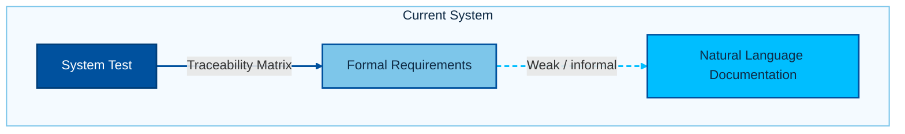
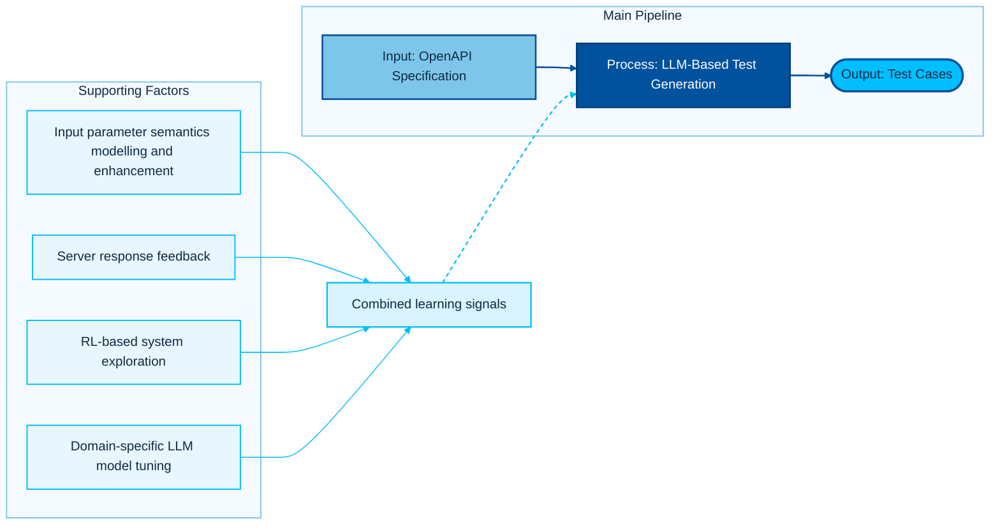
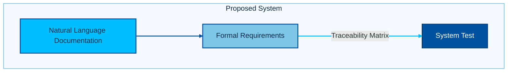
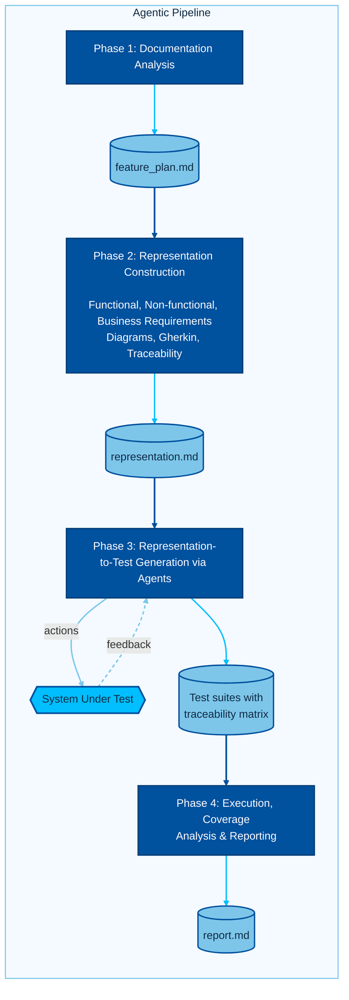
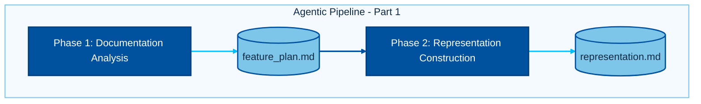
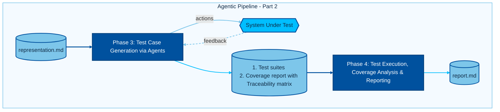
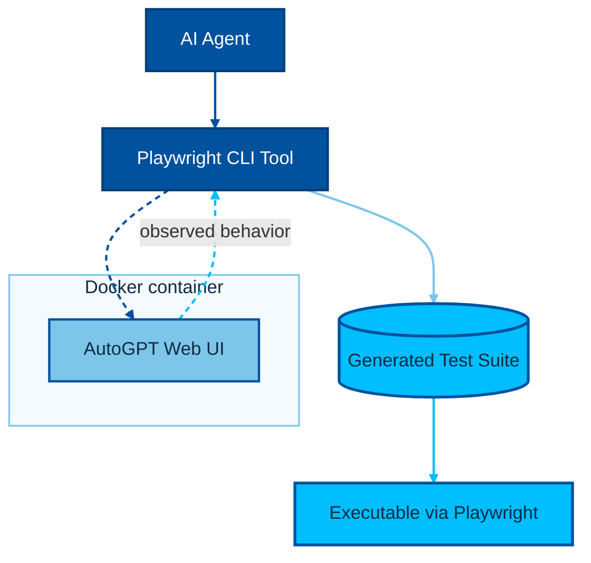

## Title & Framing

**Slide 1 – Title, Context, and Claim**  
**Title:** LLM-Assisted (AI Agents) Test Generation for Documentation-Driven Software Systems  

Content : 
Presented by: Ayush Mittal

**Suggested visual:** Pipeline graphic (Docs → Representation → Tests).  

**Speaker notes:** Briefly introduce yourself, thesis title, and institution. State that the core question is whether LLMs can systematically transform natural-language documentation into reliable, executable system tests for complex, documentation-driven systems, using Auto-GPT as the evaluation platform using LLM Agents.

---

## Problem & Motivation

**Title-2 – Problem in Context**  
**Sub heading:** Gap Between Documentation and Executable System Tests  
**Bullets:**
- Software-defined systems expose behavior via heterogeneous interfaces and rich documentation.
- System tests are often connected to formal requirements using traceability matrices, but remain largely handcrafted and disconnected from evolving documentation.
- Existing LLM-for-testing work focuses on REST APIs with formal schemas (OpenAPI), achieving moderate coverage but struggling with structured inputs and inter-parameter dependencies.
- Literature review shows that specification-only approaches (using OpenAPI alone) significantly limit test generation effectiveness—LLMs miss undocumented constraints and domain-specific knowledge.
- Semantic understanding of parameter relationships and dynamic feedback from real system responses are critical for robust test generation, but are missing in most current tools.
- There is a research gap for systems where documentation (not formal schema) is the primary specification—current LLM approaches are not designed for these documentation-driven platforms (e.g., Auto-GPT, SDVs).
- Need for new methodologies that bridge natural-language documentation and executable, infrastructure-aligned system tests, leveraging structured representations and empirical exploration.

**Speaker notes:** Explain the practical difficulty teams face when trying to maintain system tests that stay aligned with fast-changing documentation and requirements, especially when there is no formal schema (e.g., OpenAPI). Emphasize that the literature review highlights the limitations of current LLM-based approaches—such as lack of semantic understanding and inability to handle undocumented dependencies—and the amplified challenge in SDVs and documentation-driven platforms like Auto-GPT. Stress the need for new approaches that combine structured representations, empirical exploration, and dynamic feedback to bridge this gap.

Visual -1 

Visual -2

Layout-1: Horizontal main lane + factors below process with single connector

Visual - 3

**Title-3 – Research Pivot and Target System**  
**Sub heading:** From REST APIs to Documentation-Driven Software Systems  
**Bullets:**
- Pivot after literature review: focus on systems lacking formal API specs
- Candidate evaluation: Autoware vs. Auto-GPT
- Auto-GPT selected: rich docs, mature test infra, strong doc–test alignment
- RQ1: How can natural-language documentation be transformed into structured representations suitable for test derivation?
- RQ2: How can AI agents leverage these representations to generate deterministic, infrastructure-aligned web tests?
- RQ3: What is the effectiveness and failure profile of such LLM-assisted test generation?
---

 **Speaker notes:** Position your work explicitly as moving from “schema-driven” to “documentation-driven” test generation. Highlight that the literature review showed maturity in REST API testing but a research gap for systems whose primary interface is textual documentation.

## Contributions

**Title-4 – Goals and Contributions**  
**Sub heading:** Research Goals and Key Contributions  
**Bullets:**
- Design a multi-phase pipeline from documentation to executable Playwright tests
- Implement an AI agent architecture with specialized prompts and tools
- Generate and validate tests on the Auto-GPT web interface using PLawright CLI
- Provide quantitative results (document generation and Model performance experimentation)
**Suggested visual:** Contribution map: numbered contributions linked to pipeline stages.

**Speaker notes:** Phrase your contributions as concrete, evaluable outputs: a modeling methodology, an agent architecture, an implemented toolchain, and empirical findings.

## Methodology Overview

**Title-5 – Multi-Phase Pipeline Overview**  
**Sub heading:** Multi-Phase Test Generation Pipeline  
**Bullets:**
- Phase 1: Documentation analysis → decision on representation
- Phase 2: decision on representation → Representation construction (Mermaid diagrams, Gherkin, traceability tables)
- Phase 3: Representation → Playwright test generation via AI agents 
- Phase 4: Execution, coverage analysis, and reporting
- Strong separation of concerns: planning, representation, generation, execution, reporting
**Suggested visual:** End-to-end pipeline diagram with 4 phases, arrows, and artefacts per phase.  
**Speaker notes:** Walk through the pipeline at a high level before diving into agent architecture. Emphasize that each phase is explicit, tool-supported, and traceable.

~

---

## AI Agent Architecture

**Title-6 – Overall Agent Architecture**  
**Sub heading:** VS Code + Github Copilot Agents for Structured Test Generation  
**Bullets:**
- Not using any specific agent framework; implemented as a set of prompt files which are called by the user in a specific order.
- Different Prompts (Agent.md , prompt.md , instructions.md) at different hierarchy levels (agent, phase, task)
- I am using prompt.md file which specify prompt and tools that each agent can use.
- Prompt .md is configured 
- Shared environment: markdown artefacts
- Explicit tools: file I/O, search, web fetch, Playwright exploration, task tracking
**Suggested visual:** Architecture diagram showing four agents as boxes, connected via artefacts in the repo (plan/, representation/, Resources/, report/).  
**Speaker notes:** Describe the architecture as a coordinated set of specialized agents, each governed by a strict prompt and tool set. Highlight reproducibility: each phase leaves behind structured artefacts.

**Title-7 – Overall Agent Architecture**  
**Sub heading:** Context Management and Tools  
**Bullets:**
• LLMs have a limited context window, requiring careful management of information.
• The process is decomposed into clear, logical steps to maximize reliability and traceability.
• Each process produces outputs that become explicit inputs for the next, enabling agents to operate with a fresh, focused context at every stage.
• Skills.md defines reusable agent capabilities which are read when needed, while tool definition is provided in the prompt file.

**Suggested visual:** Architecture diagram showing four agents as boxes, connected via artefacts in the repo (plan/, representation/, Resources/, report/).  
**Speaker notes:** Describe the architecture as a coordinated set of specialized agents, each governed by a strict prompt and tool set. Highlight reproducibility: each phase leaves behind structured artefacts.

**Slide 8 – Prompt Design Philosophy**  
**Sub heading:** Prompt Design as Encoded Methodology  
**Bullets:**
- Prompts specify *roles* (e.g., “Senior QA Architect”, “Formal Modeling Engineer”)
- Gated and Phased prompting
- Iterative process -> Only works if you have strong baseline to build on and iterate on it.
- Each prompt encodes process constraints (phases, mandatory checks, forbidden shortcuts)
- Heavy use of task tracking and tool calls instead of free-form reasoning to reduce hallucinations and increase traceability
- Using subagents for quality checks and validation to ensure certain standards are met (e.g., no test generation without exploration, documentation must have certain sections)  
**Speaker notes:** Argue that prompts are not just instructions but a way of encoding methodological instructions: clear phases, explicit tools, and hard constraints against speculative behavior. This reframes “prompting” as process design.

## Representation & Test Generation

**Title 9 – Structured Representation Layer**  
**Sub heading:** From Documentation to Formalized Representations  
**Bullets:**
- Document -> Analysis -> Representation document
- Why a analysis step? Because the agent needs to decide what representation is best suited for the documentation section (state diagram, sequence diagram, flowchart, Gherkin scenarios, traceability tables)
- Context management
- Give a chance to the agent to decide what is best , I give access to the internet to do some research about it.
- Outputs: state diagrams, sequence diagrams, flowcharts, Gherkin, traceability tables
- Unique IDs and explicit links to documentation sections
- Designed for systematic test derivation and coverage reasoning
- Stored in representation/ for reuse and review
**Suggested visual:** Example schematic: requirement ID → state diagram node → scenario ID → test case.  
**Speaker notes:** Explain how the decision-to-representation agent converts narrative documentation into a graph of states and transitions plus Gherkin-like scenarios, enabling structured coverage and test design.

**Slide 10 – Structured Representation Layer- Example**  
**Title:** Structured Representation Layer- Example
**Bullets:**
- Example pictures of a state diagram and Gherkin scenarios generated from a specific documentation section.

**Slide 11 – Empirical Playwright Test Generation -1**  
**Title:** Representation-Driven, Empirically Grounded Playwright Tests  
**Bullets:**
- Resources : existing tests case suit , previous representation. 
- Tests derived only after live exploration with `playwright-cli` -> Improves pass rates of the generated test
- Every action backed by captured code snippets and snapshots
- Assertions guided by observed DOM, network, and console behavior
- Resulting tests: deterministic, infrastructure-aligned, and replayable
**Suggested visual:** Two-layer diagram: top = representation elements; bottom = captured Playwright code blocks linked to them.  
**Speaker notes:** Stress the philosophy shift: implementation reality is primary. The agent is forced to interact with the real Auto-GPT UI, capture the generated Playwright code, and only then synthesize tests using those verified selectors and behaviors.

**Slide 12 – Empirical Playwright Test Generation -2**  
**Title:** Representation-Driven, Empirically Grounded Playwright Tests  
**Bullets:**
- First iteration : representation > test cases -> Healing phase (executing testcases and observing logs) : Terribly horrible
- Second iteration : representation > explore using Playwright-cli > test cases > healing phase -> much better results.
- Third iteration : representation > explore using Playwright-cli> use the learning from it > test cases > all test case must pass -> much better results.
**Suggested visual:** Two-layer diagram: top = representation elements; bottom = captured Playwright code blocks linked to them.  
**Speaker notes:** Stress the philosophy shift: implementation reality is primary. The agent is forced to interact with the real Auto-GPT UI, capture the generated Playwright code, and only then synthesize tests using those verified selectors and behaviors.

**Slide 13 – Video Demo**  

---

## Experimental Setup & Results

**Slide 14 – Experimental Infrastructure**  
**Title:** Experimental Infrastructure on Auto-GPT Platform  
**Bullets:**
- Auto-GPT web UI with no-code agent builder workflows
- Docker
- Existing Playwright and Pytest suites 
**Suggested visual:** Infrastructure diagram: browser, Playwright runner, Auto-GPT web app, file system for artefacts.  
    
**Slide 15 – Quantitative Outcomes**  
**Title:** Test Generation Outcomes and Coverage  
**Bullets:**
- Number of scenarios modeled and tests generated (happy, negative, boundary)
- Coverage metrics (functional areas, flows, or branches where available)
- Execution statistics: passes, failures, blocked tests
- Findings
**Suggested visual:** Bar chart or table summarizing number of generated tests and their outcomes; coverage per feature.  
**Speaker notes:** Present concrete numbers from your academic report (counts, percentages). Emphasize not just volume of tests, but how many are executable and stable.

**Slide 16 – Comparison Between different Models**  
**Title:** Comparison Between different Models  
**Bullets:**
- Categorization: selector errors, state/precondition failures, auth/infrastructure issues, logic errors
- Mapping of failures back to representation and documentation gaps
- Identification of fragile assumptions and ambiguous docs
- Demonstrated ability of the pipeline to surface documentation–implementation mismatches
 
---

Suggested Visual

## Discussion, Contributions, and Defense

**Slide 17 – Discussion and Contributions**  
**Title:** My Learnings  
**Bullets:**
- LLMs can generate executable integration tests *when constrained by formal representations and empirical exploration*
- LLMs are becomming very good at following complex, multi-step reasoning when properly prompted. 
- Did not observed hallucinated tests that were not grounded in the actual system behavior, which is a common failure mode in LLM test generation.
- Quality checks , validation , conformant to some stadards (Like test cases should not have this , documenttiomn should have this) can be enforced via subagent rather then self regulatory prompting.
- Agent prompts that encode process rules improve determinism and reduce hallucinations
- Contributions: methodology, architecture, implementation, and empirical evaluation on a realistic system
**Suggested visual:** Bullet list with emphasis boxes highlighting 3–4 key technical contributions.  

---

## Conclusion & Future Work

**Slide 18 – Conclusions and Future Directions**  
**Title:** Conclusions, Impact, and Future Work  
**Bullets:**
- Testing APIs driven by OpenAPI , where the reinforcement algorithim or other novel algorithim , expert , findings are designed as prompt but not implemented in code. 
- Building and modelling the complex system side by side with Knowledge graph when the Agent explores the system under test. 
- Extend the framework to security testing, can help in anticipating and mitigating vulnerabilities in SDVs by generating tests that probe for security weaknesses based on documentation and observed behavior and known vulnerabilities internet.   
**Speaker notes:** Close by restating your main contribution in one or two sharp sentences, then project the next research steps

**Slide 19 – Thank You** 