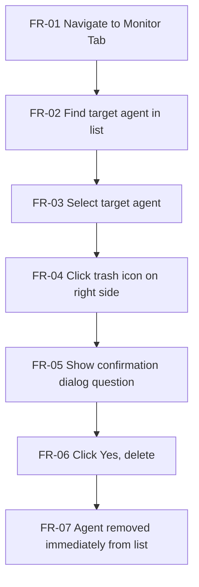
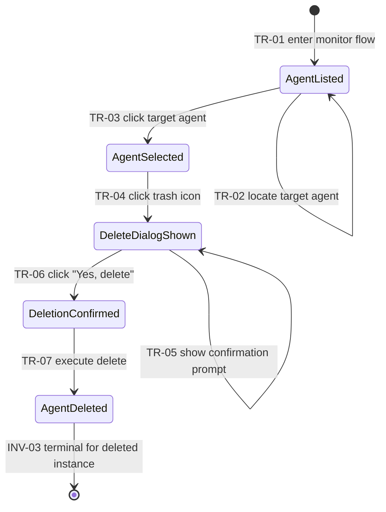
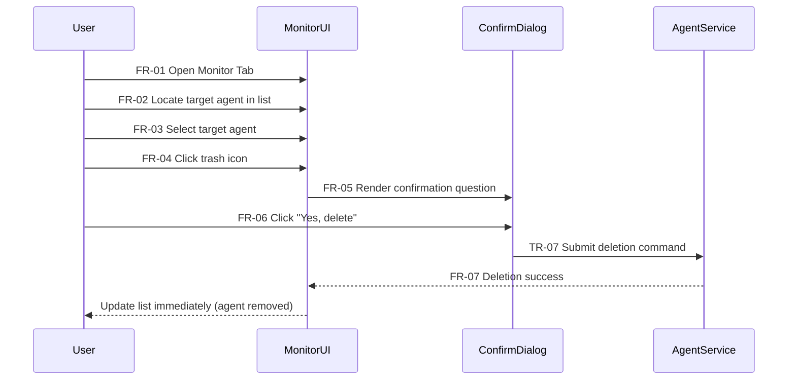

# Delete Agent — Structured Representation for Test Derivation

## Source and Scope
- Source document: `docs/content/platform/delete-agent.md`
- Scope: "How to Delete an Agent in AutoGPT"
- Representation backbone: RTM + State Transition Model + Gherkin + Mermaid diagrams (`flowchart TD`, `stateDiagram-v2`, `sequenceDiagram`)

## Model Element Catalog

| Element ID | Element Type | Definition |
|---|---|---|
| ACT-01 | Activity | Navigate to Monitor Tab |
| ACT-02 | Activity | Find target agent in list |
| ACT-03 | Activity | Select target agent |
| ACT-04 | Activity | Click trash icon |
| ACT-05 | Activity | Display confirmation dialog text |
| ACT-06 | Activity | Confirm with "Yes, delete" |
| ACT-07 | Activity | Remove agent from list immediately |
| DOC-ART-01 | Documentation artifact | Embedded help video in source page |

## Requirement Traceability Matrix (RTM)

### Functional Requirements (verbatim from approved plan)

| Req ID | Requirement Statement (verbatim) | Source Trace | Model Elements | Scenario IDs | Primary Expected Outcome |
|---|---|---|---|---|---|
| FR-01 | User can navigate to the **Monitor Tab** in the AutoGPT builder. | Steps to Delete an Agent → 1. Locate the Agent | `ACT-01`, `TR-01` | `GHK-01` | User reaches monitor context for deletion flow |
| FR-02 | User can find a target agent in the list. | Steps to Delete an Agent → 1. Locate the Agent | `ACT-02`, `TR-02` | `GHK-01` | Target agent is identified in monitor list |
| FR-03 | User can select/click the target agent. | Steps to Delete an Agent → 2. Select the Agent | `ACT-03`, `TR-03` | `GHK-01` | Agent becomes selected |
| FR-04 | User can initiate deletion via a **trash icon** on the right side of the interface. | Steps to Delete an Agent → 3. Delete the Agent | `ACT-04`, `TR-04` | `GHK-01` | Delete intent is initiated |
| FR-05 | System presents a confirmation dialog with the prompt: "Are you sure you want to delete this agent?" | Steps to Delete an Agent → confirmation dialog sentence | `ACT-05`, `TR-05` | `GHK-02` | Confirmation prompt is shown |
| FR-06 | User can confirm deletion by clicking **"Yes, delete"**. | Steps to Delete an Agent → Click "Yes, delete" | `ACT-06`, `TR-06` | `GHK-01` | Deletion is explicitly confirmed by user |
| FR-07 | On confirmation, the system removes the agent immediately from the list. | Post-step sentence: "Once confirmed, the agent will be immediately removed from your list." | `ACT-07`, `TR-07` | `GHK-01` | Agent is removed immediately from list |

### Non-Functional Requirements (verbatim from approved plan)

| NFR ID | Requirement Statement (verbatim) | Source Trace | Model Elements | Scenario IDs |
|---|---|---|---|---|
| NFR-01 | UX safety requirement: explicit confirmation step before destructive action. | Delete steps + confirmation dialog text | `BR-02`, `INV-01`, `TR-05` | `GHK-02` |
| NFR-02 | UX timeliness expectation: deletion effect is immediate after confirmation. | "Once confirmed, the agent will be immediately removed..." | `INV-02`, `TR-07` | `GHK-01` |
| NFR-03 | Content/help artifact: a video exists in the page for guidance (documentation aid, not product behavior). | Overview embedded video section | `DOC-ART-01` | N/A |

### Business Rules and Constraints (verbatim from approved plan)

| Rule ID | Rule Statement (verbatim) | Source Trace | Linked Elements |
|---|---|---|---|
| BR-01 | Deletion is **irreversible** ("cannot be undone"). | Final note in source doc | `INV-03`, `GHK-03` |
| BR-02 | Deletion requires explicit user confirmation. | Confirmation dialog + "Yes, delete" action | `TR-05`, `TR-06`, `GHK-02` |
| BR-03 | Deletion target is an existing agent visible/selectable in Monitor list. | Locate + Select steps | `PRE-03`, `TR-02`, `TR-03`, `GHK-01` |

## Preconditions and Postconditions

| Condition ID | Type | Statement (verbatim from approved plan) |
|---|---|---|
| PRE-01 | Precondition | User is in AutoGPT builder context. |
| PRE-02 | Precondition | Monitor Tab is accessible. |
| PRE-03 | Precondition | At least one deletable agent is present and locatable. |
| POST-01 | Postcondition | After confirming delete, selected agent is removed from the list immediately. |

## State Transition Model

### States

| State ID | State Name | Definition |
|---|---|---|
| ST-01 | `AgentListed` | Target agent exists in visible monitor list |
| ST-02 | `AgentSelected` | Target agent has been clicked/selected |
| ST-03 | `DeleteDialogShown` | Confirmation dialog is visible |
| ST-04 | `DeletionConfirmed` | User clicked "Yes, delete" |
| ST-05 | `AgentDeleted` | Agent removed from list |

### Transitions

| Transition ID | From | Event/Trigger | Guard/Condition | To | Expected Observable Outcome | Traces |
|---|---|---|---|---|---|---|
| TR-01 | `[*]` | Enter monitor flow | `PRE-01` and `PRE-02` | `ST-01` | Monitor list context is active | `FR-01`, `PRE-01`, `PRE-02` |
| TR-02 | `ST-01` | Locate target agent | `PRE-03` | `ST-01` | Target identified in list | `FR-02`, `BR-03` |
| TR-03 | `ST-01` | Click target agent | Target is visible/selectable | `ST-02` | Agent selection becomes active | `FR-03`, `BR-03` |
| TR-04 | `ST-02` | Click trash icon | Deletion control visible on right side | `ST-03` | Deletion intent initiated | `FR-04` |
| TR-05 | `ST-03` | Show confirmation prompt | Must ask exact confirmation question | `ST-03` | Dialog text is displayed | `FR-05`, `NFR-01`, `BR-02` |
| TR-06 | `ST-03` | Click "Yes, delete" | Explicit user confirmation provided | `ST-04` | Confirmation accepted | `FR-06`, `BR-02` |
| TR-07 | `ST-04` | Execute delete action | Confirmation already accepted | `ST-05` | Agent immediately disappears from list | `FR-07`, `NFR-02`, `POST-01`, `BR-01` |

### Invariants

| Invariant ID | Statement | Linked Rules |
|---|---|---|
| INV-01 | No transition to deletion execution without explicit confirmation action. | `NFR-01`, `BR-02` |
| INV-02 | After confirmation, deletion outcome is immediate in UI list. | `NFR-02`, `POST-01` |
| INV-03 | `ST-05` is terminal for the deleted agent instance (cannot be undone in documented flow). | `BR-01` |

## Gherkin Scenarios

```gherkin
Feature: Delete an agent from Monitor in AutoGPT
  As an AutoGPT builder user
  I want to delete an existing agent through confirmation
  So that unwanted agents are removed from my monitor list

  # GHK-01
  Scenario: Successfully delete a selected agent
    Given I am in the AutoGPT builder and the Monitor Tab is accessible
    And at least one deletable agent is present in the monitor list
    And I locate the target agent in the list
    When I click the target agent
    And I click the trash icon on the right side of the interface
    And I click "Yes, delete" in the confirmation dialog
    Then the selected agent is immediately removed from the list

  # GHK-02
  Scenario: Confirmation gate is shown before destructive action
    Given I have selected a target agent in the monitor list
    When I click the trash icon on the right side of the interface
    Then I see a confirmation dialog asking "Are you sure you want to delete this agent?"

  # GHK-03
  Scenario: Deletion is treated as irreversible
    Given I am about to confirm deletion of a selected agent
    Then the action is documented as not undoable
```

## Scenario Coverage Catalog (Positive, Negative, Boundary)

| Scenario ID | Type | Condition / Focus | Expected Outcome | Documentation Status |
|---|---|---|---|---|
| SCN-POS-01 | Positive | Full delete flow through "Yes, delete" | Agent is removed immediately | Explicitly documented |
| SCN-POS-02 | Positive | Trash icon click on selected agent | Confirmation dialog appears with exact prompt | Explicitly documented |
| SCN-BND-01 | Boundary | Minimum list cardinality for deletion flow = 1 deletable agent present | Flow is executable with one target agent | Implicit from precondition (`PRE-03`) |
| SCN-NEG-01 | Negative | Cancel from confirmation dialog | Out of scope (behavior not specified in source) | Not specified |
| SCN-NEG-02 | Negative | Agent not found in list | Out of scope (behavior not specified in source) | Not specified |
| SCN-NEG-03 | Negative | Permission/authorization error | Out of scope (behavior not specified in source) | Not specified |
| SCN-NEG-04 | Negative | Backend failure/retry handling | Out of scope (behavior not specified in source) | Not specified |

## Mermaid Diagrams

### Activity / Flow (`flowchart TD`)



### State Lifecycle (`stateDiagram-v2`)



### Interaction (`sequenceDiagram`)



## Metadata
- Model: GPT-5.3-Codex
- Execution date: 2026-02-23
- Execution time: Not exposed by current environment context
- Artifact type: Single-source structured representation for test derivation and validation