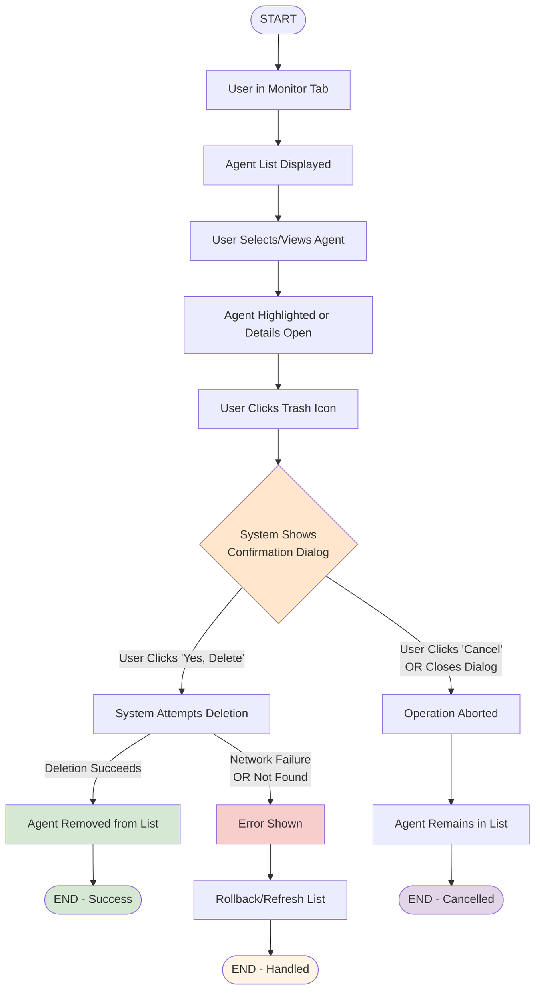
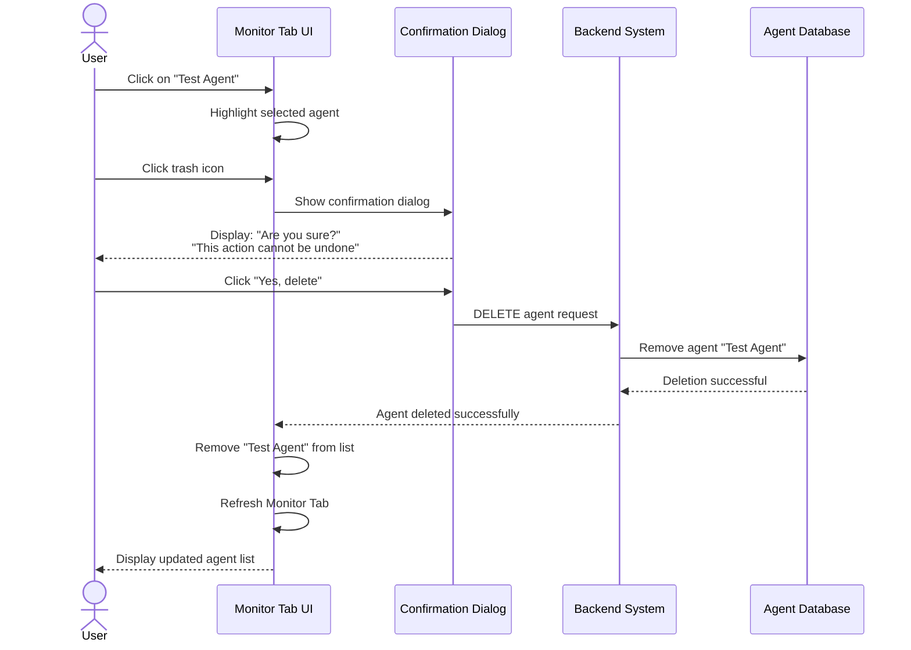
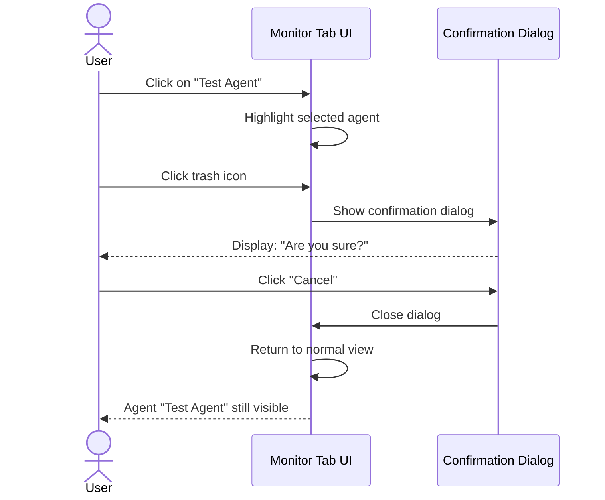
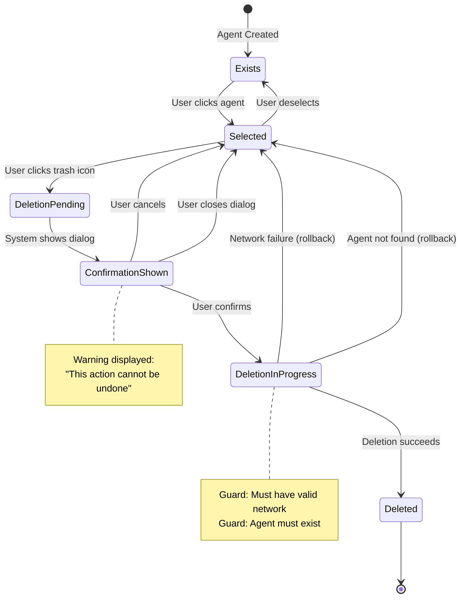
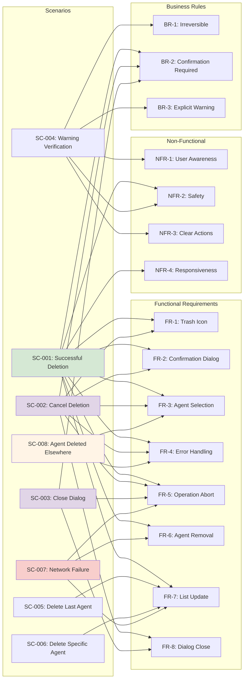
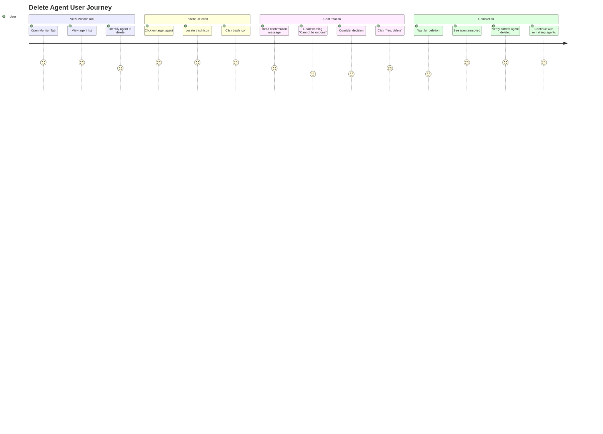

# Delete Agent Feature - Mermaid Representation

- Feature ID: FEAT-DELETE-AGENT
- Source: plan/delete-agent-representation.md

## Gherkin Specification

```gherkin
@FEAT-DELETE-AGENT
Feature: Delete Agent from AutoGPT Monitor
  As a user
  I want to delete agents I no longer need
  So that my Monitor list stays organized

  Background: Common preconditions
    @BG-DELETE-AGENT
    Given I am logged in to AutoGPT
    And I am viewing the Monitor Tab

  @SC-001 @FR-1 @FR-2 @FR-3 @FR-4 @FR-5 @FR-6 @FR-7 @NFR-2 @NFR-4 @BR-2
  Scenario: Successful Agent Deletion (Happy Path)
    Given the Monitor Tab displays the list of agents including "Test Agent"
    When I click on agent "Test Agent"
    And I click the trash icon
    Then a confirmation dialog appears with message "Are you sure you want to delete this agent?"
    And the dialog contains warning text stating "This action cannot be undone"
    When I click "Yes, delete" button
    Then the agent "Test Agent" is removed from the Monitor list
    And the Monitor Tab displays only the remaining agents
    And the system returns to the Monitor Tab view

  @SC-002 @FR-1 @FR-2 @FR-3 @FR-4 @FR-5 @FR-8 @BR-2
  Scenario: User Cancels Deletion at Confirmation
    Given the Monitor Tab displays the list of agents including "Test Agent"
    When I click on agent "Test Agent"
    And I click the trash icon
    Then a confirmation dialog appears with message "Are you sure you want to delete this agent?"
    When I click "Cancel"
    Then the agent "Test Agent" remains in the Monitor list
    And the Monitor Tab returns to normal view

  @SC-003 @FR-5 @FR-8 @BR-2
  Scenario: Dialog Closure Without Action (Implicit Cancellation)
    Given the Monitor Tab displays the list of agents including "Test Agent"
    When I click on agent "Test Agent"
    And I click the trash icon
    Then a confirmation dialog appears
    When I close the dialog without choosing an action
    Then the operation is aborted
    And the agent "Test Agent" remains in the Monitor list

  @SC-004 @NFR-1 @NFR-2 @NFR-3 @BR-1 @BR-3
  Scenario: Irreversibility Warning Verification
    Given I am viewing the Monitor Tab
    When I click on an agent
    And I click the trash icon
    Then a confirmation dialog appears
    And the dialog contains warning text stating "This action cannot be undone"
    And the dialog clearly displays a prominent "Yes, delete" action

  @SC-005 @FR-7
  Scenario: Delete Last Remaining Agent
    Given only one agent "Final Agent" exists in the list
    When I click on agent "Final Agent"
    And I click the trash icon
    And I confirm deletion by clicking "Yes, delete"
    Then the agent is removed from the list
    And the Monitor Tab displays an empty state or "No agents" message

  @SC-006 @FR-7
  Scenario Outline: Multiple Agents - Delete Specific Agent
    Given I am viewing the Monitor Tab with agents: <agent_list>
    When I click on agent "<target_agent>"
    And I click the trash icon
    And I confirm deletion by clicking "Yes, delete"
    Then agent "<target_agent>" is removed
    And agents <remaining_agents> remain in the list

    Examples:
      | agent_list                 | target_agent | remaining_agents    |
      | Agent A, Agent B, Agent C | Agent B      | Agent A, Agent C    |
      | Agent 1, Agent 2          | Agent 1      | Agent 2             |

  @SC-007 @FR-5 @FR-6 @FR-7
  Scenario: Network Failure During Deletion (Rollback)
    Given the Monitor Tab displays the list of agents including "Net Agent"
    And a confirmation dialog is shown
    When I click "Yes, delete"
    And a network failure occurs before the deletion completes
    Then the operation is aborted and rolled back
    And the agent "Net Agent" remains in the list
    And an error message is displayed indicating a network failure

  @SC-008 @FR-3 @FR-4
  Scenario: Agent Deleted While Viewing Its Details (Graceful Handling)
    Given I am viewing details for agent "Ghost Agent"
    And the agent is deleted elsewhere while I am viewing
    When I attempt deletion via the trash icon
    Then the system detects the agent no longer exists
    And displays a graceful error message
    And returns to the Monitor Tab with the updated list
```

## Activity Diagram



### Guard Conditions
- Confirmation dialog must appear before permanent deletion
- Agent must exist to be selected or deletion must handle non-existence gracefully
- Confirmation is mandatory for deletion

## Sequence Diagram - Successful Deletion (SC-001)



## Sequence Diagram - User Cancels Deletion (SC-002)



## Sequence Diagram - Network Failure (SC-007)

```mermaid
sequenceDiagram
    actor User
    participant UI as Monitor Tab UI
    participant Dialog as Confirmation Dialog
    participant System as Backend System
    participant DB as Agent Database

    User->>UI: Click on "Net Agent"
    UI->>UI: Highlight selected agent
    User->>UI: Click trash icon
    UI->>Dialog: Show confirmation dialog
    Dialog-->>User: Display confirmation
    User->>Dialog: Click "Yes, delete"
    Dialog->>System: DELETE agent request
    System->>DB: Remove agent "Net Agent"
    DB--xSystem: Network failure ❌
    System-->>UI: Error: Network failure
    UI->>UI: Rollback operation
    UI->>UI: Refresh agent list
    UI-->>User: Display error message<br/>"Net Agent" still in list
```



## State Diagram - Agent Lifecycle



## Traceability Graph - Requirements Mapping



## User Journey - Delete Agent Flow



## Traceability

- Source Document: plan/delete-agent-representation.md
- Feature/Scenario Tags map directly to Requirement IDs (FR-*, NFR-*, BR-*) for bidirectional traceability.
- Activity Diagram ID: AD-DELETE-AGENT
