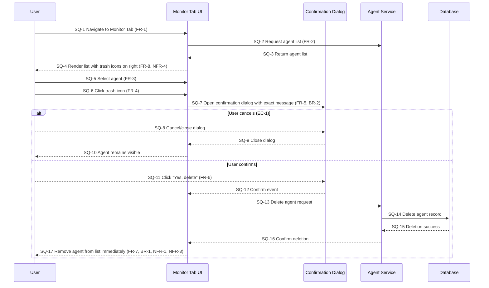

# Delete Agent Structured Representation

## Metadata

- Source documentation: d:\RP\docs\content\platform\delete-agent.md
- Plan reference: d:\RP\plan\delete-agent-representation-plan.md
- Model: GPT-5.1-Codex-Max
- Execution date: 2026-01-24
- Execution time: 00:00 UTC

## Requirements Inventory

| ID | Type | Description | Source |
| --- | --- | --- | --- |
| FR-1 | Functional | User must be able to navigate to the Monitor Tab in AutoGPT builder | delete-agent.md |
| FR-2 | Functional | User must be able to view a list of agents in the Monitor Tab | delete-agent.md |
| FR-3 | Functional | User must be able to select an agent from the list | delete-agent.md |
| FR-4 | Functional | User must be able to locate and click a trash icon for the selected agent | delete-agent.md |
| FR-5 | Functional | System must display a confirmation dialog with message "Are you sure you want to delete this agent?" | delete-agent.md |
| FR-6 | Functional | User must be able to confirm deletion by clicking "Yes, delete" | delete-agent.md |
| FR-7 | Functional | System must immediately remove the agent from the list upon confirmation | delete-agent.md |
| FR-8 | Functional | System must position the trash icon on the right side of the interface | delete-agent.md |
| NFR-1 | Non-functional | Deletion action must be irreversible (permanence constraint) | delete-agent.md |
| NFR-2 | Non-functional | User must be warned before permanent deletion (safety constraint) | delete-agent.md |
| NFR-3 | Non-functional | Deletion must occur immediately after confirmation (performance) | delete-agent.md |
| NFR-4 | Non-functional | Interface must provide clear visual affordance (usability) | delete-agent.md |
| BR-1 | Business Rule | Deleted agents cannot be recovered (irreversibility) | delete-agent.md |
| BR-2 | Business Rule | Confirmation is mandatory before deletion (safety gate) | delete-agent.md |
| BR-3 | Business Rule | Only agents in the Monitor Tab can be deleted through this workflow | delete-agent.md |
| BR-4 | Business Rule | User must have access to the Monitor Tab | delete-agent.md |
| PC-1 | Precondition | User is logged into AutoGPT platform | delete-agent.md |
| PC-2 | Precondition | User has access to the Monitor Tab | delete-agent.md |
| PC-3 | Precondition | At least one agent exists to delete | delete-agent.md |
| PC-4 | Precondition | Selected agent is valid and accessible | delete-agent.md |
| PO-1 | Postcondition | Agent is permanently removed from the system | delete-agent.md |
| PO-2 | Postcondition | Agent no longer appears in the Monitor Tab list | delete-agent.md |
| PO-3 | Postcondition | System state is consistent (no orphaned data) | delete-agent.md |
| EC-1 | Edge Case | User cancels the deletion (dismisses confirmation dialog) | delete-agent.md |
| EC-2 | Edge Case | Only one agent exists in the system | delete-agent.md |
| EC-3 | Edge Case | Agent is currently running/active | delete-agent.md |
| EC-4 | Edge Case | Multiple users attempting to delete the same agent | delete-agent.md |
| EC-5 | Edge Case | Network interruption during deletion | delete-agent.md |
| EC-6 | Edge Case | User has no agents to delete | delete-agent.md |
| EC-7 | Edge Case | User lacks permissions to delete agent | delete-agent.md |

## Flowchart (flowchart TD)

```mermaid
flowchart TD
  Start([S0 Start])
  Nav([FL-1 Navigate to Monitor Tab (FR-1, BR-3, BR-4)])
  List([FL-2 Display agent list (FR-2)])
  HasAgents{FL-3 Agents available? (PC-3)}
  Empty([FL-4 No agents available \n flow ends (EC-6)])
  Select([FL-5 Select agent (FR-3, PC-4)])
  Icon([FL-6 Trash icon positioned right (FR-8, NFR-4)])
  ClickTrash([FL-7 Click trash icon (FR-4)])
  Confirm([FL-8 Show confirmation dialog \n message exact text (FR-5, BR-2, NFR-2)])
  Choice{FL-9 Confirm deletion?}
  Cancel([FL-10 User cancels; agent unchanged (EC-1)])
  ConfirmYes([FL-11 User clicks "Yes, delete" (FR-6)])
  Delete([FL-12 Remove agent immediately (FR-7, BR-1, NFR-1, NFR-3)])
  End([S1 End])

  Start --> Nav --> List --> HasAgents
  HasAgents -- No --> Empty --> End
  HasAgents -- Yes --> Select --> Icon --> ClickTrash --> Confirm --> Choice
  Choice -- No --> Cancel --> End
  Choice -- Yes --> ConfirmYes --> Delete --> End
```

## State Diagram (stateDiagram-v2)

```mermaid
stateDiagram-v2
  [*] --> ST-Init
  ST-Init: Any location in builder
  ST-Init --> ST-Monitor: navigate to Monitor Tab (FR-1, BR-3, BR-4)
  ST-Monitor: Monitor Tab with agent list (FR-2)
  ST-Monitor --> ST-NoAgents: no agents available (EC-6, PC-3)
  ST-Monitor --> ST-Selected: agent selected (FR-3, PC-4)
  ST-Selected --> ST-Confirm: trash clicked, dialog shown (FR-4, FR-5, BR-2)
  ST-Confirm --> ST-Cancelled: user cancels (EC-1)
  ST-Confirm --> ST-Deleted: user confirms (FR-6, FR-7)
  ST-Cancelled --> ST-Monitor: agent remains listed
  ST-Deleted --> [*]: agent removed (BR-1, PO-1, PO-2, NFR-1)
  ST-NoAgents --> [*]: flow ends; no deletion possible
```

## Sequence Diagram (sequenceDiagram)



## Gherkin Scenarios

### SCN-1 Happy path delete

```gherkin
Given PC-1 the user is logged into AutoGPT
And PC-2 the user has access to the Monitor Tab
And PC-3 at least one agent exists to delete
When FR-1 the user navigates to the Monitor Tab
And FR-3 the user selects a target agent from the list
And FR-4 the user clicks the trash icon positioned on the right (FR-8)
And FR-5 the system shows a confirmation dialog with message "Are you sure you want to delete this agent?"
And FR-6 the user clicks "Yes, delete"
Then FR-7 the system immediately removes the agent from the list
And PO-1 the agent is permanently removed and cannot be recovered (BR-1, NFR-1)
And PO-2 the agent no longer appears in the Monitor Tab list
```

### SCN-2 Cancel deletion

```gherkin
Given PC-1 the user is logged into AutoGPT
And PC-2 the user has access to the Monitor Tab
And PC-3 at least one agent exists to delete
When FR-1 the user navigates to the Monitor Tab
And FR-3 the user selects a target agent
And FR-4 the user clicks the trash icon
And FR-5 the system shows the confirmation dialog
But EC-1 the user dismisses the dialog without confirming
Then the agent remains visible in the list
And no deletion request is executed (BR-2)
```

### SCN-3 No agents available

```gherkin
Given PC-1 the user is logged into AutoGPT
And PC-2 the user has access to the Monitor Tab
And EC-6 there are no agents to delete
When FR-1 the user navigates to the Monitor Tab
Then the UI presents an empty state and no delete action can proceed
And the flow ends without deletion
```

### SCN-4 Confirmation message integrity

```gherkin
Given PC-1 the user is logged into AutoGPT
And PC-2 the user has access to the Monitor Tab
And PC-3 at least one agent exists to delete
When FR-1 the user navigates to the Monitor Tab
And FR-4 the user clicks the trash icon for a selected agent (FR-3)
Then FR-5 the confirmation dialog text reads exactly "Are you sure you want to delete this agent?"
And BR-2 confirmation is required before any deletion proceeds
```

### SCN-5 UI affordance and immediacy

```gherkin
Given PC-1 the user is logged into AutoGPT
And PC-2 the user has access to the Monitor Tab
And PC-3 at least one agent exists to delete
When FR-1 the user navigates to the Monitor Tab
Then FR-8 the trash icon is visible on the right side of each agent entry (NFR-4)
When FR-4 the user clicks the trash icon and confirms deletion (FR-6)
Then FR-7 the agent disappears immediately from the list (NFR-3)
And PO-3 the system remains in a consistent state
```

## Requirement Traceability Matrix (RTM)

| Requirement ID | Flow Nodes | State Nodes | Sequence Steps | Scenarios |
| --- | --- | --- | --- | --- |
| FR-1 | FL-1 | ST-Init → ST-Monitor | SQ-1 | SCN-1, SCN-2, SCN-3, SCN-4, SCN-5 |
| FR-2 | FL-2 | ST-Monitor | SQ-2, SQ-3, SQ-4 | SCN-1 |
| FR-3 | FL-5 | ST-Selected | SQ-5 | SCN-1, SCN-2, SCN-4 |
| FR-4 | FL-7 | ST-Confirm entry | SQ-6 | SCN-1, SCN-2, SCN-4, SCN-5 |
| FR-5 | FL-8 | ST-Confirm | SQ-7 | SCN-1, SCN-2, SCN-4 |
| FR-6 | FL-11 | ST-Confirm → ST-Deleted | SQ-11, SQ-12 | SCN-1, SCN-5 |
| FR-7 | FL-12 | ST-Deleted | SQ-17 | SCN-1, SCN-5 |
| FR-8 | FL-6 | ST-Monitor | SQ-4 | SCN-1, SCN-5 |
| NFR-1 | FL-12 | ST-Deleted | SQ-17 | SCN-1 |
| NFR-2 | FL-8 | ST-Confirm | SQ-7 | SCN-1, SCN-2, SCN-4 |
| NFR-3 | FL-12 | ST-Deleted | SQ-17 | SCN-1, SCN-5 |
| NFR-4 | FL-6 | ST-Monitor | SQ-4 | SCN-5 |
| BR-1 | FL-12 | ST-Deleted | SQ-17 | SCN-1 |
| BR-2 | FL-8 | ST-Confirm | SQ-7 | SCN-1, SCN-2, SCN-4 |
| BR-3 | FL-1 | ST-Init → ST-Monitor | SQ-1 | SCN-1 |
| BR-4 | FL-1 | ST-Init → ST-Monitor | SQ-1 | SCN-1 |
| PC-1 | Start prereq | ST-Init | Precondition | SCN-1, SCN-2, SCN-3, SCN-4, SCN-5 |
| PC-2 | FL-1 | ST-Init → ST-Monitor | Precondition | SCN-1, SCN-2, SCN-3, SCN-4, SCN-5 |
| PC-3 | FL-3 | ST-Monitor | SQ-2 | SCN-1, SCN-2, SCN-4, SCN-5 |
| PC-4 | FL-5 | ST-Selected | SQ-5 | SCN-1, SCN-2, SCN-4 |
| PO-1 | FL-12 | ST-Deleted | SQ-17 | SCN-1 |
| PO-2 | FL-12 | ST-Deleted | SQ-17 | SCN-1 |
| PO-3 | FL-12 | ST-Deleted | SQ-17 | SCN-5 |
| EC-1 | FL-10 | ST-Cancelled | SQ-8, SQ-9, SQ-10 | SCN-2 |
| EC-2 | FL-3 path \n (single agent) | ST-Monitor | SQ-2 | SCN-1 |
| EC-3 | FL-5 note \n (active agent) | ST-Selected | SQ-5 | SCN-1 |
| EC-4 | FL-5 note \n (concurrency) | ST-Selected | SQ-5 | SCN-1 |
| EC-5 | FL-11/FL-12 note \n (network interruption) | ST-Confirm | SQ-13-SQ-16 | SCN-1 |
| EC-6 | FL-4 | ST-NoAgents | SQ-2 | SCN-3 |
| EC-7 | FL-1 guard \n (access denied) | ST-Init | SQ-1 | SCN-3 |

## Notes

- Diagram IDs (FL-, ST-, SQ-) align with RTM and scenarios for bidirectional traceability.
- Preconditions and business rules are enforced as guards in the flow and state models.
- Non-functional constraints (irreversibility, immediacy, warning, affordance) are embedded in flow nodes and scenarios for test derivation.
