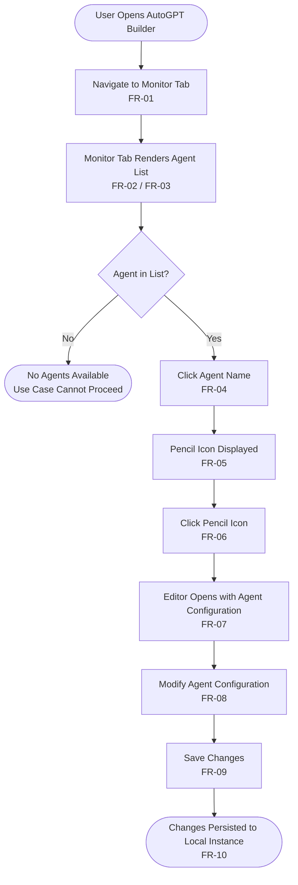
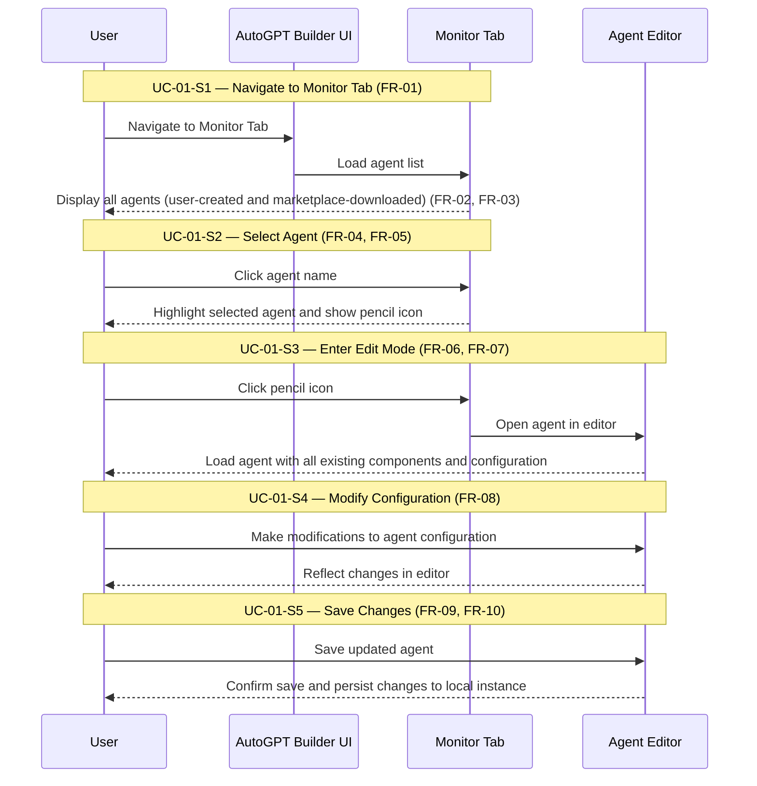
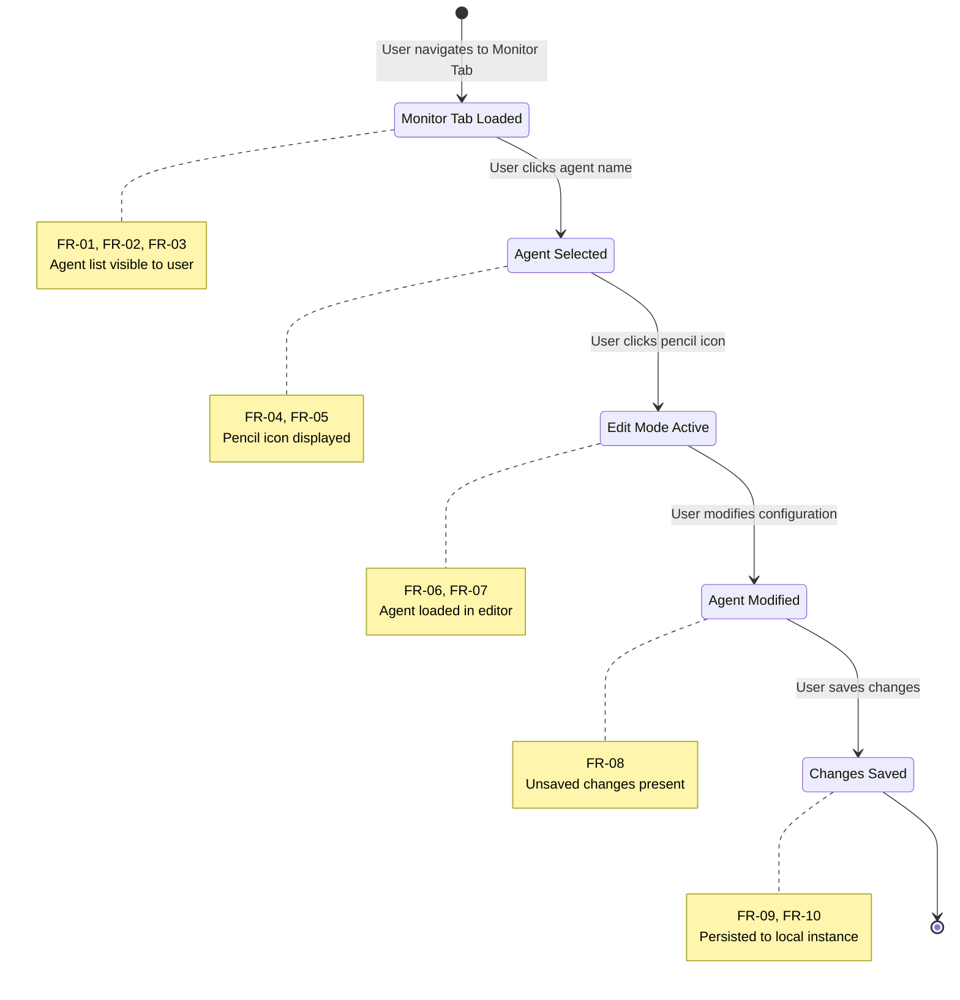

# Structured Representation: Edit Agent Feature — AutoGPT Platform

---

## Section 1: Requirements Reference Table

All requirements from the approved plan are reproduced here without omission or alteration.

### 1.1 Functional Requirements

| ID    | Requirement Description |
|-------|------------------------|
| FR-01 | The user shall be able to navigate to the Monitor Tab within the AutoGPT builder. |
| FR-02 | The Monitor Tab shall display a list of all agents available to the user. |
| FR-03 | The agent list shall include agents created by the user and agents downloaded from the marketplace. |
| FR-04 | The user shall be able to select an agent by clicking on its name. |
| FR-05 | A pencil (edit) icon shall be displayed next to the selected agent. |
| FR-06 | Clicking the pencil icon shall open the agent in the editor (edit mode). |
| FR-07 | The editor shall load the agent with all its existing components and configuration. |
| FR-08 | The user shall be able to modify the agent's configuration within the editor. |
| FR-09 | The user shall be able to save changes after making modifications. |
| FR-10 | Saved changes shall be persisted to the user's local instance. |

### 1.2 Non-Functional Requirements

| ID     | Requirement Description |
|--------|------------------------|
| NFR-01 | All agents are editable regardless of their origin (user-created or marketplace-downloaded). |
| NFR-02 | Changes are saved only to the user's local instance (not pushed back to marketplace). |

### 1.3 Business Rules

| ID    | Rule Description |
|-------|-----------------|
| BR-01 | Any agent — whether self-created or downloaded from the marketplace — can be edited. |
| BR-02 | Modifications do not affect the original marketplace listing; they apply only to the local copy. |

---

## Section 2: Use Case Specification (Primary Representation)

### UC-01: Edit Agent

| Field | Value |
|-------|-------|
| **Use Case ID** | UC-01 |
| **Use Case Name** | Edit Agent |
| **Primary Actor** | User |
| **System** | AutoGPT Platform |
| **Source Document** | `docs/content/platform/edit-agent.md` |

---

### Preconditions

| ID    | Precondition Description |
|-------|--------------------------|
| PC-01 | The user is authenticated and has access to the AutoGPT builder. |
| PC-02 | At least one agent exists in the user's list (own or marketplace-downloaded). |

---

### Main Success Scenario

| Step | Actor | Action | System Response | Traceability |
|------|-------|--------|-----------------|--------------|
| UC-01-S1 | User | Navigates to the Monitor Tab in the AutoGPT builder. | AutoGPT Platform renders the Monitor Tab and displays the complete list of agents, including user-created agents and marketplace-downloaded agents. | FR-01, FR-02, FR-03 |
| UC-01-S2 | User | Locates the target agent in the list and clicks on its name to select it. | AutoGPT Platform marks the agent as selected and displays the pencil (edit) icon next to the selected agent. | FR-04, FR-05 |
| UC-01-S3 | User | Clicks the pencil (edit) icon displayed next to the selected agent. | AutoGPT Platform opens the agent in the editor in edit mode, loading all existing components and configuration. | FR-06, FR-07 |
| UC-01-S4 | User | Makes desired modifications to the agent's configuration within the editor. | The editor reflects the user's changes in the configuration. | FR-08 |
| UC-01-S5 | User | Saves the updated agent. | AutoGPT Platform persists the modifications to the user's local instance. | FR-09, FR-10 |

---

### Postconditions

| ID    | Postcondition Description |
|-------|---------------------------|
| PO-01 | The selected agent's configuration reflects the user's modifications. |
| PO-02 | The updated configuration is saved to the local instance. |
| PO-03 | The original marketplace listing (if applicable) is not modified. |

---

### Alternative Flows

#### AF-01: Agent List is Empty

| Field | Value |
|-------|-------|
| **Alternative Flow ID** | AF-01 |
| **Trigger** | At UC-01-S1, no agents exist in the user's list. |
| **Violated Precondition** | PC-02 |
| **Flow** | Monitor Tab renders an empty list. No agent can be selected. Use case does not proceed beyond S1. |
| **Result** | Edit workflow is unavailable. User must create or download an agent before editing is possible. |
| **Traceability** | FR-01, FR-02 |

---

#### AF-02: Marketplace-Downloaded Agent Selected

| Field | Value |
|-------|-------|
| **Alternative Flow ID** | AF-02 |
| **Trigger** | At UC-01-S2, the user selects an agent that was downloaded from the marketplace. |
| **Flow** | Identical to the Main Success Scenario (UC-01-S1 through UC-01-S5). The pencil icon is displayed and edit mode is accessible in the same manner as for a user-created agent. |
| **Result** | Same as Main Success Scenario postconditions. The marketplace listing is not modified (BR-02). |
| **Traceability** | FR-04, FR-05, FR-06, FR-07, FR-08, FR-09, FR-10, BR-01, BR-02, NFR-01, NFR-02 |

---

### Business Rule References

| Business Rule | Applied At Step | Effect |
|---------------|-----------------|--------|
| BR-01 | UC-01-S1, UC-01-S2 | Both user-created and marketplace-downloaded agents appear in the list and are selectable for editing. |
| BR-02 | UC-01-S5 | Save operation writes to the local instance only; the upstream marketplace record is unchanged. |

---

## Section 3: Decision Table (Supplementary — BR-01)

The decision table models business rule BR-01: agent editability is not conditioned on agent origin.

| DT-ID  | Agent Type             | User Authenticated (PC-01) | Agent in List (PC-02) | Edit Permitted | Expected Outcome | Traceability |
|--------|------------------------|----------------------------|----------------------|----------------|------------------|--------------|
| DT-01  | User-created           | Yes                        | Yes                  | **Yes**        | Full edit flow (UC-01 main success scenario) | BR-01, FR-01–FR-10 |
| DT-02  | Marketplace-downloaded | Yes                        | Yes                  | **Yes**        | Full edit flow (AF-02; identical behavior to DT-01) | BR-01, BR-02, NFR-01, NFR-02 |
| DT-03  | User-created           | Yes                        | No                   | **N/A**        | Monitor Tab displays empty list; edit workflow unavailable (AF-01) | PC-02, FR-02 |
| DT-04  | Marketplace-downloaded | Yes                        | No                   | **N/A**        | Monitor Tab displays empty list; edit workflow unavailable (AF-01) | PC-02, FR-02 |
| DT-05  | Any                    | No                         | Any                  | **No**         | User cannot access the AutoGPT builder; use case not reachable | PC-01 |

---

## Section 4: Visual Diagrams

### Diagram 1 — Activity / Flowchart (FR-01 through FR-10)

> **Directive:** `flowchart TD`  
> **Scope:** End-to-end user procedure for editing an agent, from opening the builder through persisting saved changes. Includes the implicit decision node for agent existence.

---

### Diagram 2 — Sequence Diagram (User ↔ System Interactions)

> **Directive:** `sequenceDiagram`  
> **Scope:** All five steps of UC-01 — Navigate, Select, Enter Edit Mode, Modify, Save. Covers User-initiated actions and System responses.

---

### Diagram 3 — State Diagram (Agent Edit Session Lifecycle)

> **Directive:** `stateDiagram-v2`  
> **Scope:** Five system states corresponding to the five-step workflow. Transitions are triggered by user actions. Traceability IDs reference the use case steps and FRs.

---

## Section 5: Requirement Traceability Matrix (RTM)

| Requirement ID | Description (Summary) | Use Case Step | Alternative Flow | Decision Table | Diagram 1 Node | Diagram 2 Message | Diagram 3 State |
|----------------|----------------------|---------------|------------------|----------------|----------------|-------------------|-----------------|
| FR-01 | Navigate to Monitor Tab | UC-01-S1 | — | DT-01, DT-02 | S1 | U→UI: Navigate | MonitorTabLoaded |
| FR-02 | Monitor Tab displays agent list | UC-01-S1 | AF-01 | DT-03, DT-04 | S2 | MT→U: Display all agents | MonitorTabLoaded |
| FR-03 | List includes user-created and marketplace agents | UC-01-S1 | AF-02 | DT-01, DT-02 | S2 | MT→U: Display all agents | MonitorTabLoaded |
| FR-04 | Select agent by clicking name | UC-01-S2 | AF-02 | DT-01, DT-02 | S3 | U→MT: Click agent name | AgentSelected |
| FR-05 | Pencil icon shown next to selected agent | UC-01-S2 | AF-02 | DT-01, DT-02 | S4 | MT→U: Show pencil icon | AgentSelected |
| FR-06 | Clicking pencil opens agent in editor | UC-01-S3 | AF-02 | DT-01, DT-02 | S5 | U→MT: Click pencil icon | EditModeActive |
| FR-07 | Editor loads agent with existing components | UC-01-S3 | AF-02 | DT-01, DT-02 | S6 | AE→U: Load agent | EditModeActive |
| FR-08 | User can modify agent configuration | UC-01-S4 | AF-02 | DT-01, DT-02 | S7 | U→AE: Make modifications | AgentModified |
| FR-09 | User can save changes | UC-01-S5 | AF-02 | DT-01, DT-02 | S8 | U→AE: Save updated agent | ChangesSaved |
| FR-10 | Saved changes persisted to local instance | UC-01-S5 | AF-02 | DT-01, DT-02 | S9 | AE→U: Confirm save | ChangesSaved |
| NFR-01 | All agents editable regardless of origin | UC-01-S1, S2 | AF-02 | DT-01, DT-02 | S2, S3 | MT→U: Display all agents | MonitorTabLoaded, AgentSelected |
| NFR-02 | Changes saved to local instance only | UC-01-S5 | AF-02 | DT-01, DT-02 | S9 | AE→U: Confirm save | ChangesSaved |
| BR-01 | Any agent can be edited | UC-01-S1, S2 | AF-02 | DT-01, DT-02 | D1→Yes (both) | MT→U: Display all agents | AgentSelected |
| BR-02 | Modifications apply to local copy only | UC-01-S5 | AF-02 | DT-01, DT-02 | S9 | AE→U: Confirm save | ChangesSaved |

---

## Section 6: Metadata

| Field | Value |
|-------|-------|
| **Model** | Claude Sonnet 4.6 (GitHub Copilot) |
| **Date** | 2026-02-18 |
| **Time** | Executed on February 18, 2026 |
| **Source Document** | `docs/content/platform/edit-agent.md` |
| **Approved Plan** | `plan/edit-agent-representation-plan.md` |
| **Output File** | `representation/edit-agent-representation.md` |
| **Primary Representation** | Use Case Specification (UC-01) |
| **Supplementary Representation** | Decision Table (BR-01) |
| **Visual Companions** | Flowchart TD, sequenceDiagram, stateDiagram-v2 |
