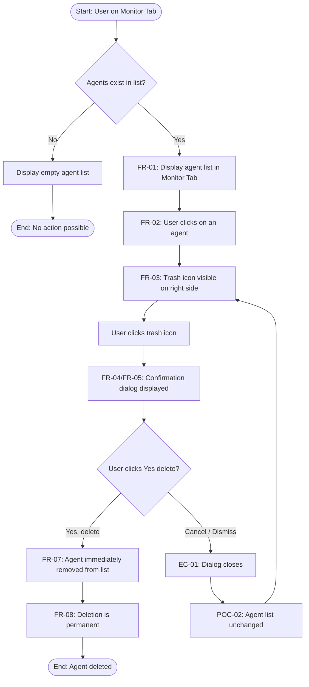
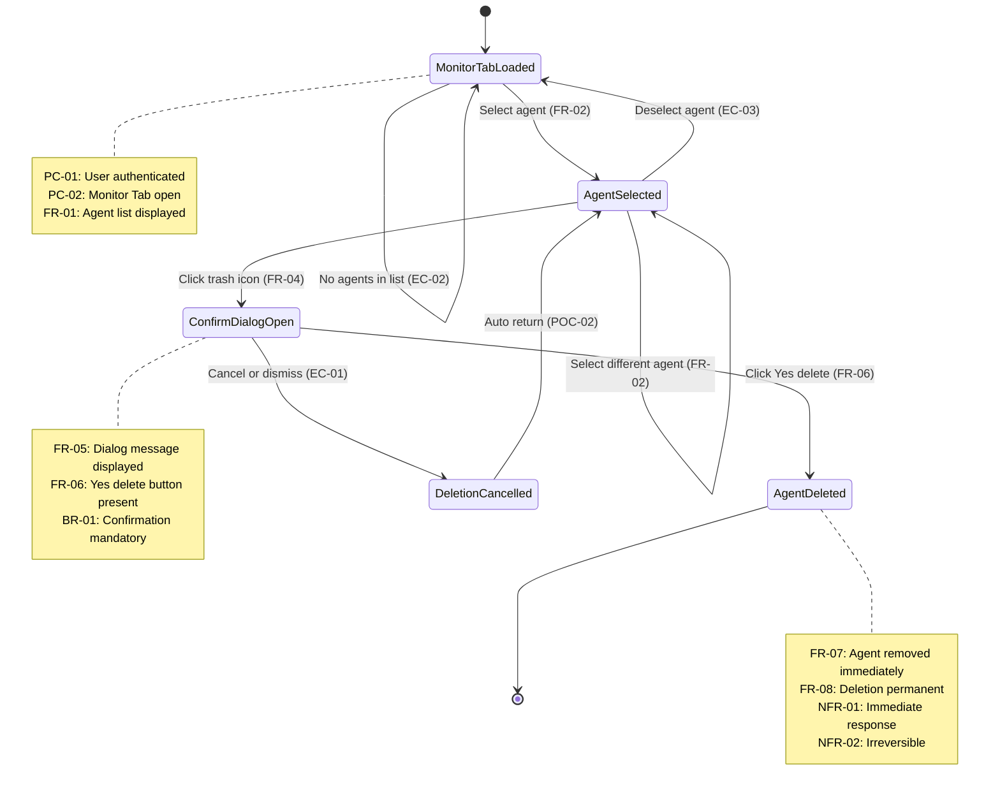

# Structured Representation: Delete Agent Feature

## Section 1: Requirements Reference

All requirements are copied verbatim from the approved plan without omission or alteration.

### Functional Requirements

| ID    | Requirement                                                                                     | Source Reference            |
|-------|-------------------------------------------------------------------------------------------------|-----------------------------|
| FR-01 | The system shall display a list of agents in the Monitor Tab of the AutoGPT builder             | Steps to Delete, Step 1     |
| FR-02 | The user shall be able to select (click on) an agent from the list                              | Steps to Delete, Step 2     |
| FR-03 | A trash icon shall be visible on the right side of the interface when an agent is selected       | Steps to Delete, Step 3     |
| FR-04 | Clicking the trash icon shall display a confirmation dialog                                     | Steps to Delete, Step 3     |
| FR-05 | The confirmation dialog shall display the message "Are you sure you want to delete this agent?" | Steps to Delete, Step 3     |
| FR-06 | The confirmation dialog shall provide a "Yes, delete" button to confirm deletion                | Steps to Delete, Step 3     |
| FR-07 | Upon confirmation, the agent shall be immediately removed from the list                         | Post-steps paragraph        |
| FR-08 | The deletion action shall be permanent and cannot be undone                                     | Note section                |

### Non-Functional Requirements

| ID     | Requirement                                                        | Source Reference     |
|--------|--------------------------------------------------------------------|----------------------|
| NFR-01 | Agent removal shall be immediate upon confirmation (responsiveness)| Post-steps paragraph |
| NFR-02 | The deletion operation is irreversible (data permanence)           | Note section         |

### Business Rules and Constraints

| ID    | Rule / Constraint                                                                  | Source Reference        |
|-------|------------------------------------------------------------------------------------|-------------------------|
| BR-01 | A confirmation step is mandatory before an agent can be deleted                    | Steps to Delete, Step 3 |
| BR-02 | Deletion is permanent — the user must be certain before confirming                 | Note section            |

### Preconditions

| ID    | Precondition                                                |
|-------|-------------------------------------------------------------|
| PC-01 | User is authenticated and logged into the AutoGPT platform  |
| PC-02 | User has navigated to the Monitor Tab                       |
| PC-03 | At least one agent exists in the agent list                 |

### Postconditions

| ID     | Postcondition                                                              |
|--------|----------------------------------------------------------------------------|
| POC-01 | (Success) The agent is permanently removed from the agent list             |
| POC-02 | (Cancel) The agent list remains unchanged; the agent is still present      |

### Edge Cases

| ID    | Edge Case                                                                         | Basis                                            |
|-------|-----------------------------------------------------------------------------------|--------------------------------------------------|
| EC-01 | User cancels/dismisses the confirmation dialog (does not click "Yes, delete")     | Implied by confirmation dialog pattern            |
| EC-02 | No agents exist in the Monitor Tab list                                           | Implied — nothing to delete                       |
| EC-03 | Trash icon not visible until an agent is selected                                 | Implied by "Look for the trash icon" after select |
| EC-04 | Concurrent deletion — agent deleted while dialog is open (race condition)         | Inferred from real-time system behavior           |

### Actors

| Actor         | Type    | Description                                           |
|---------------|---------|-------------------------------------------------------|
| User          | Primary | The person interacting with the AutoGPT builder UI    |
| System (UI)   | System  | The AutoGPT builder's Monitor Tab and its components  |

---

## Section 2: Logical Model

### 2.1 States

| State ID | State Name           | Description                                                       |
|----------|----------------------|-------------------------------------------------------------------|
| S0       | MonitorTabLoaded     | Monitor Tab is open showing the list of agents                    |
| S1       | AgentSelected        | An agent has been clicked/selected; trash icon is visible         |
| S2       | ConfirmDialogOpen    | Confirmation dialog is displayed after clicking the trash icon    |
| S3       | AgentDeleted         | Agent has been removed from the list (terminal state)             |
| S4       | DeletionCancelled    | User dismissed/cancelled the confirmation dialog; returns to S1   |

### 2.2 Inputs (Events)

| Input ID | Input Name             | Description                                           | Applicable States |
|----------|------------------------|-------------------------------------------------------|-------------------|
| I1       | SelectAgent            | User clicks on an agent from the list                 | S0                |
| I2       | ClickTrashIcon         | User clicks the trash icon                            | S1                |
| I3       | ConfirmDeletion        | User clicks "Yes, delete" in the confirmation dialog  | S2                |
| I4       | CancelDialog           | User cancels or dismisses the confirmation dialog     | S2                |
| I5       | NoAgentsAvailable      | Agent list is empty (no selectable agent)             | S0                |
| I6       | SelectDifferentAgent   | User clicks on a different agent                      | S1                |
| I7       | DeselectAgent          | User deselects the current agent                      | S1                |

### 2.3 Outputs (System Responses)

| Output ID | Output Name                  | Description                                                              |
|-----------|------------------------------|--------------------------------------------------------------------------|
| O1        | DisplayAgentList             | System displays agent list in Monitor Tab                                |
| O2        | HighlightAgentShowTrash      | System highlights selected agent and shows trash icon on the right side  |
| O3        | DisplayConfirmDialog         | System shows dialog: "Are you sure you want to delete this agent?"       |
| O4        | RemoveAgentFromList          | System immediately and permanently removes the agent from the list       |
| O5        | CloseDialogPreserveList      | System closes dialog; agent list remains unchanged                       |
| O6        | DisplayEmptyList             | System displays empty agent list (no agents available)                   |
| O7        | HideTrashIcon                | System hides trash icon (no agent selected)                              |
| O8        | UpdateHighlight              | System updates highlight to newly selected agent                         |

---

## Section 3: Primary Representation — State Transition Table

Each row represents a unique (CurrentState, Input) pair and maps directly to one test case.

### 3.1 Valid Transitions

| STT ID | Current State          | Input (Event)          | Guard / Condition                    | Next State             | Output / System Response                                                                  | Requirement Trace                |
|--------|------------------------|------------------------|--------------------------------------|------------------------|-------------------------------------------------------------------------------------------|----------------------------------|
| STT-01 | S0: MonitorTabLoaded   | I1: SelectAgent        | At least one agent exists (PC-03)    | S1: AgentSelected      | O2: Agent highlighted; trash icon visible on right side                                   | FR-01, FR-02, FR-03             |
| STT-02 | S0: MonitorTabLoaded   | I5: NoAgentsAvailable  | Agent list is empty                  | S0: MonitorTabLoaded   | O6: Empty agent list displayed; no action possible                                        | EC-02                            |
| STT-03 | S1: AgentSelected      | I2: ClickTrashIcon     | Trash icon is visible (FR-03)        | S2: ConfirmDialogOpen  | O3: Confirmation dialog displayed with message and "Yes, delete" button                   | FR-03, FR-04, FR-05, FR-06, BR-01 |
| STT-04 | S1: AgentSelected      | I6: SelectDifferentAgent | Another agent exists in list       | S1: AgentSelected      | O8: Previous agent deselected; new agent highlighted; trash icon remains visible          | FR-02, FR-03                     |
| STT-05 | S1: AgentSelected      | I7: DeselectAgent      | User clicks elsewhere / deselects    | S0: MonitorTabLoaded   | O7: Trash icon hidden; no agent highlighted                                               | EC-03                            |
| STT-06 | S2: ConfirmDialogOpen  | I3: ConfirmDeletion    | User clicks "Yes, delete"           | S3: AgentDeleted       | O4: Agent immediately and permanently removed from list                                   | FR-06, FR-07, FR-08, NFR-01, NFR-02, BR-02 |
| STT-07 | S2: ConfirmDialogOpen  | I4: CancelDialog       | User cancels or dismisses dialog     | S4: DeletionCancelled  | O5: Dialog closes; agent list unchanged; agent still present                              | EC-01, POC-02, BR-01            |
| STT-08 | S4: DeletionCancelled  | (automatic)            | Dialog closed, return to prior state | S1: AgentSelected      | O2: Agent remains highlighted; trash icon still visible                                   | POC-02                           |

### 3.2 Invalid / Unexpected Transitions

| STT ID | Current State          | Input (Event)          | Guard / Condition                      | Next State              | Expected Behavior                                                               | Requirement Trace |
|--------|------------------------|------------------------|----------------------------------------|-------------------------|---------------------------------------------------------------------------------|-------------------|
| STT-09 | S0: MonitorTabLoaded   | I2: ClickTrashIcon     | Trash icon not visible (no selection)  | S0: MonitorTabLoaded    | No action; trash icon is not rendered until agent is selected                    | EC-03             |
| STT-10 | S0: MonitorTabLoaded   | I3: ConfirmDeletion    | No dialog is open                      | S0: MonitorTabLoaded    | No action; input is not possible in this state                                  | BR-01             |
| STT-11 | S0: MonitorTabLoaded   | I4: CancelDialog       | No dialog is open                      | S0: MonitorTabLoaded    | No action; input is not possible in this state                                  | BR-01             |
| STT-12 | S1: AgentSelected      | I3: ConfirmDeletion    | No dialog is open                      | S1: AgentSelected       | No action; confirmation button does not exist outside dialog                    | BR-01             |
| STT-13 | S1: AgentSelected      | I4: CancelDialog       | No dialog is open                      | S1: AgentSelected       | No action; cancel action not applicable outside dialog                          | BR-01             |
| STT-14 | S2: ConfirmDialogOpen  | I1: SelectAgent        | Dialog is modal / blocks interaction   | S2: ConfirmDialogOpen   | No action; dialog must be resolved before interacting with list                 | BR-01             |
| STT-15 | S2: ConfirmDialogOpen  | I2: ClickTrashIcon     | Dialog is modal / blocks interaction   | S2: ConfirmDialogOpen   | No action; dialog must be resolved first                                        | BR-01             |
| STT-16 | S3: AgentDeleted       | Any input              | Terminal state                         | S3: AgentDeleted        | No further transitions; workflow has completed                                  | FR-08, NFR-02     |
| STT-17 | S2: ConfirmDialogOpen  | (external) Agent deleted concurrently | Race condition       | Undefined               | Edge case: system should handle gracefully (e.g., close dialog, refresh list)   | EC-04             |

### 3.3 State Transition Summary Matrix

This matrix provides a compact overview of all state-input combinations. Each cell shows the resulting next state or N/A if the input is not applicable.

|                        | I1: SelectAgent | I2: ClickTrashIcon | I3: ConfirmDeletion | I4: CancelDialog | I5: NoAgentsAvailable | I6: SelectDifferentAgent | I7: DeselectAgent |
|------------------------|-----------------|---------------------|---------------------|-------------------|-----------------------|--------------------------|-------------------|
| **S0: MonitorTabLoaded**  | S1              | N/A (STT-09)       | N/A (STT-10)       | N/A (STT-11)     | S0                    | N/A                     | N/A               |
| **S1: AgentSelected**     | N/A             | S2                   | N/A (STT-12)       | N/A (STT-13)     | N/A                   | S1                       | S0                |
| **S2: ConfirmDialogOpen** | N/A (STT-14)   | N/A (STT-15)        | S3                  | S4                | N/A                   | N/A (STT-14)            | N/A (STT-14)      |
| **S3: AgentDeleted**      | N/A (STT-16)   | N/A (STT-16)        | N/A (STT-16)       | N/A (STT-16)     | N/A (STT-16)          | N/A (STT-16)            | N/A (STT-16)      |
| **S4: DeletionCancelled** | auto → S1      | auto → S1           | auto → S1          | auto → S1        | auto → S1             | auto → S1               | auto → S1         |

---

## Section 4: Supplementary Representations — Mermaid Diagrams

### 4.1 Flowchart — Delete Agent Workflow

**Scope**: Complete delete-agent workflow from Monitor Tab entry to either successful deletion or cancellation, including the empty-list edge case.



### 4.2 Sequence Diagram — Delete Agent Interactions

**Scope**: Temporal sequence of interactions between User, Monitor Tab UI, Confirmation Dialog, and Backend for the delete-agent operation, covering both confirm and cancel paths.

```mermaid
sequenceDiagram
    actor User
    participant MT as Monitor Tab
    participant DLG as Confirmation Dialog
    participant BE as Backend

    Note over User,MT: PC-01: User authenticated<br/>PC-02: On Monitor Tab

    User->>MT: Navigate to Monitor Tab
    MT-->>User: FR-01: Display agent list

    User->>MT: FR-02: Click on agent (select)
    activate MT
    MT-->>User: FR-03: Highlight agent, show trash icon
    deactivate MT

    User->>MT: Click trash icon
    activate MT
    MT->>DLG: FR-04: Open confirmation dialog
    deactivate MT
    activate DLG
    DLG-->>User: FR-05: Are you sure you want to delete this agent?

    alt FR-06: User confirms deletion
        User->>DLG: Click Yes, delete
        DLG->>BE: Send delete request
        deactivate DLG
        activate BE
        BE-->>MT: Confirm deletion success
        deactivate BE
        activate MT
        MT-->>User: FR-07/NFR-01: Remove agent from list immediately
        deactivate MT
        Note over User,BE: FR-08/NFR-02: Deletion is permanent
    else EC-01: User cancels
        User->>DLG: Cancel / Dismiss dialog
        deactivate DLG
        DLG-->>MT: Close dialog
        MT-->>User: POC-02: Agent list unchanged
    end
```

### 4.3 State Diagram — Delete Agent States

**Scope**: All UI states and valid transitions for the delete-agent feature, serving as the visual equivalent of the State Transition Table (Section 3).



---

## Section 5: Requirement Traceability

This matrix maps every requirement to the STT rows and diagram elements that cover it.

| Requirement ID | Description (abbreviated)                          | STT Coverage                     | Flowchart Node       | Sequence Diagram Step          | State Diagram Element         |
|----------------|-----------------------------------------------------|----------------------------------|-----------------------|--------------------------------|-------------------------------|
| FR-01          | Display agent list in Monitor Tab                   | STT-01                           | DisplayList           | MT displays agent list         | S0 note                      |
| FR-02          | User can select an agent                            | STT-01, STT-04                   | SelectAgent           | User clicks on agent           | S0 → S1, S1 → S1            |
| FR-03          | Trash icon visible when agent selected              | STT-01, STT-03, STT-09          | ShowTrash             | MT shows trash icon            | S1 state                     |
| FR-04          | Clicking trash icon displays confirmation dialog    | STT-03                           | ShowDialog            | MT opens dialog                | S1 → S2                      |
| FR-05          | Dialog shows confirmation message                   | STT-03                           | ShowDialog            | DLG displays message           | S2 note                      |
| FR-06          | Dialog provides "Yes, delete" button                | STT-06                           | Confirm               | User clicks Yes, delete        | S2 → S3, S2 note             |
| FR-07          | Agent immediately removed upon confirmation         | STT-06                           | DeleteAgent           | MT removes agent               | S3 note                      |
| FR-08          | Deletion is permanent and irreversible              | STT-06, STT-16                   | Permanent             | Note: Deletion permanent       | S3 note                      |
| NFR-01         | Agent removal immediate                             | STT-06                           | DeleteAgent           | MT removes immediately         | S3 note                      |
| NFR-02         | Deletion irreversible                               | STT-06, STT-16                   | Permanent             | Note: Deletion permanent       | S3 note                      |
| BR-01          | Confirmation mandatory before deletion              | STT-03, STT-07, STT-10–15       | ShowDialog, Confirm   | DLG step required              | S2 note                      |
| BR-02          | User must be certain before confirming              | STT-06                           | Permanent             | Note: Deletion permanent       | S3 note                      |
| PC-01          | User authenticated                                  | All (implicit precondition)      | Start                 | Note: User authenticated       | S0 note                      |
| PC-02          | User on Monitor Tab                                 | All (implicit precondition)      | Start                 | Note: On Monitor Tab           | S0 note                      |
| PC-03          | At least one agent exists                           | STT-01 (guard)                   | CheckList             | Implicit                       | S0 → S1 guard                |
| POC-01         | Agent permanently removed                           | STT-06                           | EndSuccess            | MT removes agent               | S3                            |
| POC-02         | Agent list unchanged on cancel                      | STT-07, STT-08                   | Unchanged             | MT agent list unchanged        | S4 → S1                      |
| EC-01          | User cancels/dismisses dialog                       | STT-07                           | CancelAction          | User cancels                   | S2 → S4                      |
| EC-02          | No agents in list                                   | STT-02                           | EmptyList             | Not covered (precondition)     | S0 → S0                      |
| EC-03          | Trash icon not visible until agent selected         | STT-05, STT-09                   | ShowTrash (conditional)| Implicit                      | S1 → S0                      |
| EC-04          | Concurrent deletion race condition                  | STT-17                           | Not covered (OOS)     | Not covered (OOS)              | Not covered (OOS)            |

---

## Section 6: Metadata

| Field                | Value                                              |
|----------------------|----------------------------------------------------|
| **Model**            | Claude Opus 4.6 (GitHub Copilot)                  |
| **Date**             | 2025-02-23                                         |
| **Time**             | Generated at task execution time                   |
| **Feature Analyzed** | Delete Agent (AutoGPT Platform)                    |
| **Source Document**  | `docs/content/platform/delete-agent.md`            |
| **Approved Plan**    | `plan/delete-agent-representation-plan.md`         |
| **Output File**      | `representation/delete-agent-representation.md`    |
| **Primary Rep.**     | State Transition Table (17 rows)                   |
| **Supplementary**    | Flowchart, Sequence Diagram, State Diagram (Mermaid) |
