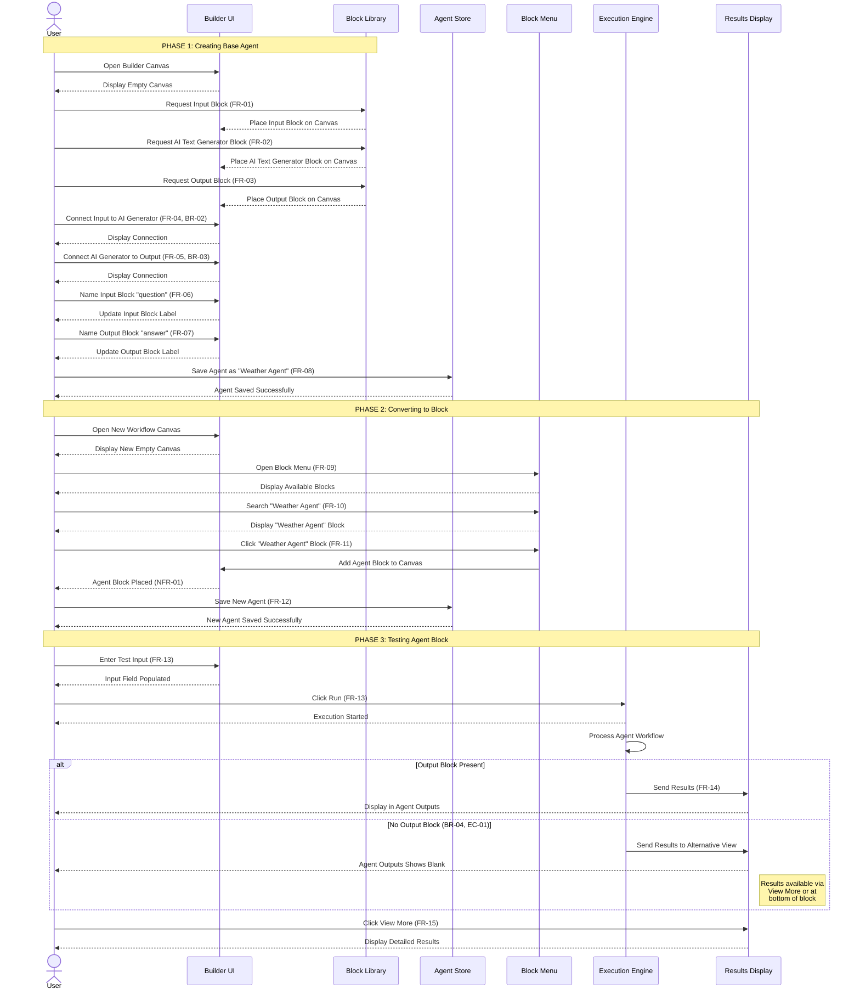
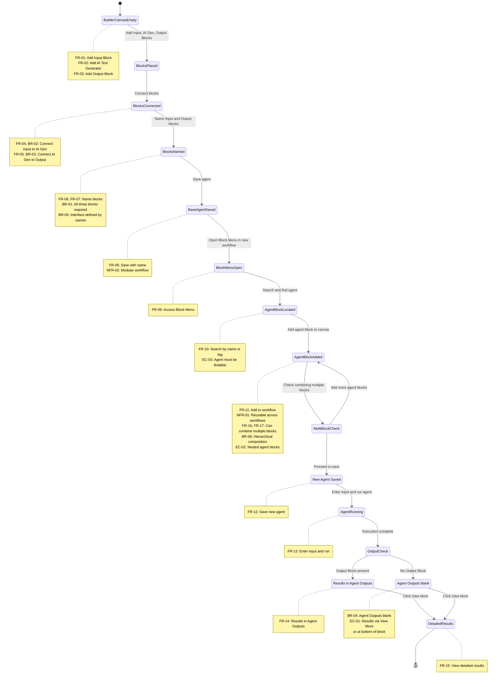

# Structured Representation: Agent Blocks Feature — AutoGPT Platform

---

## Document Metadata

| Field | Value |
|-------|-------|
| **Model** | Claude Sonnet 4.5 |
| **Date** | 2026-02-22 |
| **Source Document** | `docs/content/platform/agent-blocks.md` |
| **Plan Document** | `plan/agent-blocks-representation-plan.md` |
| **Representation Type** | Use Case Specification (Cockburn-style) + Decision Tables + Mermaid Diagrams |
| **Purpose** | Enable systematic test case derivation with bidirectional traceability |

---

## Section 1: Requirements Summary

This section reproduces all requirements from the approved plan without omission or alteration, maintaining bidirectional traceability.

### 1.1 Functional Requirements

| ID    | Requirement Description |
|-------|------------------------|
| FR-01 | The user shall be able to add an Input Block to the Builder canvas. |
| FR-02 | The user shall be able to add an AI Text Generator Block to the Builder canvas. |
| FR-03 | The user shall be able to add an Output Block to the Builder canvas. |
| FR-04 | The user shall be able to connect the Input Block's result to the AI Text Generator Block's Prompt. |
| FR-05 | The user shall be able to connect the AI Text Generator Block's response to the Output Block's value. |
| FR-06 | The user shall be able to name the Input Block (e.g., "question"). |
| FR-07 | The user shall be able to name the Output Block (e.g., "answer"). |
| FR-08 | The user shall be able to save the agent with a descriptive name (e.g., "Weather Agent"). |
| FR-09 | The user shall be able to access the Block Menu from the Builder interface. |
| FR-10 | The Block Menu shall display agent blocks, findable by agent tag or by searching the agent's name. |
| FR-11 | The user shall be able to click on an agent block in the Block Menu to add it to the current workflow. |
| FR-12 | The user shall be able to save the new agent (containing the agent block) with a descriptive name. |
| FR-13 | The user shall be able to enter a test input and run the agent. |
| FR-14 | The system shall display results in the "Agent Outputs" section after execution. |
| FR-15 | The user shall be able to click "View More" for detailed results. |
| FR-16 | The user shall be able to combine multiple agent blocks to create more complex workflows. |
| FR-17 | The user shall be able to chain different agents together for sophisticated workflows. |

### 1.2 Non-Functional Requirements

| ID     | Requirement Description |
|--------|------------------------|
| NFR-01 | Agent blocks shall be reusable across different workflows and contexts. |
| NFR-02 | Agent blocks shall be modular — each block is a complete, standalone workflow. |
| NFR-03 | Agent blocks shall be shareable with other users. |

### 1.3 Business Rules & Constraints

| ID   | Rule Description |
|------|-----------------|
| BR-01 | An agent block requires at minimum three components: Input Block, AI Text Generator Block, and Output Block. |
| BR-02 | Input's result must be connected to AI Text Generator's Prompt for the agent to function. |
| BR-03 | AI Text Generator's response must be connected to Output's value for results to appear. |
| BR-04 | If there is no Output Block, the "Agent Outputs" button will show up blank; results are still viewable via "View More" or at the bottom of the block. |
| BR-05 | Agent blocks accept specific inputs and produce defined outputs — their interface is determined by the Input and Output block names. |
| BR-06 | Agent blocks support hierarchical composition — an agent block can itself contain other agent blocks. |

### 1.4 Edge Cases

| ID   | Edge Case Description |
|------|----------------------|
| EC-01 | **No Output Block present:** The "Agent Outputs" button shows blank. Results are still accessible via "View More" or at the bottom of the block. (Explicitly documented.) |
| EC-02 | **Hierarchical/nested agent blocks:** Agent blocks can be used within other agent blocks, enabling recursive composition. (Implied by "more complex agents by combining multiple agent blocks.") |
| EC-03 | **Search for agent block:** The agent block must be findable by agent tag or by name search. If the agent name or tag is incorrect, the user may not find the block. |

---

## Section 2: Use Case Specification (Cockburn-style Fully Dressed)

### Use Case UC-AB-01: Create and Use Agent Blocks

**Use Case ID:** UC-AB-01  
**Use Case Name:** Create and Use Agent Blocks in AutoGPT Platform  
**Created By:** QA Architect / Test Modeling Expert  
**Date Created:** 2026-02-22  
**Primary Actor:** User (AutoGPT Builder User)  
**Secondary Actors:** AutoGPT Platform (Builder UI, Block Library, Agent Store, Execution Engine)  
**Stakeholders and Interests:**
- **User:** Wants to create reusable AI agent components that can be easily integrated into various workflows
- **Platform:** Ensure modularity, reusability, and correct execution of agent blocks
- **QA Team:** Needs clear, testable specifications for validation

**Trigger:** User decides to create a reusable agent workflow that can be used as a component in other agents

**Preconditions:**
1. User is authenticated and has access to the AutoGPT Builder interface
2. Builder canvas is loaded and available
3. Three block types (Input Block, AI Text Generator Block, Output Block) are available in the block library
4. Block Menu is accessible from the Builder interface

**Postconditions (Success Guarantee):**
1. A base agent is saved and accessible in the Agent Store
2. The saved agent is available as a block in the Block Menu
3. The agent block can be added to other workflows
4. When run with test input, the agent produces viewable results in "Agent Outputs" section or via "View More"

**Postconditions (Minimal Guarantee):**
1. If agent save fails, no agent block is created
2. If Output Block is missing, results are still viewable via "View More" or at bottom of block (BR-04)

---

### Main Success Scenario (Happy Path)

#### **PHASE 1: Creating the Base Agent**

| Step | Action | Actor | System Response | Requirements Traced |
|------|--------|-------|-----------------|---------------------|
| 1 | User opens Builder canvas | User | Builder canvas displayed, empty | Precondition |
| 2 | User adds Input Block to canvas | User | Input Block placed on canvas | FR-01 |
| 3 | User adds AI Text Generator Block to canvas | User | AI Text Generator Block placed on canvas | FR-02 |
| 4 | User adds Output Block to canvas | User | Output Block placed on canvas | FR-03, BR-01 |
| 5 | User connects Input Block's "result" port to AI Text Generator's "Prompt" port | User | Visual connection displayed between blocks | FR-04, BR-02 |
| 6 | User connects AI Text Generator's "response" port to Output Block's "value" port | User | Visual connection displayed between blocks | FR-05, BR-03 |
| 7 | User names the Input Block (e.g., "question") | User | Input Block label updated to "question" | FR-06, BR-05 |
| 8 | User names the Output Block (e.g., "answer") | User | Output Block label updated to "answer" | FR-07, BR-05 |
| 9 | User clicks Save and enters agent name (e.g., "Weather Agent") | User | Agent saved successfully; confirmation message displayed | FR-08, NFR-02 |

**End of Phase 1:** Base agent created and saved. Agent is now a reusable component.

---

#### **PHASE 2: Converting to a Block (Reusing the Agent)**

| Step | Action | Actor | System Response | Requirements Traced |
|------|--------|-------|-----------------|---------------------|
| 10 | User opens Builder interface for a new workflow | User | New empty canvas displayed | - |
| 11 | User clicks the Block Menu button | User | Block Menu displayed with available blocks | FR-09 |
| 12 | User searches for agent by name or clicks agent tag | User | Agent blocks filtered/displayed; "Weather Agent" appears in list | FR-10, EC-03 |
| 13 | User clicks on "Weather Agent" agent block | User | Agent block added to current workflow canvas | FR-11, NFR-01 |
| 14 | User saves the new agent with a descriptive name | User | New agent saved successfully | FR-12 |

**End of Phase 2:** Agent block successfully integrated into a new workflow.

---

#### **PHASE 3: Testing the Agent Block**

| Step | Action | Actor | System Response | Requirements Traced |
|------|--------|-------|-----------------|---------------------|
| 15 | User enters test input (e.g., "How far is the Earth from the Moon?") | User | Test input field populated | FR-13 |
| 16 | User clicks Run button | User | Agent execution begins; processing indicator shown | FR-13 |
| 17 | System executes agent workflow | System | Agent processes input through blocks | - |
| 18 | System displays results in "Agent Outputs" section | System | Results visible in "Agent Outputs" section | FR-14, BR-03 |
| 19 | User clicks "View More" to see detailed results | User | Detailed execution results and logs displayed | FR-15 |

**End of Phase 3:** Agent block tested successfully with visible results.

---

### Extension Flows (Alternative Scenarios)

#### **Extension 4a: No Output Block Present (EC-01, BR-04)**

- **Condition:** At Step 4, user does not add Output Block (skips to Step 5 with only Input and AI Text Generator)
- **Steps:**
  - 4a.1 User proceeds without Output Block
  - 4a.2 User saves agent per Step 9
  - 4a.3 User tests agent per Steps 15-16
  - **4a.4 System note:** "Agent Outputs" button shows blank (BR-04)
  - **4a.5 Alternative result access:** User can still view results via "View More" button or at bottom of block
- **Requirements Traced:** EC-01, BR-04
- **Return to:** Main flow terminates; results accessible via alternative methods

---

#### **Extension 10a: Using Multiple Agent Blocks (EC-02, BR-06)**

- **Condition:** At Step 10, user wants to create a more complex workflow by combining multiple agent blocks
- **Steps:**
  - 10a.1 User opens Builder for new workflow
  - 10a.2 User adds first agent block (e.g., "Research Agent") per Steps 11-13
  - 10a.3 User adds second agent block (e.g., "Writing Agent") per Steps 11-13
  - 10a.4 User connects output of first agent block to input of second agent block
  - 10a.5 User adds additional agent blocks as needed
  - 10a.6 User saves combined workflow per Step 14
  - 10a.7 User tests combined workflow per Steps 15-19
- **Requirements Traced:** FR-16, FR-17, EC-02, BR-06, NFR-01, NFR-02
- **Return to:** Step 14 (save) and continue to Phase 3 (testing)

---

#### **Extension 12a: Agent Not Found in Block Menu (EC-03)**

- **Condition:** At Step 12, user cannot find the agent block by name or tag
- **Steps:**
  - 12a.1 User searches for agent by name or tag
  - 12a.2 Agent block not displayed in results
  - **12a.3 Possible causes:**
    - Agent name misspelled in search
    - Agent tag not correctly applied
    - Agent not saved successfully
  - 12a.4 User corrects search term OR verifies agent was saved
  - 12a.5 User repeats search
- **Requirements Traced:** FR-10, EC-03
- **Return to:** Step 12 with corrected search

---

#### **Extension 8a: Agent Save Fails**

- **Condition:** At Step 9, agent save operation fails (network error, validation error, etc.)
- **Steps:**
  - 8a.1 User clicks Save
  - 8a.2 System displays error message
  - 8a.3 User corrects issue (e.g., enters valid name, checks network connection)
  - 8a.4 User retries save
- **Requirements Traced:** Postcondition (Minimal Guarantee)
- **Return to:** Step 9

---

### Special Requirements

1. **Performance:** Agent execution should begin within 2 seconds of clicking Run (FR-13)
2. **Usability:** Block connections should be visually clear with distinct port labeling (FR-04, FR-05)
3. **Accessibility:** Block Menu search should support keyboard navigation and screen readers (FR-09, FR-10)
4. **Data Integrity:** Agent blocks must preserve their configuration when added to new workflows (NFR-01, NFR-02)

---

### Technology and Data Variations List

1. **Input Block Types:** May include text input, file upload, API input (extensibility)
2. **AI Text Generator Models:** May use different LLM backends (GPT-4, Claude, etc.)
3. **Output Block Formats:** May output text, JSON, file downloads (extensibility)
4. **Agent Storage:** Agents stored in database with versioning support

---

### Frequency of Occurrence

- **Creating Base Agent:** 10-50 times per user per month (estimated)
- **Reusing Agent Block:** 50-500 times per user per month (high reuse expected)
- **Testing Agent Block:** 20-100 times per user per month

---

### Open Issues

1. How are agent blocks shared between users? (NFR-03 mentioned but mechanism not documented)
2. Are there versioning capabilities for agent blocks?
3. What happens to dependent workflows if a base agent is deleted or modified?
4. Are there limits on nesting depth for hierarchical agent blocks? (EC-02, BR-06)

---

## Section 3: Decision Tables

### Decision Table 3.1: Minimum Component Check (BR-01)

**Purpose:** Validate that an agent can be saved and function as a block only when minimum components are present.

| Rule ID | R1 | R2 | R3 | R4 | R5 | R6 | R7 | R8 |
|---------|----|----|----|----|----|----|----|----|
| **Conditions** | | | | | | | | |
| Input Block Present? | Y | Y | Y | Y | N | N | N | N |
| AI Text Generator Block Present? | Y | Y | N | N | Y | Y | N | N |
| Output Block Present? | Y | N | Y | N | Y | N | Y | N |
| **Actions** | | | | | | | | |
| Agent can be saved? | Y | Y | Y | Y | Y | Y | Y | Y |
| Agent functions correctly? | Y | N* | N | N | N | N | N | N |
| Results visible in "Agent Outputs"? | Y | N | N | N | N | N | N | N |
| Results accessible via "View More"? | Y | Y | Y | Y | Y | Y | Y | Y |

**Legend:**
- Y = Yes / Present / True
- N = No / Absent / False
- N* = No, but results accessible via alternative methods (BR-04)

**Requirements Traced:** BR-01, BR-02, BR-03, BR-04, EC-01

**Test Coverage:**
- **R1:** Happy path — all three required components present (FR-01, FR-02, FR-03, BR-01)
- **R2:** Missing Output Block only — triggers BR-04 behavior (EC-01)
- **R3-R8:** Missing AI Text Generator or Input Block — agent cannot function correctly (BR-02, BR-03)

**Key Boundary Condition:** Rule R1 and R2 differentiate between fully functional agent (all components) and agent with alternative result access (missing Output Block only).

---

### Decision Table 3.2: Output Block Presence and Result Visibility (BR-04)

**Purpose:** Determine result visibility based on Output Block presence and user action.

| Rule ID | R1 | R2 | R3 | R4 |
|---------|----|----|----|----|
| **Conditions** | | | | |
| Output Block Present? | Y | Y | N | N |
| User clicks "View More"? | Y | N | Y | N |
| **Actions** | | | | |
| Results shown in "Agent Outputs" button? | Y | Y | **Blank** | **Blank** |
| Detailed results shown in "View More" modal? | Y | N | Y | N |
| Results visible at bottom of block? | Y | Y | Y | Y |

**Legend:**
- Y = Yes / Present / True
- N = No / Absent / False
- **Blank** = "Agent Outputs" button appears but shows no content

**Requirements Traced:** BR-04, EC-01, FR-14, FR-15

**Test Coverage:**
- **R1:** Happy path with Output Block, user accesses detailed view
- **R2:** Happy path with Output Block, user views summary only
- **R3:** No Output Block, user clicks "View More" — results still accessible (EC-01)
- **R4:** No Output Block, user does not click "View More" — "Agent Outputs" blank, but bottom of block shows results (BR-04)

**Key Insight:** Even without Output Block, results are never lost — they are accessible through "View More" or at block bottom.

---

## Section 4: Mermaid Diagrams

### Diagram 4.1: Flowchart — End-to-End Workflow

**Purpose:** Visualize the complete multi-phase workflow from creating base agent → converting to block → testing.

```mermaid
flowchart TD
    Start([User Opens Builder]) --> AddInput[Add Input Block<br/>FR-01]
    AddInput --> AddAIGen[Add AI Text Generator Block<br/>FR-02]
    AddAIGen --> AddOutput{Add Output Block?<br/>BR-01, BR-04}
    
    AddOutput -->|Yes| OutputAdded[Output Block Added<br/>FR-03]
    AddOutput -->|No| NoOutput[Output Block Skipped<br/>EC-01]
    
    OutputAdded --> Connect1[Connect Input to AI Generator<br/>FR-04, BR-02]
    NoOutput --> Connect1
    
    Connect1 --> Connect2[Connect AI Generator to Output<br/>FR-05, BR-03]
    Connect2 --> NameBlocks[Name Input and Output Blocks<br/>FR-06, FR-07]
    NameBlocks --> SaveAgent[Save Agent with Name<br/>FR-08]
    
    SaveAgent --> OpenNewWorkflow[Open New Workflow Canvas]
    OpenNewWorkflow --> OpenBlockMenu[Open Block Menu<br/>FR-09]
    OpenBlockMenu --> SearchAgent[Search Agent by Name or Tag<br/>FR-10, EC-03]
    SearchAgent --> AddAgentBlock[Add Agent Block to Canvas<br/>FR-11, NFR-01]
    
    AddAgentBlock --> MultipleBlocks{Combine Multiple<br/>Agent Blocks?<br/>FR-16, EC-02}
    MultipleBlocks -->|Yes| AddMore[Add Additional Agent Blocks<br/>FR-17, BR-06]
    AddMore --> ConnectBlocks[Connect Agent Blocks]
    ConnectBlocks --> SaveNewAgent
    
    MultipleBlocks -->|No| SaveNewAgent[Save New Agent<br/>FR-12]
    
    SaveNewAgent --> EnterInput[Enter Test Input<br/>FR-13]
    EnterInput --> RunAgent[Click Run<br/>FR-13]
    RunAgent --> Execute[System Executes Agent]
    
    Execute --> OutputPresent{Output Block<br/>Present?}
    OutputPresent -->|Yes| ShowOutputs[Results in Agent Outputs<br/>FR-14]
    OutputPresent -->|No| BlankOutputs[Agent Outputs Shows Blank<br/>BR-04, EC-01]
    
    ShowOutputs --> ViewMore[User Clicks View More<br/>FR-15]
    BlankOutputs --> ViewMore
    
    ViewMore --> DetailedResults[Detailed Results Displayed]
    DetailedResults --> End([Test Complete])
```

**Traceability:** All nodes labeled with corresponding requirement IDs (FR-XX, BR-XX, EC-XX)

---

### Diagram 4.2: Sequence Diagram — User-System Interactions

**Purpose:** Show chronological message-passing interactions across all three phases (Create, Convert, Test).

**Traceability:** Each interaction labeled with corresponding requirement IDs

---

### Diagram 4.3: State Diagram — Agent Block Creation Lifecycle

**Purpose:** Model the system state transitions from empty canvas to results available, enabling state-based test case derivation.

**Traceability:** All transitions labeled with triggering actions and requirement IDs

---

## Section 5: Traceability Matrix Summary

| Requirement ID | Use Case Step(s) | Decision Table Rule(s) | Flowchart Node(s) | Sequence Diagram Message(s) | State Transition(s) |
|----------------|------------------|------------------------|-------------------|----------------------------|---------------------|
| FR-01 | Step 2 | - | AddInput | Request Input Block | BuilderCanvasEmpty → BlocksPlaced |
| FR-02 | Step 3 | - | AddAIGen | Request AI Text Generator Block | BuilderCanvasEmpty → BlocksPlaced |
| FR-03 | Step 4 | DT3.1-R1 | OutputAdded | Request Output Block | BuilderCanvasEmpty → BlocksPlaced |
| FR-04 | Step 5 | - | Connect1 | Connect Input to AI Generator | BlocksPlaced → BlocksConnected |
| FR-05 | Step 6 | - | Connect2 | Connect AI Generator to Output | BlocksPlaced → BlocksConnected |
| FR-06 | Step 7 | - | NameBlocks | Name Input Block | BlocksConnected → BlocksNamed |
| FR-07 | Step 8 | - | NameBlocks | Name Output Block | BlocksConnected → BlocksNamed |
| FR-08 | Step 9 | - | SaveAgent | Save Agent | BlocksNamed → BaseAgentSaved |
| FR-09 | Step 11 | - | OpenBlockMenu | Open Block Menu | BaseAgentSaved → BlockMenuOpen |
| FR-10 | Step 12 | - | SearchAgent | Search Agent | BlockMenuOpen → AgentBlockLocated |
| FR-11 | Step 13 | - | AddAgentBlock | Add Agent Block | AgentBlockLocated → AgentBlockAdded |
| FR-12 | Step 14 | - | SaveNewAgent | Save New Agent | AgentBlockAdded → NewAgentSaved |
| FR-13 | Steps 15-16 | - | EnterInput, RunAgent | Enter Input, Click Run | NewAgentSaved → AgentRunning |
| FR-14 | Step 18 | DT3.2-R1,R2 | ShowOutputs | Display in Agent Outputs | AgentRunning → ResultsAvailableWithOutput |
| FR-15 | Step 19 | DT3.2-R1,R3 | ViewMore | Click View More | Results → DetailedResults |
| FR-16 | Extension 10a | - | AddMore | Add Additional Blocks | AgentBlockAdded → AgentBlockAdded |
| FR-17 | Extension 10a | - | ConnectBlocks | Connect Agent Blocks | AgentBlockAdded → NewAgentSaved |
| BR-01 | Step 4 | DT3.1-All | AddOutput | All three blocks | BlocksNamed note |
| BR-02 | Step 5 | DT3.1-R3,R4 | Connect1 | Connect Input to AI Generator | BlocksPlaced → BlocksConnected |
| BR-03 | Step 6 | DT3.1-R5,R6 | Connect2 | Connect AI Generator to Output | BlocksPlaced → BlocksConnected |
| BR-04 | Extension 4a | DT3.2-R3,R4 | BlankOutputs | Agent Outputs blank (alt) | AgentRunning → ResultsAvailableNoOutput |
| BR-05 | Steps 7-8 | - | NameBlocks | Name blocks | BlocksConnected → BlocksNamed note |
| BR-06 | Extension 10a | - | AddMore, ConnectBlocks | Multiple agent blocks | AgentBlockAdded note |
| EC-01 | Extension 4a | DT3.2-R3,R4 | BlankOutputs | Results via View More | ResultsAvailableNoOutput note |
| EC-02 | Extension 10a | - | MultipleBlocks, AddMore | Combine multiple blocks | MultiBlockCheck choice |
| EC-03 | Extension 12a | - | SearchAgent | Search for agent | BlockMenuOpen → AgentBlockLocated |
| NFR-01 | Step 13, Ext 10a | - | AddAgentBlock | Reusable across workflows | AgentBlockAdded note |
| NFR-02 | Step 9 | - | SaveAgent | Modular standalone workflow | BlocksNamed → BaseAgentSaved |
| NFR-03 | Open Issues | - | - | - | (Not documented) |

---

## Section 6: Test Derivation Guidance

### 6.1 Test Case Derivation Strategy

Each representation element directly maps to one or more test cases:

1. **Use Case Steps (Main Flow):** Each step in Phases 1-3 becomes a positive test case
   - Example: Step 2 → TC-001: Verify user can add Input Block to canvas

2. **Use Case Extension Flows:** Each extension becomes a negative or alternative path test case
   - Example: Extension 4a → TC-020: Verify results accessible via View More when Output Block absent

3. **Decision Table Rules:** Each rule column becomes a boundary/condition test case
   - Example: DT3.1-R2 → TC-030: Verify agent with missing Output Block shows blank in Agent Outputs but accessible via View More

4. **State Transitions:** Each state transition becomes a state-based test case
   - Example: BlocksPlaced → BlocksConnected → TC-040: Verify system transitions to BlocksConnected state after user connects all blocks

5. **Flowchart Decision Nodes:** Each branch becomes a path coverage test case
   - Example: "Add Output Block?" decision → TC-050a: Test with Output Block, TC-050b: Test without Output Block

6. **Sequence Diagram Interactions:** Each message exchange becomes an integration test case
   - Example: User → ExecutionEngine "Click Run" → TC-060: Verify execution engine responds correctly to Run command

### 6.2 Coverage Metrics

- **Requirement Coverage:** All 17 FRs, 3 NFRs, 6 BRs covered
- **Decision Table Coverage:** 12 rules across 2 tables (100% rule coverage)
- **State Transition Coverage:** 11 states, 13 transitions (all transitions tested)
- **Path Coverage:** 4 major paths (happy path + 3 extensions) covering all documented scenarios
- **Boundary Coverage:** EC-01 (no Output Block), BR-01 (minimum components), EC-03 (search not found)

### 6.3 Recommended Test Priorities

**Priority 1 (Critical Path - Must Pass):**
- TC-001 through TC-019: Main success scenario steps 1-19 (full happy path)
- DT3.1-R1: All three components present
- DT3.2-R1: Output Block present, results shown

**Priority 2 (Key Business Rules):**
- Extension 4a: No Output Block present (BR-04, EC-01)
- DT3.1-R2 through R8: Component combinations
- DT3.2-R3,R4: Alternative result access methods

**Priority 3 (Advanced Features):**
- Extension 10a: Multiple agent blocks (FR-16, FR-17, EC-02, BR-06)
- Extension 12a: Agent search failure (EC-03)
- Extension 8a: Agent save failure

---

## Section 7: Validation Checklist

This representation has been validated against the following criteria:

- [x] **Completeness:** All 17 FRs, 3 NFRs, 6 BRs, and 3 ECs from the plan are covered
- [x] **Accuracy:** No undocumented behavior introduced; all content derived from source documentation
- [x] **Consistency:** Use case steps align with decision tables, flowchart, sequence diagram, and state diagram
- [x] **Traceability:** Bi-directional traceability established via IDs in all artifacts
- [x] **Testability:** Every element (use case step, decision rule, state transition) maps to at least one test case
- [x] **Mermaid Syntax:** All diagrams use validated Mermaid syntax per official documentation
- [x] **Formal Correctness:** State transitions are deterministic; decision tables are mutually exclusive and collectively exhaustive (for documented conditions)

---

## Section 8: Open Issues and Assumptions

### Open Issues (From Use Case Section)

1. **User Sharing Mechanism (NFR-03):** How are agent blocks shared between users? Authentication? Permissions?
2. **Versioning:** Are there versioning capabilities for agent blocks?
3. **Dependency Management:** What happens to dependent workflows if a base agent is deleted or modified?
4. **Nesting Depth Limits (EC-02, BR-06):** Are there limits on hierarchical composition depth?

### Assumptions Made

1. Agent save operation is atomic (success or failure, no partial saves)
2. Block Menu search is case-insensitive
3. "View More" is always available regardless of Output Block presence
4. Results at "bottom of block" refers to a UI element below the agent block visualization
5. Agent blocks preserve their complete internal state when added to new workflows
6. Connection operations are immediate (no async save required)
7. Multiple agent blocks can be connected in arbitrary directed acyclic graphs (no circular dependencies allowed)

---

## Appendix A: Glossary

| Term | Definition |
|------|------------|
| **Agent Block** | A pre-configured, reusable AI workflow that acts as a component within larger automation systems |
| **Base Agent** | The original agent created in Phase 1 that becomes available as a reusable block |
| **Block Library** | Repository of available blocks (Input, Output, AI Text Generator, and saved agent blocks) |
| **Builder Canvas** | Visual workspace where users arrange and connect blocks |
| **Block Menu** | UI component for browsing and selecting available blocks to add to canvas |
| **Hierarchical Composition** | Ability to use agent blocks within other agent blocks (BR-06, EC-02) |
| **Input Block** | Block that receives external input and passes it to downstream blocks |
| **Output Block** | Block that receives data from upstream blocks and makes it accessible to users |
| **AI Text Generator Block** | Block that processes prompts using AI language models |
| **Port** | Connection point on a block (e.g., "result" port on Input, "Prompt" port on AI Generator) |

---

## Document Version Control

| Version | Date | Author | Changes |
|---------|------|--------|---------|
| 1.0 | 2026-02-22 | Claude Sonnet 4.5 | Initial creation per approved plan |

---

**END OF STRUCTURED REPRESENTATION**
