# Agent Creation Workflow - Activity Diagram

**Metadata:**
- Model: Claude Sonnet 4.5
- Date: February 22, 2026
- Source: create-basic-agent.md
- Plan: create-basic-agent-representation-plan.md
- Diagram Type: Activity Diagram (Flowchart)

---

## Purpose
Visualize the complete step-by-step process of creating and testing an agent in the AutoGPT platform, covering both Q&A Agent (with AI) and Calculator Agent (without AI) creation flows.

## Scope
- Agent type selection (Q&A vs Calculator)
- Block addition and configuration
- Block connection establishment
- Agent saving
- Agent execution and result viewing

## Key Entities
- User (Agent Creator)
- Visual Builder UI
- Block Components (Input, AI Text Generator, Calculator, Output)
- Execution Engine

---

## Agent Creation Workflow Diagram

```mermaid
flowchart TD
    Start([User Opens Visual Builder]) --> SelectType{Select Agent Type}
    
    SelectType -->|Q&A Agent| QA_Start[Q&A Agent Creation Flow]
    SelectType -->|Calculator Agent| Calc_Start[Calculator Agent Creation Flow]
    
    %% Q&A Agent Creation Flow
    QA_Start --> QA_AddInput[Add Input Block<br/>FR-QA-001]
    QA_AddInput --> QA_NameInput[Name Input Block as question<br/>FR-QA-006]
    QA_NameInput --> QA_AddAI[Add AI Text Generator Block<br/>FR-QA-002]
    QA_AddAI --> QA_NameAI[Name AI Block as answer<br/>FR-QA-006]
    QA_NameAI --> QA_AddOutput[Add Output Block<br/>FR-QA-003]
    QA_AddOutput --> QA_NameOutput[Name Output Block<br/>FR-QA-006]
    QA_NameOutput --> QA_Connect1[Connect question output to<br/>answer Prompt input<br/>FR-QA-004]
    QA_Connect1 --> QA_Connect2[Connect answer response to<br/>Output value<br/>FR-QA-005]
    QA_Connect2 --> QA_Validate{All Blocks<br/>Connected?<br/>BR-001}
    QA_Validate -->|No| QA_Error1[Display Connection Error]
    QA_Error1 --> QA_Connect1
    QA_Validate -->|Yes| QA_Save[Save Agent with Name<br/>FR-QA-007]
    QA_Save --> QA_NameCheck{Name<br/>Provided?<br/>BR-004}
    QA_NameCheck -->|No| QA_Error2[Display Name Required Error<br/>Edge-Case-2]
    QA_Error2 --> QA_Save
    QA_NameCheck -->|Yes| SavedState[Agent Saved Successfully]
    
    %% Calculator Agent Creation Flow
    Calc_Start --> Calc_AddInput1[Add Input Block for a<br/>FR-CALC-001]
    Calc_AddInput1 --> Calc_NameInput1[Name Input Block as a<br/>FR-CALC-006]
    Calc_NameInput1 --> Calc_AddInput2[Add Input Block for b<br/>FR-CALC-001]
    Calc_AddInput2 --> Calc_NameInput2[Name Input Block as b<br/>FR-CALC-006]
    Calc_NameInput2 --> Calc_AddCalc[Add Calculator Block<br/>FR-CALC-002]
    Calc_AddCalc --> Calc_SelectOp[Select Operation<br/>multiply/add/subtract/divide<br/>FR-CALC-007]
    Calc_SelectOp --> Calc_AddOutput[Add Output Block<br/>FR-CALC-003]
    Calc_AddOutput --> Calc_NameOutput[Name Output Block<br/>FR-CALC-006]
    Calc_NameOutput --> Calc_Connect1[Connect a output to<br/>Calculator operand1<br/>FR-CALC-004]
    Calc_Connect1 --> Calc_Connect2[Connect b output to<br/>Calculator operand2<br/>FR-CALC-004]
    Calc_Connect2 --> Calc_Connect3[Connect Calculator result to<br/>Output value<br/>FR-CALC-005]
    Calc_Connect3 --> Calc_Validate{All Blocks<br/>Connected?<br/>BR-001}
    Calc_Validate -->|No| Calc_Error1[Display Connection Error<br/>Edge-Case-8]
    Calc_Error1 --> Calc_Connect1
    Calc_Validate -->|Yes| Calc_Save[Save Agent with Name<br/>FR-CALC-007]
    Calc_Save --> Calc_NameCheck{Name<br/>Provided?}
    Calc_NameCheck -->|No| Calc_Error2[Display Name Required Error]
    Calc_Error2 --> Calc_Save
    Calc_NameCheck -->|Yes| SavedState
    
    %% Common Execution Flow
    SavedState --> RunDecision{Run Agent<br/>Now?}
    RunDecision -->|No| End1([End - Agent Saved])
    RunDecision -->|Yes| CheckSaved{Agent<br/>Saved?<br/>BR-004}
    CheckSaved -->|No| Error_NotSaved[Display Error<br/>Agent Must Be Saved<br/>Edge-Case-7]
    Error_NotSaved --> End2([End - Cannot Execute])
    CheckSaved -->|Yes| ExecutionStart[Start Agent Execution]
    
    ExecutionStart --> AgentType{Agent Type?}
    
    %% Q&A Execution
    AgentType -->|Q&A| QA_ProvideInput[Provide Question Input<br/>FR-QA-008]
    QA_ProvideInput --> QA_InputCheck{Input<br/>Provided?}
    QA_InputCheck -->|No| QA_InputError[Display Input Error<br/>or Use Empty<br/>Edge-Case-1]
    QA_InputError --> QA_ProvideInput
    QA_InputCheck -->|Yes| QA_CheckService{AI Service<br/>Available?}
    QA_CheckService -->|No| QA_ServiceError[Display Service Error<br/>Edge-Case-6]
    QA_ServiceError --> End3([End - Execution Failed])
    QA_CheckService -->|Yes| QA_Execute[Execute Agent<br/>Process through blocks]
    QA_Execute --> ViewResults
    
    %% Calculator Execution
    AgentType -->|Calculator| Calc_ProvideInputs[Provide Numeric Inputs<br/>a and b<br/>FR-CALC-008]
    Calc_ProvideInputs --> Calc_ValidateInputs{Inputs<br/>Numeric?}
    Calc_ValidateInputs -->|No| Calc_InputError[Display Non-Numeric Error<br/>Edge-Case-4]
    Calc_InputError --> Calc_ProvideInputs
    Calc_ValidateInputs -->|Yes| Calc_CheckOperation{Operation<br/>is Divide?}
    Calc_CheckOperation -->|No| Calc_Execute[Execute Calculation<br/>FR-CALC-008]
    Calc_CheckOperation -->|Yes| Calc_CheckZero{Divisor<br/>is Zero?}
    Calc_CheckZero -->|Yes| Calc_ZeroError[Display Division by Zero Error<br/>Edge-Case-5]
    Calc_ZeroError --> End4([End - Execution Failed])
    Calc_CheckZero -->|No| Calc_Execute
    Calc_Execute --> ViewResults
    
    %% View Results
    ViewResults[Agent Completed<br/>State: Completed] --> ViewOption{View Option?}
    ViewOption -->|View More| ViewMore[Display Results via View More<br/>FR-QA-009, FR-CALC-010]
    ViewOption -->|Agent Outputs| ViewOutputs[Display Results in Agent Outputs<br/>FR-QA-010, FR-CALC-009]
    ViewMore --> RunAgain{Run<br/>Again?}
    ViewOutputs --> RunAgain
    RunAgain -->|Yes| ExecutionStart
    RunAgain -->|No| End5([End - Session Complete])
    
    %% Styling
    classDef inputStyle fill:#e1f5ff,stroke:#01579b,stroke-width:2px
    classDef processStyle fill:#f3e5f5,stroke:#4a148c,stroke-width:2px
    classDef decisionStyle fill:#fff9c4,stroke:#f57f17,stroke-width:2px
    classDef errorStyle fill:#ffcdd2,stroke:#c62828,stroke-width:2px
    classDef successStyle fill:#c8e6c9,stroke:#2e7d32,stroke-width:2px
    
    class QA_AddInput,QA_AddAI,QA_AddOutput,Calc_AddInput1,Calc_AddInput2,Calc_AddCalc,Calc_AddOutput,QA_ProvideInput,Calc_ProvideInputs inputStyle
    class QA_NameInput,QA_NameAI,QA_NameOutput,Calc_NameInput1,Calc_NameInput2,Calc_NameOutput,Calc_SelectOp,QA_Execute,Calc_Execute processStyle
    class SelectType,QA_Validate,QA_NameCheck,Calc_Validate,Calc_NameCheck,RunDecision,CheckSaved,AgentType,QA_InputCheck,QA_CheckService,Calc_ValidateInputs,Calc_CheckOperation,Calc_CheckZero,ViewOption,RunAgain decisionStyle
    class QA_Error1,QA_Error2,Calc_Error1,Calc_Error2,Error_NotSaved,QA_InputError,QA_ServiceError,Calc_InputError,Calc_ZeroError errorStyle
    class SavedState,ViewResults successStyle
```



---

## Diagram Analysis

### Key Decision Points
1. **Agent Type Selection**: User chooses between Q&A or Calculator agent
2. **Connection Validation**: System checks if all blocks are properly connected (BR-001)
3. **Name Validation**: System ensures agent name is provided before saving (BR-004)
4. **Execution Readiness**: System verifies agent is saved before execution (BR-004)
5. **Input Validation**: System checks input validity (numeric for calculator, service availability for Q&A)

### Error Handling Points
- Missing block connections (Edge-Case-8)
- Missing agent name (Edge-Case-2)
- Unsaved agent execution attempt (Edge-Case-7)
- Missing or invalid inputs (Edge-Case-1, Edge-Case-4)
- Service unavailability (Edge-Case-6)
- Division by zero (Edge-Case-5)

### Data Flow Paths
**Q&A Agent Path:**
```
User Input (question) → AI Text Generator (Prompt) → AI Processing → 
AI Text Generator (response) → Output Block (value) → Display
```

**Calculator Agent Path:**
```
User Input (a, b) → Calculator (operand1, operand2) → Calculation → 
Calculator (result) → Output Block (value) → Display
```

### Traceability
All functional requirements (FR-QA-001 through FR-QA-010, FR-CALC-001 through FR-CALC-010) and business rules (BR-001, BR-004) are explicitly labeled in the diagram nodes.

---

## Notes
- The diagram uses decision diamonds (rhombus shapes) for all decision points
- Error paths are shown in red styling
- Success paths flow toward the "Saved" and "Completed" states
- The workflow supports iterative execution (Run Again loop)
- Both agent types converge at the execution and result viewing stages
