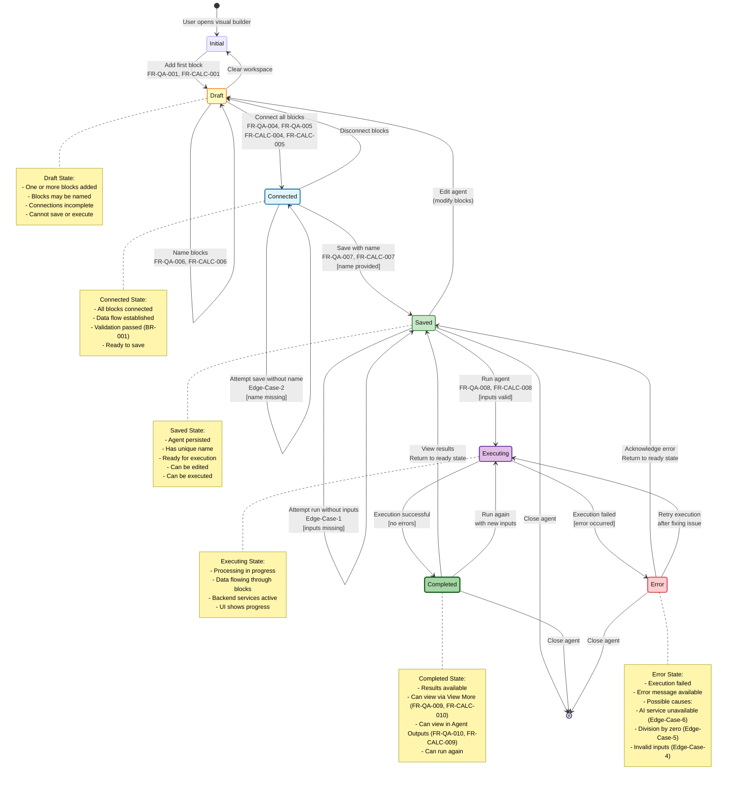

# Agent Lifecycle - State Diagram

**Metadata:**
- Model: Claude Sonnet 4.5
- Date: February 22, 2026
- Source: create-basic-agent.md
- Plan: create-basic-agent-representation-plan.md
- Diagram Type: State Diagram (stateDiagram-v2)

---

## Purpose
Model the different states an agent goes through from creation to execution, showing valid state transitions, triggers, and guards.

## Scope
- Agent lifecycle states from initial creation to execution completion
- State transitions based on user actions and system validations
- Valid and invalid state transitions
- Applies to both Q&A and Calculator agent types

## Key States
- **Initial**: Starting point when user opens visual builder
- **Draft**: Blocks added but not fully configured or connected
- **Connected**: Blocks properly connected but not saved
- **Saved**: Agent saved with name and ready for execution
- **Executing**: Agent currently running
- **Completed**: Execution finished successfully
- **Error**: Execution or validation failed

---

## Complete Agent Lifecycle State Diagram

---

## Detailed State Descriptions

### Initial State
**Description:** Starting point when user opens the visual builder  
**Entry Condition:** User navigates to visual builder  
**Exit Condition:** User adds first block  
**Available Actions:** Add blocks, close builder  

---

### Draft State
**Description:** Agent under construction with incomplete configuration  
**Entry Conditions:**
- First block added (from Initial)
- Blocks disconnected (from Connected)
- Agent edited (from Saved)

**Characteristics:**
- One or more blocks present in workspace
- Blocks may or may not be named
- Connections incomplete or missing
- Fails validation check (BR-001 not satisfied)

**Available Actions:**
- Add more blocks (FR-QA-001-003, FR-CALC-001-003)
- Name blocks (FR-QA-006, FR-CALC-006)
- Connect blocks
- Delete blocks
- Clear workspace

**Exit Conditions:**
- All blocks connected → Connected state
- Workspace cleared → Initial state

**Cannot:**
- Save agent (blocks not connected)
- Execute agent (not saved)

**Related Requirements:** FR-QA-001, FR-QA-002, FR-QA-003, FR-QA-006, FR-CALC-001, FR-CALC-002, FR-CALC-003, FR-CALC-006

---

### Connected State
**Description:** All blocks properly connected, awaiting save  
**Entry Conditions:**
- All required blocks connected (from Draft)
- Validation passed (BR-001)

**Characteristics:**
- All blocks have valid connections
- Data flow established (BR-005)
- Connection points properly linked (BR-006)
- Agent configuration complete
- No name assigned yet (or name exists from previous save)

**Available Actions:**
- Save agent with name (FR-QA-007, FR-CALC-007)
- Disconnect blocks (return to Draft)
- Modify connections

**Exit Conditions:**
- Save with valid name → Saved state
- Disconnect blocks → Draft state

**Validation Guards:**
- **[name provided]**: Allows transition to Saved
- **[name missing]**: Stays in Connected, shows error (Edge-Case-2)

**Cannot:**
- Execute agent (not saved per BR-004)

**Related Requirements:** FR-QA-004, FR-QA-005, FR-QA-007, FR-CALC-004, FR-CALC-005, FR-CALC-007, BR-001, BR-005, BR-006

---

### Saved State
**Description:** Agent persisted and ready for execution  
**Entry Conditions:**
- Valid name provided and agent saved (from Connected)
- Results viewed after execution (from Completed)
- Error acknowledged (from Error)

**Characteristics:**
- Agent has unique identifier (name)
- Configuration persisted to storage
- All blocks and connections preserved
- Ready for execution (BR-004 satisfied)
- Can be loaded and edited later

**Available Actions:**
- Run agent (FR-QA-008, FR-CALC-008)
- Edit agent (modify blocks/connections)
- Clone agent
- Delete agent
- Close agent

**Exit Conditions:**
- Run with valid inputs → Executing state
- Edit agent → Draft state
- Close → End state

**Validation Guards:**
- **[inputs valid]**: Allows transition to Executing
- **[inputs missing]**: Stays in Saved, shows prompt (Edge-Case-1)

**Cannot:**
- Execute without inputs (validation required)

**Related Requirements:** FR-QA-007, FR-QA-008, FR-CALC-007, FR-CALC-008, BR-004

---

### Executing State
**Description:** Agent currently processing inputs through blocks  
**Entry Conditions:**
- Run initiated from Saved state with valid inputs
- Retry after error (from Error)
- Run again after completion (from Completed)

**Characteristics:**
- Data flowing through connected blocks
- Backend services active (AI Service or Calculator Service)
- Progress indicators visible
- User cannot modify agent configuration
- Intermediate processing states active

**Processing Flow:**
- **Q&A Agent**: Input → AI Text Generator → Output
- **Calculator Agent**: Inputs (a, b) → Calculator → Output

**Exit Conditions:**
- Processing succeeds → Completed state
- Processing fails → Error state

**Cannot:**
- Edit agent (execution in progress)
- Change inputs (execution already started)
- Save configuration (busy processing)

**Related Requirements:** FR-QA-008, FR-CALC-008, BR-005, BR-006

---

### Completed State
**Description:** Execution finished successfully, results available  
**Entry Conditions:**
- Successful execution completion (from Executing)
- No errors during processing

**Characteristics:**
- Results stored in Output Block
- Agent state shows "Completed"
- Results ready for viewing
- Agent can be executed again

**Available Actions:**
- View results via "View More" (FR-QA-009, FR-CALC-010)
- View results in "Agent Outputs" (FR-QA-010, FR-CALC-009)
- Run again with new inputs
- Return to Saved state

**Exit Conditions:**
- Acknowledge results → Saved state
- Run again → Executing state
- Close → End state

**Results Display:**
- Q&A Agent: AI-generated text response
- Calculator Agent: Numeric calculation result

**Related Requirements:** FR-QA-009, FR-QA-010, FR-CALC-009, FR-CALC-010

---

### Error State
**Description:** Execution or validation failed, error information available  
**Entry Conditions:**
- Execution failed (from Executing)
- Validation failed during processing

**Error Categories:**

1. **Service Errors** (Edge-Case-6):
   - AI Text Generator service unavailable
   - Backend connectivity issues

2. **Validation Errors** (Edge-Case-4, Edge-Case-5):
   - Non-numeric input for Calculator
   - Division by zero

3. **Configuration Errors** (Edge-Case-8):
   - Incomplete connections discovered at runtime
   - Block configuration issues

**Characteristics:**
- Error message available to user
- Error details logged
- Agent configuration unchanged
- Can retry or return to Saved state

**Available Actions:**
- View error details
- Acknowledge error → Return to Saved
- Fix issue and retry → Executing
- Close agent

**Exit Conditions:**
- Acknowledge → Saved state
- Retry → Executing state
- Close → End state

**Related Requirements:** Edge-Case-1, Edge-Case-4, Edge-Case-5, Edge-Case-6, Edge-Case-8

---

## State Transition Summary Table

| From State | To State | Trigger | Guard/Condition | Requirements |
|-----------|----------|---------|----------------|--------------|
| [*] | Initial | User opens builder | - | - |
| Initial | Draft | Add first block | - | FR-QA-001, FR-CALC-001 |
| Draft | Draft | Add blocks, name blocks | - | FR-QA-002, FR-QA-003, FR-QA-006 |
| Draft | Connected | Connect all blocks | [all connected] | FR-QA-004, FR-QA-005, BR-001 |
| Draft | Initial | Clear workspace | - | - |
| Connected | Draft | Disconnect blocks | - | - |
| Connected | Saved | Save agent | [name provided] | FR-QA-007, BR-004 |
| Connected | Connected | Save without name | [name missing] | Edge-Case-2 |
| Saved | Draft | Edit agent | - | - |
| Saved | Executing | Run agent | [inputs valid] | FR-QA-008, FR-CALC-008 |
| Saved | Saved | Run without inputs | [inputs missing] | Edge-Case-1 |
| Executing | Completed | Processing done | [no errors] | - |
| Executing | Error | Processing failed | [error occurred] | Edge-Cases 4, 5, 6 |
| Completed | Saved | View results | - | FR-QA-009, FR-QA-010 |
| Completed | Executing | Run again | [new inputs] | - |
| Error | Saved | Acknowledge error | - | - |
| Error | Executing | Retry | [issue fixed] | - |
| Saved | [*] | Close agent | - | - |
| Completed | [*] | Close agent | - | - |
| Error | [*] | Close agent | - | - |

---

## State Validation Rules

### Entry Validations
- **Connected**: All required blocks connected (BR-001)
- **Saved**: Agent name provided and unique (BR-002, BR-003, BR-004)
- **Executing**: Agent saved and inputs provided
- **Completed**: Execution completed without errors
- **Error**: Exception or validation failure occurred

### Exit Validations
- **Draft → Connected**: Validate all connections exist
- **Connected → Saved**: Validate name provided
- **Saved → Executing**: Validate inputs provided
- **Executing → Completed**: Validate successful processing
- **Executing → Error**: Validate error handling

---

## Concurrent States
The state diagram represents a single agent instance. Multiple agents can exist simultaneously, each with independent state.

---

## State Persistence
- **Draft**: Workspace state (may be temporary)
- **Connected**: Workspace state (temporary)
- **Saved**: Persisted to database/storage
- **Executing**: Transient processing state
- **Completed**: Results persisted
- **Error**: Error logged, state transient

---

## Traceability

### Functional Requirements Coverage
- FR-QA-001 to FR-QA-010: Mapped to state transitions
- FR-CALC-001 to FR-CALC-010: Mapped to state transitions

### Business Rules Coverage
- BR-001: Enforced at Draft → Connected transition
- BR-002, BR-003: Enforced in Connected state
- BR-004: Enforced at Saved → Executing transition
- BR-005, BR-006: Active in Connected and Executing states

### Edge Cases Coverage
- Edge-Case-1: Saved → Saved (missing inputs)
- Edge-Case-2: Connected → Connected (missing name)
- Edge-Case-4: Executing → Error (invalid inputs)
- Edge-Case-5: Executing → Error (division by zero)
- Edge-Case-6: Executing → Error (service unavailable)
- Edge-Case-8: Draft state (incomplete connections)

---

## Notes
- State diagram uses `stateDiagram-v2` syntax per Mermaid documentation
- Transitions include requirement IDs for traceability
- Guards shown in square brackets [condition]
- Notes provide state context and characteristics
- Styling differentiates state types (draft, saved, completed, error)
- Diagram applies to both Q&A and Calculator agent types
