# Error Handling Flow - Flowchart

**Metadata:**
- Model: Claude Sonnet 4.5
- Date: February 22, 2026
- Source: create-basic-agent.md
- Plan: create-basic-agent-representation-plan.md
- Diagram Type: Error Handling Flowchart

---

## Purpose
Show how the system handles various error conditions during agent creation and execution, including error detection, messaging, and recovery actions.

## Scope
- Missing connections error (Edge-Case-8)
- Invalid inputs error (Edge-Case-1, Edge-Case-4)
- Service unavailability error (Edge-Case-6)
- Unsaved agent execution attempt (Edge-Case-7)
- Missing agent name error (Edge-Case-2)
- Division by zero error (Edge-Case-5)
- Incompatible block connection error (Edge-Case-3)

---

## Complete Error Handling Flowchart

```mermaid
flowchart TD
    Start([User Action Initiated]) --> ActionType{Action Type?}
    
    %% Save Agent Path
    ActionType -->|Save Agent| CheckName{Agent Name<br/>Provided?<br/>BR-004}
    CheckName -->|No| Error_Name[Error: Name Required<br/>Edge-Case-2]
    Error_Name --> Display_Name[Display Error Message:<br/>Agent name is required]
    Display_Name --> Recover_Name[User Action:<br/>Provide agent name]
    Recover_Name --> CheckName
    
    CheckName -->|Yes| CheckConnections{All Blocks<br/>Connected?<br/>BR-001}
    CheckConnections -->|No| Error_Conn[Error: Missing Connections<br/>Edge-Case-8]
    Error_Conn --> Display_Conn[Display Error Message:<br/>All blocks must be connected]
    Display_Conn --> Highlight[Highlight Unconnected Blocks]
    Highlight --> Recover_Conn[User Action:<br/>Connect missing blocks]
    Recover_Conn --> CheckConnections
    
    CheckConnections -->|Yes| SaveSuccess[Agent Saved Successfully]
    SaveSuccess --> End_Success([End - Success])
    
    %% Run Agent Path
    ActionType -->|Run Agent| CheckSaved{Agent<br/>Saved?<br/>BR-004}
    CheckSaved -->|No| Error_Unsaved[Error: Agent Not Saved<br/>Edge-Case-7]
    Error_Unsaved --> Display_Unsaved[Display Error Message:<br/>Agent must be saved before execution]
    Display_Unsaved --> Recover_Unsaved[User Action:<br/>Save agent first]
    Recover_Unsaved --> End_Error1([End - Action Required])
    
    CheckSaved -->|Yes| CheckInputs{Inputs<br/>Provided?}
    CheckInputs -->|No| Error_NoInput[Error: Missing Inputs<br/>Edge-Case-1]
    Error_NoInput --> Display_NoInput[Display Error Message:<br/>Required inputs missing]
    Display_NoInput --> Recover_NoInput[User Action:<br/>Provide inputs]
    Recover_NoInput --> CheckInputs
    
    CheckInputs -->|Yes| ValidateInputs{Input Types<br/>Valid?}
    
    %% Calculator-specific validation
    ValidateInputs -->|Invalid| CheckAgentType{Agent<br/>Type?}
    CheckAgentType -->|Calculator| Error_NonNumeric[Error: Non-Numeric Input<br/>Edge-Case-4]
    Error_NonNumeric --> Display_NonNumeric[Display Error Message:<br/>Numeric input required for 'a' or 'b']
    Display_NonNumeric --> Recover_NonNumeric[User Action:<br/>Provide numeric values]
    Recover_NonNumeric --> ValidateInputs
    
    CheckAgentType -->|Q&A| Error_InvalidQA[Error: Invalid Input Format]
    Error_InvalidQA --> Display_InvalidQA[Display Error Message:<br/>Valid text input required]
    Display_InvalidQA --> Recover_InvalidQA[User Action:<br/>Correct input format]
    Recover_InvalidQA --> ValidateInputs
    
    %% Valid inputs proceed to execution
    ValidateInputs -->|Valid| AgentTypeExec{Agent<br/>Type?}
    
    %% Calculator Execution Path
    AgentTypeExec -->|Calculator| CheckOperation{Operation<br/>Type?}
    CheckOperation -->|Divide| CheckDivisor{Divisor<br/>is Zero?}
    CheckDivisor -->|Yes| Error_DivZero[Error: Division by Zero<br/>Edge-Case-5]
    Error_DivZero --> Display_DivZero[Display Error Message:<br/>Division by zero is not allowed]
    Display_DivZero --> LogError_Div[Log Error Details]
    LogError_Div --> Recover_DivZero[User Action:<br/>Provide non-zero divisor]
    Recover_DivZero --> ValidateInputs
    
    CheckDivisor -->|No| ExecuteCalc[Execute Calculator Operation]
    CheckOperation -->|Not Divide| ExecuteCalc
    ExecuteCalc --> CalcSuccess{Calculation<br/>Successful?}
    CalcSuccess -->|No| Error_CalcFail[Error: Calculation Failed]
    Error_CalcFail --> Display_CalcFail[Display Error Message:<br/>Calculation error occurred]
    Display_CalcFail --> LogError_Calc[Log Error Details]
    LogError_Calc --> End_Error2([End - Execution Failed])
    CalcSuccess -->|Yes| DisplayResult_Calc[Display Calculation Result]
    DisplayResult_Calc --> End_Success
    
    %% Q&A Execution Path
    AgentTypeExec -->|Q&A| CheckAIService{AI Service<br/>Available?}
    CheckAIService -->|No| Error_Service[Error: Service Unavailable<br/>Edge-Case-6]
    Error_Service --> Display_Service[Display Error Message:<br/>AI service is currently unavailable]
    Display_Service --> LogError_Service[Log Service Error]
    LogError_Service --> Retry_Service[Retry Options:<br/>1. Retry now<br/>2. Cancel execution]
    Retry_Service --> RetryDecision{User<br/>Chooses?}
    RetryDecision -->|Retry| CheckAIService
    RetryDecision -->|Cancel| End_Error3([End - Execution Cancelled])
    
    CheckAIService -->|Yes| ExecuteAI[Execute AI Text Generation]
    ExecuteAI --> AISuccess{AI Processing<br/>Successful?}
    AISuccess -->|No| Error_AIFail[Error: AI Processing Failed]
    Error_AIFail --> Display_AIFail[Display Error Message:<br/>AI processing error]
    Display_AIFail --> LogError_AI[Log AI Error Details]
    LogError_AI --> Retry_AI[Retry Options:<br/>1. Retry<br/>2. Cancel]
    Retry_AI --> RetryAI_Decision{User<br/>Chooses?}
    RetryAI_Decision -->|Retry| ExecuteAI
    RetryAI_Decision -->|Cancel| End_Error4([End - Execution Cancelled])
    AISuccess -->|Yes| DisplayResult_AI[Display AI-Generated Answer]
    DisplayResult_AI --> End_Success
    
    %% Connect Blocks Path
    ActionType -->|Connect Blocks| ValidateBlockTypes{Block Types<br/>Compatible?<br/>Edge-Case-3}
    ValidateBlockTypes -->|No| Error_Incompatible[Error: Incompatible Blocks]
    Error_Incompatible --> Display_Incompatible[Display Error Message:<br/>Cannot connect incompatible block types]
    Display_Incompatible --> ShowValidOptions[Show Valid Connection Options]
    ShowValidOptions --> Recover_Incompatible[User Action:<br/>Select compatible blocks]
    Recover_Incompatible --> End_Error5([End - Connection Cancelled])
    
    ValidateBlockTypes -->|Yes| ValidateConnectionPoints{Connection Points<br/>Available?}
    ValidateConnectionPoints -->|No| Error_NoPoints[Error: No Available Points]
    Error_NoPoints --> Display_NoPoints[Display Error Message:<br/>No available connection points]
    Display_NoPoints --> End_Error6([End - Connection Failed])
    
    ValidateConnectionPoints -->|Yes| EstablishConnection[Establish Block Connection]
    EstablishConnection --> VerifyConnection{Connection<br/>Successful?}
    VerifyConnection -->|No| Error_ConnFail[Error: Connection Failed]
    Error_ConnFail --> Display_ConnFail[Display Error Message:<br/>Failed to establish connection]
    Display_ConnFail --> LogError_ConnFail[Log Connection Error]
    LogError_ConnFail --> Recover_ConnFail[User Action:<br/>Retry connection]
    Recover_ConnFail --> EstablishConnection
    
    VerifyConnection -->|Yes| ConnectionSuccess[Connection Established]
    ConnectionSuccess --> UpdateDataFlow[Update Data Flow Diagram]
    UpdateDataFlow --> End_Success
    
    %% Styling
    classDef errorStyle fill:#ffcdd2,stroke:#c62828,stroke-width:2px,font-weight:bold
    classDef displayStyle fill:#fff9c4,stroke:#f57f17,stroke-width:2px
    classDef recoverStyle fill:#e1f5ff,stroke:#01579b,stroke-width:2px
    classDef successStyle fill:#c8e6c9,stroke:#2e7d32,stroke-width:2px
    classDef decisionStyle fill:#e1bee7,stroke:#4a148c,stroke-width:2px
    classDef logStyle fill:#d7ccc8,stroke:#5d4037,stroke-width:2px
    
    class Error_Name,Error_Conn,Error_Unsaved,Error_NoInput,Error_NonNumeric,Error_InvalidQA,Error_DivZero,Error_CalcFail,Error_Service,Error_AIFail,Error_Incompatible,Error_NoPoints,Error_ConnFail errorStyle
    class Display_Name,Display_Conn,Display_Unsaved,Display_NoInput,Display_NonNumeric,Display_InvalidQA,Display_DivZero,Display_CalcFail,Display_Service,Display_AIFail,Display_Incompatible,Display_NoPoints,Display_ConnFail displayStyle
    class Recover_Name,Recover_Conn,Recover_Unsaved,Recover_NoInput,Recover_NonNumeric,Recover_InvalidQA,Recover_DivZero,Recover_Incompatible,Recover_ConnFail,Retry_Service,Retry_AI recoverStyle
    class SaveSuccess,DisplayResult_Calc,DisplayResult_AI,ConnectionSuccess,UpdateDataFlow successStyle
    class ActionType,CheckName,CheckConnections,CheckSaved,CheckInputs,ValidateInputs,CheckAgentType,AgentTypeExec,CheckOperation,CheckDivisor,CalcSuccess,CheckAIService,AISuccess,RetryDecision,RetryAI_Decision,ValidateBlockTypes,ValidateConnectionPoints,VerifyConnection decisionStyle
    class LogError_Div,LogError_Calc,LogError_Service,LogError_AI,LogError_ConnFail logStyle
```



---

## Error Handling Analysis

### Error Categories

#### 1. Validation Errors (Pre-Execution)
**Prevent invalid operations before execution:**

- **Error_Name** (Edge-Case-2):
  - Trigger: User attempts to save without providing agent name
  - Detection: Pre-save validation
  - Message: "Agent name is required"
  - Recovery: Prompt user to enter name
  - Requirement: BR-004

- **Error_Conn** (Edge-Case-8):
  - Trigger: User attempts to save with unconnected blocks
  - Detection: Connection validation check
  - Message: "All blocks must be connected"
  - Recovery: Highlight unconnected blocks, allow user to connect
  - Requirement: BR-001

- **Error_Unsaved** (Edge-Case-7):
  - Trigger: User attempts to run unsaved agent
  - Detection: Agent state check
  - Message: "Agent must be saved before execution"
  - Recovery: Direct user to save agent first
  - Requirement: BR-004

- **Error_NoInput** (Edge-Case-1):
  - Trigger: User attempts to run agent without providing inputs
  - Detection: Input validation
  - Message: "Required inputs missing"
  - Recovery: Prompt user to provide inputs

- **Error_Incompatible** (Edge-Case-3):
  - Trigger: User attempts to connect incompatible block types
  - Detection: Block type compatibility check
  - Message: "Cannot connect incompatible block types"
  - Recovery: Show valid connection options

#### 2. Input Validation Errors
**Detect invalid input before processing:**

- **Error_NonNumeric** (Edge-Case-4):
  - Trigger: Non-numeric input provided to Calculator
  - Detection: Input type validation
  - Message: "Numeric input required for 'a' or 'b'"
  - Recovery: Prompt user to provide numeric values
  - Applies to: Calculator agent only

- **Error_InvalidQA**:
  - Trigger: Invalid text format provided to Q&A agent
  - Detection: Input format validation
  - Message: "Valid text input required"
  - Recovery: Prompt user to correct input format
  - Applies to: Q&A agent only

#### 3. Runtime Errors
**Handle errors during execution:**

- **Error_DivZero** (Edge-Case-5):
  - Trigger: Division operation with zero divisor
  - Detection: Pre-calculation check
  - Message: "Division by zero is not allowed"
  - Recovery: Prompt user to provide non-zero divisor
  - Applies to: Calculator agent with divide operation

- **Error_CalcFail**:
  - Trigger: Calculation processing failure
  - Detection: Calculation service response
  - Message: "Calculation error occurred"
  - Recovery: Log error, end execution
  - Action: Manual investigation required

- **Error_Service** (Edge-Case-6):
  - Trigger: AI service unavailable
  - Detection: Service connectivity check
  - Message: "AI service is currently unavailable"
  - Recovery Options: Retry or Cancel
  - Applies to: Q&A agent only
  - Action: Log service error, offer retry

- **Error_AIFail**:
  - Trigger: AI processing failure
  - Detection: AI service error response
  - Message: "AI processing error"
  - Recovery Options: Retry or Cancel
  - Action: Log error details

#### 4. Connection Errors
**Handle block connection issues:**

- **Error_NoPoints**:
  - Trigger: No available connection points
  - Detection: Connection point availability check
  - Message: "No available connection points"
  - Recovery: None (inform user)

- **Error_ConnFail**:
  - Trigger: Connection establishment failed
  - Detection: Connection operation result
  - Message: "Failed to establish connection"
  - Recovery: Retry connection operation

---

## Error Handling Patterns

### Pattern 1: Validation with Recovery
```
User Action → Validate → Error Detected → Display Error → User Corrects → Retry Validation
```
Examples: Error_Name, Error_Conn, Error_NoInput, Error_NonNumeric

### Pattern 2: Service Unavailability with Retry
```
Execute → Check Service → Unavailable → Display Error → Offer Retry/Cancel → Decision
```
Examples: Error_Service, Error_AIFail

### Pattern 3: Prevention Check
```
Action → Pre-Check → Invalid → Display Error → Prevent Action → Guide User
```
Examples: Error_DivZero, Error_Incompatible

### Pattern 4: Fatal Error with Logging
```
Execute → Fail → Display Error → Log Details → End (Manual Investigation)
```
Examples: Error_CalcFail

---

## Error Message Specifications

| Error ID | Message Text | Severity | User Action | System Action |
|----------|-------------|----------|-------------|---------------|
| Error_Name | "Agent name is required" | Warning | Provide name | Block save |
| Error_Conn | "All blocks must be connected" | Warning | Connect blocks | Highlight gaps |
| Error_Unsaved | "Agent must be saved before execution" | Warning | Save agent | Block execution |
| Error_NoInput | "Required inputs missing" | Warning | Provide inputs | Block execution |
| Error_NonNumeric | "Numeric input required for 'a' or 'b'" | Error | Provide numeric | Block execution |
| Error_InvalidQA | "Valid text input required" | Error | Correct format | Block execution |
| Error_DivZero | "Division by zero is not allowed" | Error | Change divisor | Block calculation |
| Error_CalcFail | "Calculation error occurred" | Error | Review inputs | Log error |
| Error_Service | "AI service is currently unavailable" | Error | Retry/Cancel | Log service error |
| Error_AIFail | "AI processing error" | Error | Retry/Cancel | Log AI error |
| Error_Incompatible | "Cannot connect incompatible block types" | Warning | Select compatible | Show options |
| Error_NoPoints | "No available connection points" | Warning | Review design | Inform user |
| Error_ConnFail | "Failed to establish connection" | Error | Retry connection | Log error |

---

## Error Recovery Flows

### Immediate Recovery (User Correctable)
- Error_Name → Provide name → Retry save
- Error_Conn → Connect blocks → Retry save
- Error_NoInput → Provide inputs → Retry execution
- Error_NonNumeric → Provide numeric values → Retry execution
- Error_DivZero → Change divisor → Retry execution

### Retry with Decision (Service-Related)
- Error_Service → User decides: Retry or Cancel
- Error_AIFail → User decides: Retry or Cancel

### No Automatic Recovery (System Issues)
- Error_CalcFail → Manual investigation required
- Error_NoPoints → Design review needed
- Error_ConnFail → May require retry or technical support

---

## Error Logging Requirements

### Log Entry Format
```
{
  "timestamp": "2026-02-22T10:30:00Z",
  "errorCode": "ERROR_DIV_ZERO",
  "agentId": "agent-12345",
  "agentType": "Calculator",
  "userId": "user-789",
  "context": {
    "operation": "divide",
    "inputA": 100,
    "inputB": 0
  },
  "errorMessage": "Division by zero is not allowed",
  "severity": "ERROR",
  "userAction": "Prompted to provide non-zero divisor"
}
```

### Errors Requiring Logging
- Error_DivZero (Edge-Case-5)
- Error_CalcFail
- Error_Service (Edge-Case-6)
- Error_AIFail
- Error_ConnFail

---

## Error State Transitions

| Current State | Error Occurs | Target State | Requirements |
|--------------|--------------|--------------|--------------|
| Draft | Error_Conn | Draft | Stays in Draft until fixed |
| Connected | Error_Name | Connected | Stays in Connected until named |
| Saved | Error_NoInput | Saved | Stays in Saved until inputs provided |
| Executing | Error_DivZero | Error | Transition to Error state |
| Executing | Error_Service | Error | Transition to Error state |
| Executing | Error_AIFail | Error | Transition to Error state |
| Executing | Error_CalcFail | Error | Transition to Error state |

---

## Traceability to Requirements

| Requirement / Edge Case | Error Handling Coverage |
|------------------------|------------------------|
| BR-001 (Blocks connected) | Error_Conn |
| BR-004 (Agent saved before run) | Error_Unsaved |
| Edge-Case-1 (No inputs) | Error_NoInput |
| Edge-Case-2 (No name) | Error_Name |
| Edge-Case-3 (Incompatible blocks) | Error_Incompatible |
| Edge-Case-4 (Non-numeric input) | Error_NonNumeric |
| Edge-Case-5 (Division by zero) | Error_DivZero |
| Edge-Case-6 (Service unavailable) | Error_Service |
| Edge-Case-7 (Unsaved execution) | Error_Unsaved |
| Edge-Case-8 (Incomplete connections) | Error_Conn |

---

## Testing Implications

### Negative Test Cases
Each error node represents at least one negative test case:
- Test triggering the error condition
- Test error message display
- Test error recovery mechanism
- Test logging (where applicable)

### Error Path Coverage
The flowchart ensures:
- All error conditions have detection points
- All errors have user-facing messages
- All errors have defined recovery paths
- Critical errors are logged for analysis

---

## Notes
- Flowchart uses `flowchart TD` syntax per Mermaid documentation
- Decision points shown as diamond shapes
- Error nodes styled in red for visibility
- Recovery actions styled in blue
- Success outcomes styled in green
- Logging actions styled in brown
- All edge cases from the plan are covered
- Error messages are user-friendly and actionable
