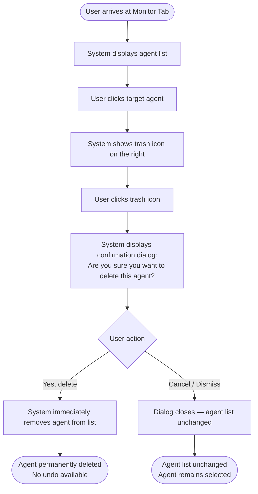
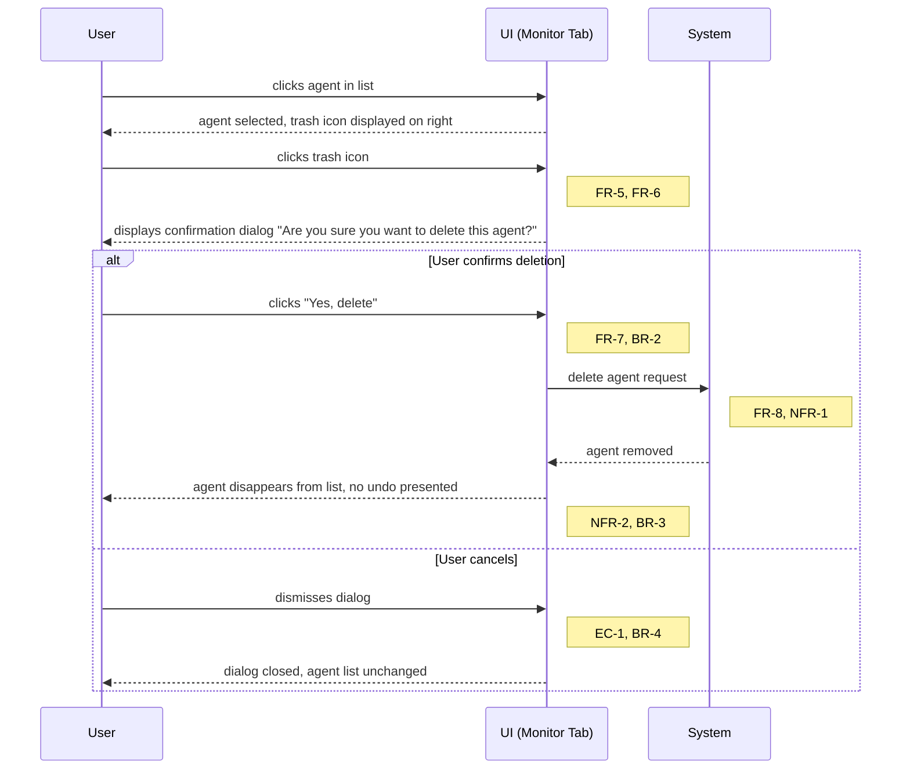
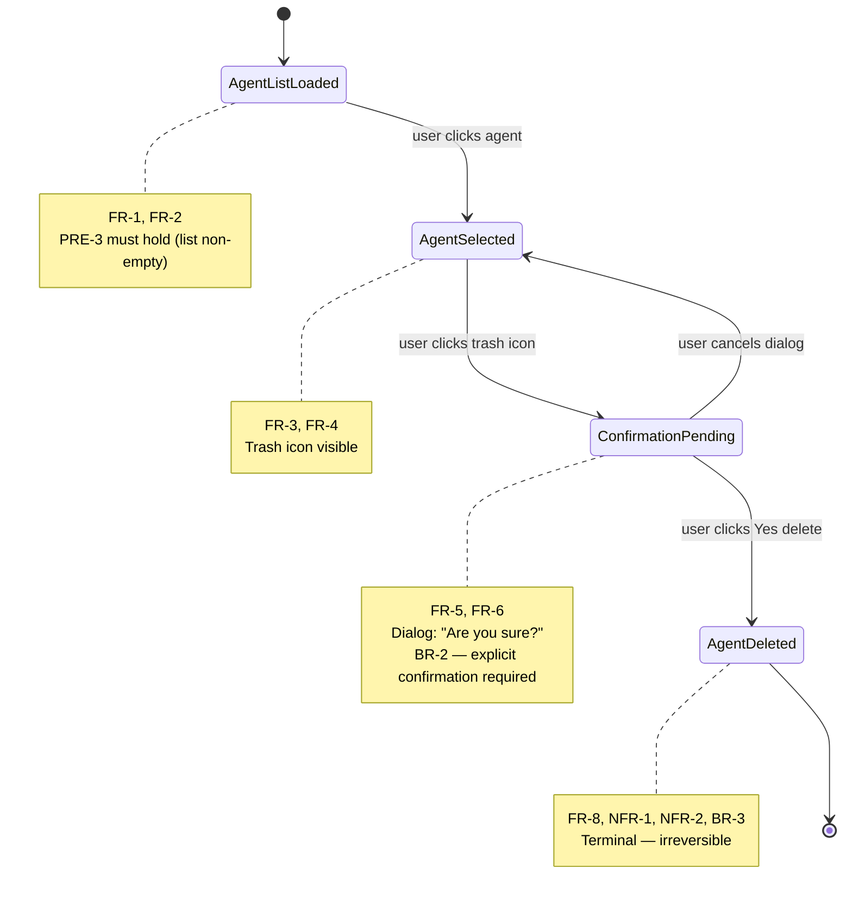

# Delete Agent — Structured Representation

> **Source document:** `docs/content/platform/delete-agent.md`  
> **Approved plan:** `plan/delete-agent-representation-plan.md`  
> **Model:** Claude Sonnet 4.6 (GitHub Copilot)  
> **Date:** 2026-02-22  

---

## Requirements Reference

All requirements are reproduced verbatim from the approved plan without omission or alteration.

### Functional Requirements

| ID   | Requirement |
|------|-------------|
| FR-1 | The system shall display a Monitor Tab within the AutoGPT builder |
| FR-2 | The system shall list all agents in the Monitor Tab |
| FR-3 | The user shall be able to click an agent in the list to select it |
| FR-4 | A trash icon shall be visible on the right side of the interface when an agent is selected |
| FR-5 | Clicking the trash icon shall trigger a confirmation dialog |
| FR-6 | The confirmation dialog shall display the message: *"Are you sure you want to delete this agent?"* |
| FR-7 | The dialog shall present a "Yes, delete" action to confirm deletion |
| FR-8 | Upon confirmation, the agent shall be immediately removed from the agent list |

### Non-Functional Requirements

| ID    | Requirement |
|-------|-------------|
| NFR-1 | Deletion shall be **immediate** upon confirmation (no perceptible delay implied) |
| NFR-2 | The deletion action is **irreversible** — the system shall not provide an undo mechanism |

### Business Rules & Constraints

| ID   | Rule |
|------|------|
| BR-1 | An agent must exist and be visible in the Monitor Tab before it can be deleted |
| BR-2 | Deletion requires explicit user confirmation via the dialog |
| BR-3 | Once confirmed, deletion is permanent and cannot be undone |
| BR-4 | The confirmation dialog implicitly allows cancellation (no "Yes, delete" → no deletion) |

### Edge Cases

| ID   | Edge Case |
|------|-----------|
| EC-1 | User opens confirmation dialog but cancels (does not click "Yes, delete") |
| EC-2 | Agent list is empty — no trash icon should be accessible |
| EC-3 | Rapid double-click on trash icon (potential duplicate dialog risk) |
| EC-4 | Network/system failure occurs during deletion (not documented; excluded from scope) |

---

## Layer 1 — Use-Case Specification (Primary)

### UC-01: Delete an Agent

| Field | Value |
|-------|-------|
| **Use-Case ID** | UC-01 |
| **Use-Case Name** | Delete an Agent |
| **Actor** | User |
| **Goal** | Permanently remove a selected agent from the AutoGPT platform |
| **Trigger** | User decides to remove an agent visible in the Monitor Tab |

---

### UC-01 Preconditions

| ID | Precondition | Traceability |
|----|-------------|--------------|
| PRE-1 | User is authenticated and has access to the AutoGPT platform | BR-1 |
| PRE-2 | User is currently on the Monitor Tab of the AutoGPT builder | FR-1, FR-2 |
| PRE-3 | At least one agent exists and is visible in the agent list | FR-2, BR-1, EC-2 |

---

### UC-01 Main Flow (Happy Path)

| Step | Actor | Action / System Response | Traceability |
|------|-------|--------------------------|--------------|
| MF-1 | System | Displays the Monitor Tab with the list of all agents | FR-1, FR-2 |
| MF-2 | User | Locates the target agent in the agent list | FR-2 |
| MF-3 | User | Clicks the target agent | FR-3 |
| MF-4 | System | Marks the agent as selected and displays the trash icon on the right side of the interface | FR-4 |
| MF-5 | User | Clicks the trash icon | FR-4, FR-5 |
| MF-6 | System | Displays a confirmation dialog with the message: *"Are you sure you want to delete this agent?"* | FR-5, FR-6 |
| MF-7 | User | Clicks the **"Yes, delete"** button in the dialog | FR-7, BR-2 |
| MF-8 | System | Immediately removes the selected agent from the agent list | FR-8, NFR-1 |
| MF-9 | System | Displays the updated agent list without the deleted agent; no undo option is provided | FR-8, NFR-2, BR-3 |

---

### UC-01 Postconditions — Success Path

| ID | Postcondition | Traceability |
|----|--------------|--------------|
| POST-S1 | The selected agent is permanently and immediately removed from the agent list | FR-8, NFR-1, BR-3 |
| POST-S2 | No undo mechanism is presented; the deletion cannot be reversed | NFR-2, BR-3 |

---

### UC-01 Alternative Flow: AF-01 — User Cancels the Confirmation Dialog

**Trigger:** At step MF-7, the user dismisses or closes the confirmation dialog without clicking "Yes, delete".

| Step | Actor | Action / System Response | Traceability |
|------|-------|--------------------------|--------------|
| AF-01-1 | User | Dismisses or closes the confirmation dialog (e.g., clicks Cancel, presses Escape, or clicks outside the dialog) | EC-1, BR-4 |
| AF-01-2 | System | Closes the confirmation dialog | BR-4 |
| AF-01-3 | System | Agent list remains unchanged; no agent is deleted | BR-4 |
| AF-01-4 | System | Returns to the state where the agent is still selected (MF-4) | BR-4 |

**Postconditions — Cancel Path:**

| ID | Postcondition | Traceability |
|----|--------------|--------------|
| POST-C1 | No agent is deleted; the agent list is identical to its state before the dialog was triggered | BR-4, EC-1 |
| POST-C2 | The previously selected agent remains selected in the list | BR-4 |

---

### UC-01 Exception Flows

| ID | Trigger / Condition | Behavior | Traceability |
|----|--------------------|---------| -----------|
| EF-01 | Agent list is empty at PRE-3 | No agent can be selected; the trash icon is inaccessible; use case cannot proceed past MF-2 | EC-2, BR-1 |
| EF-02 | User rapidly double-clicks the trash icon at MF-5 | Risk of duplicate confirmation dialogs being displayed; the system should present only one dialog instance (behavior not explicitly specified in documentation) | EC-3 |
| EF-03 | Network or system failure occurs during deletion (MF-8) | Outside documented scope; excluded from this specification | EC-4 |

---

### UC-01 Traceability Matrix

| Use-Case Element | Requirement IDs |
|-----------------|----------------|
| MF-1 | FR-1, FR-2 |
| MF-2 | FR-2 |
| MF-3 | FR-3 |
| MF-4 | FR-4 |
| MF-5 | FR-4, FR-5 |
| MF-6 | FR-5, FR-6 |
| MF-7 | FR-7, BR-2 |
| MF-8 | FR-8, NFR-1 |
| MF-9 | FR-8, NFR-2, BR-3 |
| POST-S1 | FR-8, NFR-1, BR-3 |
| POST-S2 | NFR-2, BR-3 |
| AF-01-1 to AF-01-4 | EC-1, BR-4 |
| POST-C1, POST-C2 | EC-1, BR-4 |
| EF-01 | EC-2, BR-1 |
| EF-02 | EC-3 |
| EF-03 | EC-4 |

---

## Layer 2 — Decision Table (Secondary)

### DG-01: Confirmation Dialog Response Gate

This decision table explicitly models the single critical binary decision gate in UC-01 (step MF-7 / AF-01), which controls whether deletion proceeds or is aborted.

| # | Condition / Action | Rule 1 | Rule 2 |
|---|-------------------|--------|--------|
| **C1** | Confirmation dialog is displayed | Y | Y |
| **C2** | User clicks "Yes, delete" | Y | N |
| **C3** | User cancels or dismisses the dialog | N | Y |
| **A1** | System deletes the agent immediately | **Yes** | No |
| **A2** | Agent list is updated (agent removed) | **Yes** | No |
| **A3** | Agent list remains unchanged | No | **Yes** |
| **A4** | No undo mechanism is provided | **Yes** | N/A |
| **Traceability** | | FR-7, FR-8, NFR-1, NFR-2, BR-2, BR-3 | BR-4, EC-1 |

> **Note:** C2 and C3 are mutually exclusive and exhaustive given C1 = Y. A single `No` action in the dialog (including dismiss, escape, clicking outside) is treated as cancellation per BR-4.

---

## Layer 3 — Supplementary Mermaid Diagrams

### 3.1 Activity / Flow Diagram

Scope: End-to-end deletion workflow from Monitor Tab arrival through agent removal or cancellation.  
Directive: `flowchart TD`

> **FR coverage:** FR-1 (Monitor Tab), FR-2 (list), FR-3 (select), FR-4 (trash icon), FR-5 (dialog trigger), FR-6 (dialog message), FR-7 (Yes delete), FR-8 (removal), NFR-1 (immediate), NFR-2 (no undo), BR-4 (cancel path).

---

### 3.2 Sequence Diagram

Scope: Chronological message exchange between User, UI (Monitor Tab), and System for the delete interaction, including the confirmation handshake. Both the confirmation and cancellation paths are shown.  
Directive: `sequenceDiagram`

---

### 3.3 State Diagram

Scope: Discrete states of the agent entity during the deletion interaction, from Monitor Tab load to post-deletion.  
Directive: `stateDiagram-v2`

> **State-to-requirement mapping:**
>
> | State | Requirements |
> |-------|-------------|
> | `AgentListLoaded` | FR-1, FR-2, BR-1 |
> | `AgentSelected` | FR-3, FR-4 |
> | `ConfirmationPending` | FR-5, FR-6, FR-7, BR-2, EC-1, EC-3 |
> | `AgentDeleted` | FR-8, NFR-1, NFR-2, BR-3 |
> | `ConfirmationPending → AgentSelected` (cancel) | BR-4, EC-1 |

---

## Metadata

| Field | Value |
|-------|-------|
| **Model** | Claude Sonnet 4.6 (GitHub Copilot) |
| **Date** | 2026-02-22 |
| **Source document** | `docs/content/platform/delete-agent.md` |
| **Approved plan** | `plan/delete-agent-representation-plan.md` |
| **Prompt used** | `.github/prompts/dec_to_rep.prompt.md` |
| **Output file** | `representation/delete-agent-representation.md` |
