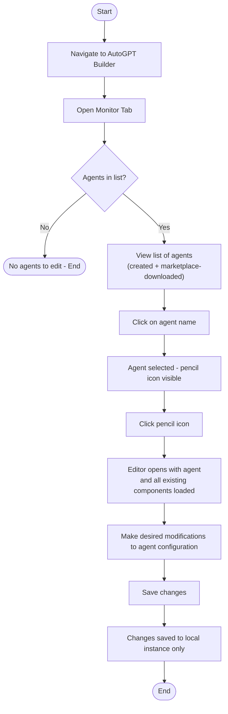
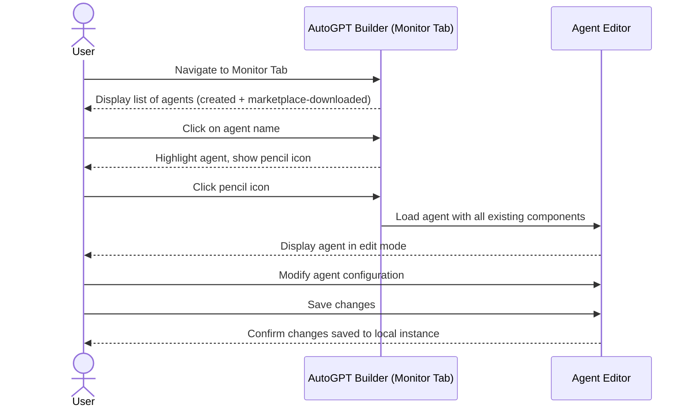
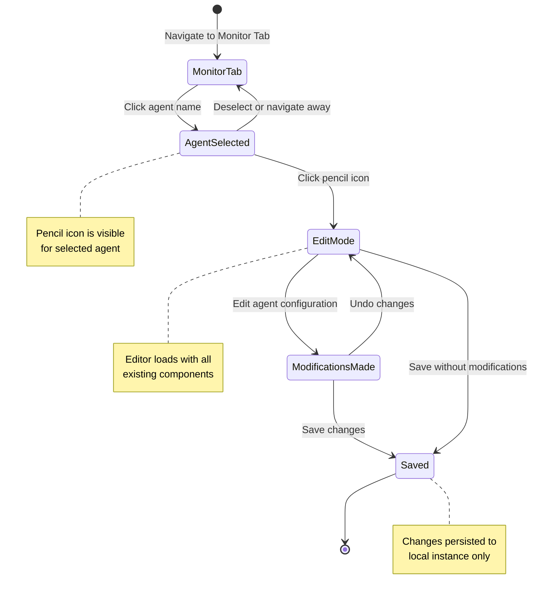

# Edit Agent Feature – Structured Test Representation

> **Source Documentation**: `docs/content/platform/edit-agent.md`
> **Approved Plan**: `plan/edit-agent-representation-plan.md`
> **Primary Representation**: Gherkin (Given-When-Then)
> **Secondary Representation**: Use-Case Specification
> **Supporting**: Requirement Traceability Matrix (RTM)
> **Supporting Visuals**: Mermaid Diagrams (Flowchart, Sequence, State)

---

## Section 1: Requirements Reference

All requirements are reproduced verbatim from the approved plan without alteration.

### 1.1 Functional Requirements

| ID | Requirement |
|----|-------------|
| FR-01 | The system shall provide a Monitor Tab within the AutoGPT builder interface. |
| FR-02 | The Monitor Tab shall list all agents accessible to the user, including user-created agents and agents downloaded from the marketplace. |
| FR-03 | The user shall be able to select an agent by clicking on its name within the Monitor Tab. |
| FR-04 | A pencil icon shall be displayed next to the selected agent. |
| FR-05 | Clicking the pencil icon shall open the agent in the editor (Edit Mode). |
| FR-06 | The editor shall load the agent with all its existing components intact. |
| FR-07 | The user shall be able to modify the agent's configuration within the editor. |
| FR-08 | The user shall be able to save the modified agent. |
| FR-09 | All agents (regardless of origin: user-created or marketplace-downloaded) shall be editable. |
| FR-10 | Saved changes shall be persisted to the user's local instance. |

### 1.2 Non-Functional Requirements

| ID | Requirement |
|----|-------------|
| NFR-01 | Changes are saved to the local instance only (not synced back to the marketplace). |

### 1.3 Business Rules & Constraints

| ID | Rule |
|----|------|
| BR-01 | Any agent visible in the Monitor Tab can be edited, including marketplace-downloaded agents. |
| BR-02 | Edits affect the local copy of the agent only. |

### 1.4 Preconditions
- The user has access to the AutoGPT Builder application.
- At least one agent exists in the Monitor Tab (user-created or downloaded).

### 1.5 Postconditions
- The agent's configuration is updated and saved to the local instance.

---

## Section 2: Gherkin Scenarios (Primary Representation)

> Each scenario is tagged with the requirement IDs it covers to maintain bidirectional traceability.

```gherkin
Feature: Edit Agent in AutoGPT Builder
  As a user of the AutoGPT Builder
  I want to edit existing agents in the Monitor Tab
  So that I can update agent configurations and save them to my local instance

  Background:
    Given the user has access to the AutoGPT Builder application

  # ---------------------------------------------------------------------------
  # SC-01: Happy Path – Edit and save a user-created agent
  # Covers: FR-01, FR-02, FR-03, FR-04, FR-05, FR-06, FR-07, FR-08, FR-10
  # ---------------------------------------------------------------------------
  @SC-01 @FR-01 @FR-02 @FR-03 @FR-04 @FR-05 @FR-06 @FR-07 @FR-08 @FR-10
  Scenario: Successfully edit and save a user-created agent
    Given the Monitor Tab is open in the AutoGPT Builder
    And at least one user-created agent is visible in the agent list
    When the user clicks on the agent name
    Then the agent is highlighted in the list
    And a pencil icon is displayed next to the selected agent
    When the user clicks the pencil icon
    Then the editor opens with the agent loaded
    And all existing components of the agent are intact in the editor
    When the user modifies the agent's configuration
    And the user saves the changes
    Then the agent's updated configuration is persisted to the local instance

  # ---------------------------------------------------------------------------
  # SC-02: Happy Path – Edit and save a marketplace-downloaded agent
  # Covers: FR-01, FR-02, FR-03, FR-04, FR-05, FR-06, FR-07, FR-08, FR-09,
  #         FR-10, NFR-01, BR-01, BR-02
  # ---------------------------------------------------------------------------
  @SC-02 @FR-01 @FR-02 @FR-03 @FR-04 @FR-05 @FR-06 @FR-07 @FR-08 @FR-09 @FR-10 @NFR-01 @BR-01 @BR-02
  Scenario: Successfully edit and save a marketplace-downloaded agent
    Given the Monitor Tab is open in the AutoGPT Builder
    And at least one agent downloaded from the marketplace is visible in the agent list
    When the user clicks on the marketplace agent name
    Then the agent is highlighted in the list
    And a pencil icon is displayed next to the selected agent
    When the user clicks the pencil icon
    Then the editor opens with the agent loaded
    And all original components of the marketplace agent are intact in the editor
    When the user modifies the agent's configuration
    And the user saves the changes
    Then the agent's updated configuration is persisted to the local instance only
    And the changes are not synced back to the marketplace

  # ---------------------------------------------------------------------------
  # SC-03: Edge Case – Monitor Tab contains no agents (EC-01)
  # Covers: FR-01, FR-02
  # ---------------------------------------------------------------------------
  @SC-03 @EC-01 @FR-01 @FR-02
  Scenario: Monitor Tab displays no agents when none exist
    Given the Monitor Tab is open in the AutoGPT Builder
    And no agents exist in the user's account
    When the user views the Monitor Tab
    Then no agent names are displayed in the agent list
    And no pencil icon is visible

  # ---------------------------------------------------------------------------
  # SC-04: Edge Case – Marketplace agent loads with all original components (EC-02)
  # Covers: FR-05, FR-06, BR-01
  # ---------------------------------------------------------------------------
  @SC-04 @EC-02 @FR-05 @FR-06 @BR-01
  Scenario: Marketplace-downloaded agent opens with all original components intact
    Given the Monitor Tab is open in the AutoGPT Builder
    And a marketplace-downloaded agent is selected and highlighted
    When the user clicks the pencil icon next to the agent
    Then the editor opens
    And every original component of the marketplace agent is present and loaded in the editor

  # ---------------------------------------------------------------------------
  # SC-05: Edge Case – Save without making any modifications (EC-03)
  # Covers: FR-08, FR-10
  # ---------------------------------------------------------------------------
  @SC-05 @EC-03 @FR-08 @FR-10
  Scenario: User saves an agent without making any modifications
    Given the Monitor Tab is open in the AutoGPT Builder
    And an agent is open in the editor with no changes made
    When the user saves the agent
    Then the agent is saved to the local instance
    And the agent configuration remains unchanged

  # ---------------------------------------------------------------------------
  # SC-06: Verify Monitor Tab lists both agent origins
  # Covers: FR-02, BR-01
  # ---------------------------------------------------------------------------
  @SC-06 @FR-02 @BR-01
  Scenario Outline: Monitor Tab lists agents from all origins
    Given the Monitor Tab is open in the AutoGPT Builder
    And at least one <agent_origin> agent exists in the account
    When the user views the agent list in the Monitor Tab
    Then the <agent_origin> agent is visible in the list
    And the user can click on the <agent_origin> agent to select it

    Examples:
      | agent_origin          |
      | user-created          |
      | marketplace-downloaded |
```

---

## Section 3: Use-Case Specification (Secondary Representation)

### UC-01: Edit Agent

| Field | Detail |
|-------|--------|
| **Use Case ID** | UC-01 |
| **Use Case Name** | Edit Agent |
| **Actor(s)** | User (primary); AutoGPT Builder (system) |
| **Description** | The user selects an agent from the Monitor Tab, opens it in the editor via the pencil icon, modifies its configuration, and saves the changes to the local instance. |
| **Preconditions** | 1. The user has access to the AutoGPT Builder application. 2. At least one agent (user-created or marketplace-downloaded) exists in the Monitor Tab. |
| **Postconditions** | The agent's configuration is updated and saved to the user's local instance. Changes are not propagated to the marketplace. |
| **Trigger** | User navigates to the Monitor Tab in AutoGPT Builder. |

#### Main Flow (Basic Course of Events)

| Step | Actor | Action / System Response |
|------|-------|--------------------------|
| 1 | User | Navigates to the Monitor Tab in the AutoGPT Builder. *(FR-01)* |
| 2 | AutoGPT Builder | Displays the Monitor Tab with a list of all agents (user-created and marketplace-downloaded). *(FR-02)* |
| 3 | User | Clicks on the name of the agent to edit. *(FR-03)* |
| 4 | AutoGPT Builder | Highlights the selected agent and displays the pencil icon next to it. *(FR-04)* |
| 5 | User | Clicks the pencil icon next to the selected agent. *(FR-05)* |
| 6 | AutoGPT Builder | Opens the agent in the editor with all existing components loaded. *(FR-05, FR-06)* |
| 7 | User | Makes desired modifications to the agent's configuration. *(FR-07)* |
| 8 | User | Saves the changes. *(FR-08)* |
| 9 | AutoGPT Builder | Persists the updated configuration to the user's local instance. *(FR-10, NFR-01)* |

#### Alternative Flow A: No Agents in Monitor Tab

| Step | Actor | Action / System Response |
|------|-------|--------------------------|
| 1 | User | Navigates to the Monitor Tab. *(FR-01)* |
| 2 | AutoGPT Builder | Displays the Monitor Tab with an empty agent list. *(FR-02)* |
| 3 | — | No agents are available to select or edit. Use case ends. |

#### Alternative Flow B: Marketplace-Downloaded Agent

| Step | Actor | Action / System Response |
|------|-------|--------------------------|
| 3b | User | Clicks on the name of a marketplace-downloaded agent. *(FR-03, BR-01)* |
| 4b | AutoGPT Builder | Highlights the agent and shows the pencil icon, identical to user-created agents. *(FR-04, FR-09)* |
| 6b | AutoGPT Builder | Opens the marketplace agent in the editor with all its original components intact. *(FR-06, BR-01)* |
| 9b | AutoGPT Builder | Persists changes locally; changes are not synced to the marketplace. *(FR-10, NFR-01, BR-02)* |

#### Alternative Flow C: Save Without Modifications

| Step | Actor | Action / System Response |
|------|-------|--------------------------|
| 7c | User | Proceeds directly to save without making changes. *(EC-03)* |
| 8c | User | Saves the agent. *(FR-08)* |
| 9c | AutoGPT Builder | Persists the unchanged configuration to the local instance. *(FR-10)* |

---

## Section 4: Requirement Traceability Matrix (RTM)

| Req ID | Requirement Summary | Gherkin Scenario(s) | Use-Case Step(s) | Test Type |
|--------|---------------------|---------------------|-----------------|-----------|
| FR-01 | Monitor Tab provided in AutoGPT Builder | SC-01, SC-02, SC-03, SC-06 | UC-01 Step 1–2 | Functional |
| FR-02 | Monitor Tab lists all agents (created + marketplace) | SC-01, SC-02, SC-03, SC-06 | UC-01 Step 2 | Functional |
| FR-03 | User can select agent by clicking its name | SC-01, SC-02, SC-06 | UC-01 Step 3 | Functional |
| FR-04 | Pencil icon displayed next to selected agent | SC-01, SC-02 | UC-01 Step 4 | Functional / UI |
| FR-05 | Clicking pencil icon opens editor (Edit Mode) | SC-01, SC-02, SC-04 | UC-01 Step 5–6 | Functional |
| FR-06 | Editor loads agent with all existing components | SC-01, SC-02, SC-04 | UC-01 Step 6 | Functional |
| FR-07 | User can modify agent configuration in editor | SC-01, SC-02 | UC-01 Step 7 | Functional |
| FR-08 | User can save the modified agent | SC-01, SC-02, SC-05 | UC-01 Step 8 | Functional |
| FR-09 | All agents are editable regardless of origin | SC-02, SC-06 | UC-01 Alt Flow B Step 4b | Functional / Business Rule |
| FR-10 | Saved changes persisted to local instance | SC-01, SC-02, SC-05 | UC-01 Step 9 | Functional |
| NFR-01 | Changes saved to local instance only (not marketplace) | SC-02 | UC-01 Step 9 / Alt Flow B Step 9b | Non-Functional |
| BR-01 | Any Monitor Tab agent (incl. marketplace) can be edited | SC-02, SC-04, SC-06 | UC-01 Alt Flow B | Business Rule |
| BR-02 | Edits affect local copy only | SC-02 | UC-01 Alt Flow B Step 9b | Business Rule |
| EC-01 | Monitor Tab has no agents listed | SC-03 | UC-01 Alt Flow A | Edge Case |
| EC-02 | Marketplace agent loads with all original components | SC-04 | UC-01 Alt Flow B Step 6b | Edge Case |
| EC-03 | User saves without making any modifications | SC-05 | UC-01 Alt Flow C | Edge Case |

---

## Section 5: Supporting Mermaid Diagrams

### Diagram 1: Edit Agent Activity / Flowchart

> **Scope**: Full workflow — start → Monitor Tab → Agent selected → Pencil icon → Editor → Modify → Save → End
> **Traceability**: FR-01 through FR-10, NFR-01



---

### Diagram 2: Edit Agent Sequence Diagram

> **Scope**: User ↔ AutoGPT Builder (Monitor Tab) ↔ Agent Editor message exchange
> **Traceability**: FR-01, FR-02, FR-03, FR-04, FR-05, FR-06, FR-07, FR-08, FR-10, NFR-01



---

### Diagram 3: Edit Agent State Diagram

> **Scope**: All discrete UI states from Monitor Tab view to agent saved
> **Traceability**: FR-01 through FR-10, NFR-01, BR-01, BR-02



---

## Section 6: Metadata

| Field | Value |
|-------|-------|
| **Model** | Claude Sonnet 4.6 (GitHub Copilot) |
| **Date** | 2026-02-23 |
| **Source Documentation** | `docs/content/platform/edit-agent.md` |
| **Approved Plan** | `plan/edit-agent-representation-plan.md` |
| **Output File** | `representation/edit-agent-representation.md` |

---

*End of Representation*
