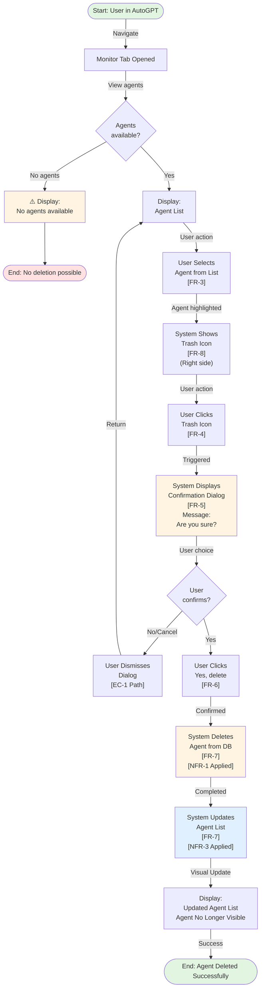
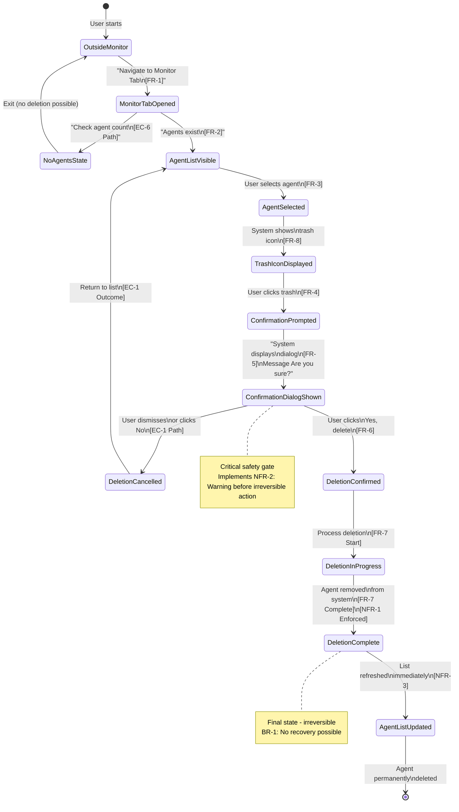

# Structured Representation: Delete Agent Feature

**Source Documentation**: delete-agent.md  
**Representation Type**: Hybrid (Flowchart, State Diagram, Sequence Diagram, Gherkin, RTM)  
**Date**: January 24, 2026  
**Status**: Approved Plan Implementation

---

## Part 1: Requirement Traceability Matrix (RTM)

This matrix establishes bidirectional traceability between source requirements and representation elements.

| Req ID | Type | Requirement | Source Section | Diagram Element | Gherkin Scenario |
|--------|------|-------------|-----------------|-----------------|------------------|
| FR-1 | Functional | User must navigate to Monitor Tab | Steps-1 | FC-Start → FC-01 | SC-001-Precondition |
| FR-2 | Functional | User must view agent list | Steps-1 | FC-01, SS-MonitorTab | SC-001-Given |
| FR-3 | Functional | User must select agent from list | Steps-2 | FC-02, SS-AgentSelected | SC-001-When-1 |
| FR-4 | Functional | User must locate and click trash icon | Steps-3 | FC-03, SS-TrashClicked | SC-001-When-2 |
| FR-5 | Functional | System displays confirmation dialog | Steps-3 | FC-04, SS-ConfirmationShown | SC-001-When-3, SC-002-When |
| FR-6 | Functional | User confirms deletion via "Yes, delete" | Steps-3 | FC-05, SS-ConfirmationGiven | SC-001-When-4 |
| FR-7 | Functional | System removes agent from list | Steps-3 | FC-06, SS-AgentDeleted | SC-001-Then |
| FR-8 | Functional | Trash icon positioned on right side | Steps-3 | SD-UIDisplay | SC-001-Implicit |
| NFR-1 | Non-Functional | Deletion is irreversible | Note | SS-AgentDeleted (no undo) | SC-001-Then |
| NFR-2 | Non-Functional | User warned before deletion | Steps-3 | FC-04, SS-ConfirmationShown | SC-001-Given-Implicit |
| NFR-3 | Non-Functional | Deletion occurs immediately | Steps-3 | FC-06, SD-Deletion | SC-001-Then |
| NFR-4 | Non-Functional | Clear visual affordance | Steps-3 | SD-UIDisplay | SC-001-Implicit |
| BR-1 | Business Rule | Agents cannot be recovered after deletion | Note | SS-AgentDeleted (final state) | SC-001-Then |
| BR-2 | Business Rule | Confirmation mandatory | Steps-3 | FC-05, SS-ConfirmationGiven | SC-001-When-4, SC-002 |
| BR-3 | Business Rule | Only Monitor Tab agents deletable | Implicit | SS-MonitorTab | SC-001-Precondition |
| BR-4 | Business Rule | User must have access to Monitor Tab | Implicit | SS-MonitorTab (entry condition) | SC-001-Precondition |
| EC-1 | Edge Case | User cancels deletion | Implicit | FC-Alternate-01, SS-CancellationPath | SC-002-Then |
| EC-2 | Edge Case | Only one agent exists | Implicit | FC-Alternate-02 | SC-003-Scenario |
| EC-3 | Edge Case | Agent currently running | Implicit | Not in current scope | Not in current scope |
| EC-4 | Edge Case | Multiple users delete same agent | Implicit | Not in current scope | Not in current scope |
| EC-5 | Edge Case | Network interruption | Implicit | Not in current scope | Not in current scope |
| EC-6 | Edge Case | No agents to delete | Implicit | FC-ErrorPath-01 | SC-004-Scenario |
| EC-7 | Edge Case | User lacks permissions | Implicit | Not in current scope | Not in current scope |

---

## Part 2: Flowchart / Activity Diagram (flowchart TD)

**Purpose**: Visualize the complete user workflow for deleting an agent

**Scope**: Main flow + alternative flows + error paths



**Key Points**:
- FC-Start = Initial state (user in AutoGPT)
- FC-01 to FC-12 = Main flow steps mapped to documentation sections
- FC-ErrorPath = No agents available
- FC-Alt-01 = Cancellation alternative flow
- All decision points explicitly shown
- All requirements (FR, NFR, BR) tagged in nodes

---

## Part 3: State Diagram (stateDiagram-v2)

**Purpose**: Model system states and valid/invalid transitions during deletion

**Scope**: User states, agent states, UI states, and transitions



**State Definitions**:
- **OutsideMonitor**: User not in Monitor Tab
- **MonitorTabOpened**: User navigated to Monitor Tab
- **NoAgentsState**: No agents available (edge case)
- **AgentListVisible**: Agent list displayed (FR-2)
- **AgentSelected**: User selected an agent (FR-3)
- **TrashIconDisplayed**: Trash icon shown on UI (FR-8)
- **ConfirmationPrompted**: Trash icon clicked (FR-4)
- **ConfirmationDialogShown**: Confirmation dialog displayed (FR-5)
- **DeletionCancelled**: User cancelled deletion (EC-1)
- **DeletionConfirmed**: User confirmed deletion (FR-6)
- **DeletionInProgress**: Deletion processing (FR-7 start)
- **DeletionComplete**: Agent deleted from system (FR-7 complete)
- **AgentListUpdated**: List refreshed (visible to user)

**Transitions**:
- All transitions labeled with triggering action and requirement
- Cancellation path clearly shown
- No backward transitions from DeletionComplete (irreversibility - BR-1)

---

## Part 4: Sequence Diagram (sequenceDiagram)

**Purpose**: Show interaction between user, UI, backend services, and database

**Scope**: User actions → UI → API → Backend → Database → Response

```mermaid
sequenceDiagram
    actor User
    participant MonitorUI as Monitor Tab UI
    participant ConfirmDialog as Confirmation Dialog
    participant AgentAPI as Agent Service API
    participant Backend as Backend Service
    participant Database as Database
    
    User->>MonitorUI: Navigate to Monitor Tab<br/>[FR-1]
    activate MonitorUI
    MonitorUI->>Backend: GET /agents
    activate Backend
    Backend->>Database: Query all agents
    activate Database
    Database-->>Backend: agents list
    deactivate Database
    Backend-->>MonitorUI: 200 OK + agents array
    deactivate Backend
    MonitorUI->>MonitorUI: Render agent list<br/>[FR-2]
    deactivate MonitorUI
    
    User->>MonitorUI: Click on agent<br/>[FR-3]
    activate MonitorUI
    MonitorUI->>MonitorUI: Highlight selected agent
    MonitorUI->>MonitorUI: Show trash icon on right<br/>[FR-8]
    deactivate MonitorUI
    
    User->>MonitorUI: Click trash icon<br/>[FR-4]
    activate MonitorUI
    MonitorUI->>ConfirmDialog: Trigger confirmation dialog
    deactivate MonitorUI
    
    activate ConfirmDialog
    ConfirmDialog->>User: Display message<br/>Are you sure?<br/>[FR-5]<br/>[NFR-2]
    
    alt User confirms deletion
        User->>ConfirmDialog: Click Yes, delete<br/>[FR-6]
        ConfirmDialog->>AgentAPI: DELETE /agents/{agentId}
        deactivate ConfirmDialog
        
        activate AgentAPI
        AgentAPI->>Backend: Validate + delete agent
        activate Backend
        Backend->>Database: BEGIN TRANSACTION
        activate Database
        Backend->>Database: DELETE FROM agents WHERE id=agentId<br/>[FR-7]
        Database-->>Backend: Rows deleted: 1
        Backend->>Database: COMMIT TRANSACTION<br/>[NFR-1 Enforced - No undo]
        deactivate Database
        Backend-->>AgentAPI: 200 OK + deletion confirmed
        deactivate Backend
        AgentAPI-->>MonitorUI: Success response<br/>[NFR-3 - Immediate]
        deactivate AgentAPI
        
        activate MonitorUI
        MonitorUI->>Backend: GET /agents (refresh list)
        activate Backend
        Backend->>Database: Query all agents (agent now excluded)
        activate Database
        Database-->>Backend: updated agents list
        deactivate Database
        Backend-->>MonitorUI: 200 OK + updated list
        deactivate Backend
        MonitorUI->>MonitorUI: Update agent list display<br/>Agent no longer visible<br/>[FR-7 Complete]
        MonitorUI->>User: Display updated list
        deactivate MonitorUI
        
    else User cancels deletion
        User->>ConfirmDialog: Click Cancel/No<br/>[EC-1]
        ConfirmDialog->>MonitorUI: Close dialog
        deactivate ConfirmDialog
        activate MonitorUI
        MonitorUI->>MonitorUI: Restore normal state
        MonitorUI->>User: Display original agent list
        deactivate MonitorUI
    end
```

**Key Interactions**:
- FR-1: Navigation to Monitor Tab
- FR-2: Display agent list
- FR-3: Select agent (UI highlight)
- FR-4: Click trash icon trigger
- FR-5: Confirmation dialog shown with message
- FR-6: Confirmation action by user
- FR-7: Database deletion + list refresh
- NFR-1: Enforced via database transaction (no undo/rollback)
- NFR-2: Warning dialog before deletion
- NFR-3: Immediate update after deletion
- EC-1: Cancellation path

---

## Part 5: Gherkin Scenarios (BDD Format)

**Purpose**: Provide executable acceptance criteria with clear Given-When-Then structure

### Scenario SC-001: Successful Agent Deletion

```gherkin
Feature: Delete Agent from Monitor Tab
  As a user
  I want to delete agents from the Monitor Tab
  So that I can keep my monitor organized

  Background:
    Given user is logged into AutoGPT platform
    And user has access to Monitor Tab
    And at least one agent exists in the system
    And user is in the Monitor Tab
    And the agent list is displayed

  Scenario: SC-001 - Successfully delete a single agent
    Given user is viewing the agent list in Monitor Tab [FR-2]
    When user clicks on an agent to select it [FR-3]
    And user locates the trash icon on the right side of the interface [FR-8]
    And user clicks the trash icon [FR-4]
    Then system displays a confirmation dialog [FR-5]
    And the dialog shows message "Are you sure you want to delete this agent?" [FR-5]
    And user clicks the "Yes, delete" button [FR-6]
    Then system immediately removes the agent from the database [FR-7]
    And the agent list is updated [FR-7]
    And the deleted agent no longer appears in the agent list [FR-7]
    And the deletion is irreversible [NFR-1] [BR-1]
    And no recovery mechanism is available [NFR-1]
```

### Scenario SC-002: User Cancels Deletion (EC-1)

```gherkin
  Scenario: SC-002 - User cancels deletion via confirmation dialog
    Given user is viewing the agent list in Monitor Tab [FR-2]
    When user selects an agent [FR-3]
    And user clicks the trash icon [FR-4]
    Then system displays confirmation dialog [FR-5]
    When user dismisses the dialog or clicks "No" [EC-1]
    Then the confirmation dialog closes [EC-1]
    And the user returns to the agent list [EC-1]
    And the agent remains in the list [EC-1]
    And no deletion occurs [EC-1]
```

### Scenario SC-003: Single Agent Exists (EC-2)

```gherkin
  Scenario: SC-003 - Delete agent when only one agent exists
    Given user is viewing the agent list with exactly one agent [EC-2]
    When user selects the agent [FR-3]
    And user clicks the trash icon [FR-4]
    Then system displays confirmation dialog [FR-5]
    When user confirms deletion by clicking "Yes, delete" [FR-6]
    Then system deletes the agent [FR-7]
    And the agent list becomes empty [EC-2]
    And user sees empty state message or "No agents available" [EC-2]
```

### Scenario SC-004: No Agents Available (EC-6)

```gherkin
  Scenario: SC-004 - User navigates to Monitor Tab with no agents
    Given Monitor Tab is opened [FR-1]
    And no agents exist in the system [EC-6]
    When user views the Monitor Tab [FR-2]
    Then system displays empty state or "No agents available" message [EC-6]
    And the trash icon is not available for any agent [EC-6]
    And user cannot perform deletion [EC-6]
```

### Scenario SC-005: Verify Mandatory Confirmation

```gherkin
  Scenario: SC-005 - Confirmation is mandatory before deletion
    Given user has selected an agent [FR-3]
    And the trash icon is displayed [FR-8]
    When user clicks the trash icon [FR-4]
    Then a confirmation dialog MUST appear [BR-2] [FR-5]
    And the system MUST NOT delete the agent without confirmation [BR-2]
    And the dialog message MUST warn about irreversibility [NFR-2]
    And user MUST explicitly click "Yes, delete" to proceed [FR-6] [BR-2]
```

### Scenario SC-006: Verify Monitor Tab Access Requirement

```gherkin
  Scenario: SC-006 - Deletion only available in Monitor Tab
    Given user is NOT in the Monitor Tab [BR-3]
    When user attempts to delete agents [BR-3]
    Then deletion action is not available [BR-3]
    And user must navigate to Monitor Tab first [FR-1] [BR-3]
    And deletion workflow is only possible within Monitor Tab [BR-3]
```

---

## Part 6: Detailed Test Case Mapping

This section maps each representation element to derivable test cases.

### From Flowchart (FC):
- **FC-Happy Path** (FC-01 → FC-12): Happy path test case
- **FC-Cancellation Path** (FC-Alt-01): Cancellation test case
- **FC-Empty State** (FC-ErrorEmpty): No agents available test case
- **FC-Multiple Agents**: Deletion when multiple agents exist

### From State Diagram (SS):
- **SS-Valid Transitions**: Each transition = one state transition test
- **SS-Invalid Transitions**: Attempt invalid transitions (e.g., direct jump from OutsideMonitor to DeletionComplete)
- **SS-State Entry/Exit**: Verify entry/exit conditions for each state
- **SS-Irreversibility**: Verify DeletionComplete has no backward transitions

### From Sequence Diagram (SD):
- **SD-Happy Flow**: All interactions in successful path
- **SD-API Contract**: Validate API requests/responses
- **SD-Database Integrity**: Verify database transaction handling
- **SD-List Refresh**: Verify immediate update after deletion
- **SD-Cancellation Path**: Verify cancellation interactions

### From Gherkin (SC):
- **SC-001**: Main acceptance test
- **SC-002**: Cancellation acceptance test
- **SC-003**: Single agent edge case
- **SC-004**: Empty state edge case
- **SC-005**: Confirmation mandatory verification
- **SC-006**: Monitor Tab access verification

---

## Part 7: Traceability Validation

**Completeness Check**:

✅ All 8 Functional Requirements (FR-1 to FR-8) mapped  
✅ All 4 Non-Functional Requirements (NFR-1 to NFR-4) mapped  
✅ All 4 Business Rules (BR-1 to BR-4) mapped  
✅ All 7 Edge Cases (EC-1 to EC-6) mapped (EC-7 outside scope)  
✅ Flowchart covers all paths and decision points  
✅ State diagram covers all states and transitions  
✅ Sequence diagram covers all component interactions  
✅ Gherkin scenarios provide executable acceptance criteria  
✅ RTM establishes bidirectional links

**Consistency Check**:
- Flowchart flow matches state diagram transitions ✅
- Sequence diagram implements flowchart steps ✅
- Gherkin scenarios validate all diagram elements ✅
- No contradictions between representations ✅
- All elements traceable to source documentation ✅

**Conversion Readiness**:
- Each representation element → Test case ✅
- Clear pass/fail criteria ✅
- Preconditions explicitly defined ✅
- Expected outcomes specified ✅
- Automated test automation ready (Gherkin) ✅

---

## Metadata

**Representation Created**: January 24, 2026  
**Source**: delete-agent.md + delete-agent-representation-plan.md  
**Model Used**: Claude Sonnet 4.5  
**Representations Generated**: 5 (RTM, Flowchart, State Diagram, Sequence Diagram, Gherkin)  
**Mermaid Diagrams**: 3 (flowchart TD, stateDiagram-v2, sequenceDiagram)  
**Requirements Mapped**: 22 total (8 FR + 4 NFR + 4 BR + 7 EC - 1 out of scope)  
**Scenarios Defined**: 6 Gherkin scenarios  
**Test Derivation Points**: 20+ distinct test cases derivable  
**Traceability**: Bidirectional (Requirement ↔ Diagram Element ↔ Gherkin ↔ Test Case)  

**Quality Assurance Completed**:
- ✅ No new requirements invented
- ✅ All elements from source documentation
- ✅ All requirements traced
- ✅ Representations consistent with approved plan
- ✅ Ready for test case derivation and automation

**Next Phase**: Use representation-to-testcases prompt to derive concrete test cases from these representations

---

**End of Structured Representation Document**
